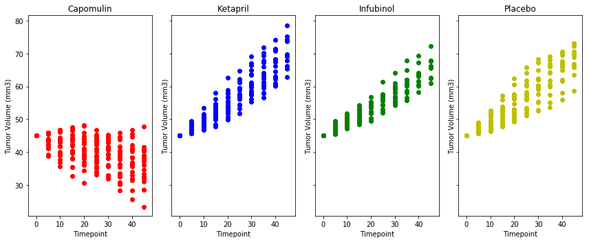
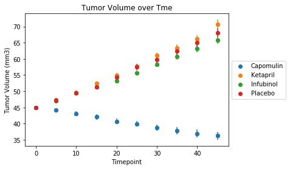
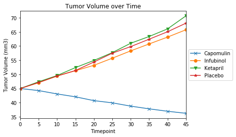
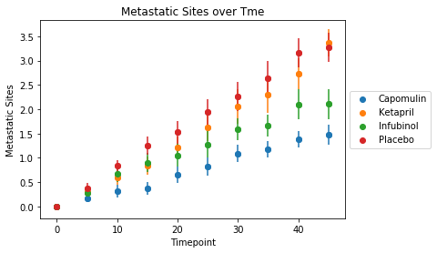
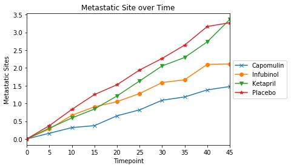
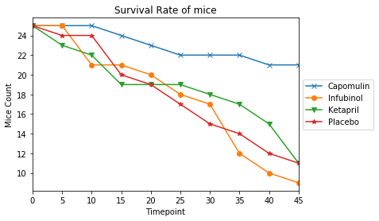

# Pymaceuticals Analysis

## Overview and Objective

Pymaceuticals Inc. is a burgeoning pharmaceutical company based out of San Diego, CA. Pymaceuticals specializes in drug-based, anti-cancer pharmaceuticals. In their most recent efforts, they've since begun screening for potential treatments to squamous cell carcinoma (SCC), a commonly occurring form of skin cancer.

We have been given access to the complete data from their most recent animal study. In this study, 250 mice were treated through a variety of drug regimes over the course of 45 days. Their physiological responses were then monitored over the course of that time. 

Our objective is to analyze the data to show how four treatments (Capomulin, Infubinol, Ketapril, and Placebo) compare.

As part of the analysis we need to do the following:
* Create a scatter plot that shows how the tumor volume changes over time for each treatment.
* Create a scatter plot that shows how the number of metastatic (cancer spreading) sites changes over time for each treatment.
* Create a scatter plot that shows the number of mice still alive through the course of treatment (Survival Rate)
* Create a bar graph that compares the total % tumor volume change for each drug across the full 45 days.

## Observations:

Amongst the 4 drugs in question - Capomulin, Infubinol, Ketapril, and Placebo, Capomulin seems to give better results than the other three. 

### Observed Trend 1
The Tumor Volume decreases over time with the use of the drug Capomulin. The Tumor Volume increases over time for the other three drugs - Infubinol, Ketapril, and Placebo

### Observed Trend 2
The rate of increase of Metastatic sites in lowest with the use of Capomulin and highest with Placebo.

### Observed Trend 3
The survival rate of mice is higher in those treated with Capomulin and was lower in those treated with Infubinol, Ketapril, and Placebo

<table border="1" class="dataframe">
  <thead>
    <tr style="text-align: right;">
      <th></th>
      <th>Mouse ID</th>
      <th>Timepoint</th>
      <th>Tumor Volume (mm3)</th>
      <th>Metastatic Sites</th>
    </tr>
  </thead>
  <tbody>
    <tr>
      <th>0</th>
      <td>b128</td>
      <td>0</td>
      <td>45.0</td>
      <td>0</td>
    </tr>
    <tr>
      <th>1</th>
      <td>f932</td>
      <td>0</td>
      <td>45.0</td>
      <td>0</td>
    </tr>
    <tr>
      <th>2</th>
      <td>g107</td>
      <td>0</td>
      <td>45.0</td>
      <td>0</td>
    </tr>
    <tr>
      <th>3</th>
      <td>a457</td>
      <td>0</td>
      <td>45.0</td>
      <td>0</td>
    </tr>
    <tr>
      <th>4</th>
      <td>c819</td>
      <td>0</td>
      <td>45.0</td>
      <td>0</td>
    </tr>
  </tbody>
</table>

<table border="1" class="dataframe">
  <thead>
    <tr style="text-align: right;">
      <th></th>
      <th>Mouse ID</th>
      <th>Drug</th>
    </tr>
  </thead>
  <tbody>
    <tr>
      <th>0</th>
      <td>f234</td>
      <td>Stelasyn</td>
    </tr>
    <tr>
      <th>1</th>
      <td>x402</td>
      <td>Stelasyn</td>
    </tr>
    <tr>
      <th>2</th>
      <td>a492</td>
      <td>Stelasyn</td>
    </tr>
    <tr>
      <th>3</th>
      <td>w540</td>
      <td>Stelasyn</td>
    </tr>
    <tr>
      <th>4</th>
      <td>v764</td>
      <td>Stelasyn</td>
    </tr>
  </tbody>
</table>

    <class 'pandas.core.frame.DataFrame'>
    Int64Index: 777 entries, 0 to 776
    Data columns (total 5 columns):
    Mouse ID              777 non-null object
    Timepoint             777 non-null int64
    Tumor Volume (mm3)    777 non-null float64
    Metastatic Sites      777 non-null int64
    Drug                  777 non-null object
    dtypes: float64(1), int64(2), object(2)
    memory usage: 36.4+ KB

## Plots that show how the tumor volume changes over time for each treatment.

### Scatter plots - one for each Drug compared against each other show how the Tumor Volume of all the mice for that drug progress over time

### Scatter plot showing one plot with data for all drugs

### Line graph showing one plot with data for all drugs

<table border="1" class="dataframe">
  <thead>
    <tr style="text-align: right;">
      <th>Drug</th>
      <th>Capomulin</th>
      <th>Infubinol</th>
      <th>Ketapril</th>
      <th>Placebo</th>
    </tr>
    <tr>
      <th>Timepoint</th>
      <th></th>
      <th></th>
      <th></th>
      <th></th>
    </tr>
  </thead>
  <tbody>
    <tr>
      <th>0</th>
      <td>45.000000</td>
      <td>45.000000</td>
      <td>45.000000</td>
      <td>45.000000</td>
    </tr>
    <tr>
      <th>5</th>
      <td>44.266086</td>
      <td>47.062001</td>
      <td>47.389175</td>
      <td>47.125589</td>
    </tr>
    <tr>
      <th>10</th>
      <td>43.084291</td>
      <td>49.403909</td>
      <td>49.582269</td>
      <td>49.423329</td>
    </tr>
    <tr>
      <th>15</th>
      <td>42.064317</td>
      <td>51.296397</td>
      <td>52.399974</td>
      <td>51.359742</td>
    </tr>
    <tr>
      <th>20</th>
      <td>40.716325</td>
      <td>53.197691</td>
      <td>54.920935</td>
      <td>54.364417</td>
    </tr>
    <tr>
      <th>25</th>
      <td>39.939528</td>
      <td>55.715252</td>
      <td>57.678982</td>
      <td>57.482574</td>
    </tr>
    <tr>
      <th>30</th>
      <td>38.769339</td>
      <td>58.299397</td>
      <td>60.994507</td>
      <td>59.809063</td>
    </tr>
    <tr>
      <th>35</th>
      <td>37.816839</td>
      <td>60.742461</td>
      <td>63.371686</td>
      <td>62.420615</td>
    </tr>
    <tr>
      <th>40</th>
      <td>36.958001</td>
      <td>63.162824</td>
      <td>66.068580</td>
      <td>65.052675</td>
    </tr>
    <tr>
      <th>45</th>
      <td>36.236114</td>
      <td>65.755562</td>
      <td>70.662958</td>
      <td>68.084082</td>
    </tr>
  </tbody>
</table>

## Plots that shows how the number of metastatic (cancer spreading) sites changes over time for each treatment.

### Scatter Plot showing the change in Metastatic Sites over Time

### Line Graph showing the change in Metastatic Sites over Time

<table border="1" class="dataframe">
  <thead>
    <tr style="text-align: right;">
      <th>Drug</th>
      <th>Capomulin</th>
      <th>Infubinol</th>
      <th>Ketapril</th>
      <th>Placebo</th>
    </tr>
    <tr>
      <th>Timepoint</th>
      <th></th>
      <th></th>
      <th></th>
      <th></th>
    </tr>
  </thead>
  <tbody>
    <tr>
      <th>0</th>
      <td>0.000000</td>
      <td>0.000000</td>
      <td>0.000000</td>
      <td>0.000000</td>
    </tr>
    <tr>
      <th>5</th>
      <td>0.160000</td>
      <td>0.280000</td>
      <td>0.304348</td>
      <td>0.375000</td>
    </tr>
    <tr>
      <th>10</th>
      <td>0.320000</td>
      <td>0.666667</td>
      <td>0.590909</td>
      <td>0.833333</td>
    </tr>
    <tr>
      <th>15</th>
      <td>0.375000</td>
      <td>0.904762</td>
      <td>0.842105</td>
      <td>1.250000</td>
    </tr>
    <tr>
      <th>20</th>
      <td>0.652174</td>
      <td>1.050000</td>
      <td>1.210526</td>
      <td>1.526316</td>
    </tr>
    <tr>
      <th>25</th>
      <td>0.818182</td>
      <td>1.277778</td>
      <td>1.631579</td>
      <td>1.941176</td>
    </tr>
    <tr>
      <th>30</th>
      <td>1.090909</td>
      <td>1.588235</td>
      <td>2.055556</td>
      <td>2.266667</td>
    </tr>
    <tr>
      <th>35</th>
      <td>1.181818</td>
      <td>1.666667</td>
      <td>2.294118</td>
      <td>2.642857</td>
    </tr>
    <tr>
      <th>40</th>
      <td>1.380952</td>
      <td>2.100000</td>
      <td>2.733333</td>
      <td>3.166667</td>
    </tr>
    <tr>
      <th>45</th>
      <td>1.476190</td>
      <td>2.111111</td>
      <td>3.363636</td>
      <td>3.272727</td>
    </tr>
  </tbody>
</table>

## Scatter plot that shows the number of mice still alive through the course of treatment (Survival Rate)

### Line graph showing the Survival Rate of mice

<table border="1" class="dataframe">
  <thead>
    <tr style="text-align: right;">
      <th>Drug</th>
      <th>Capomulin</th>
      <th>Infubinol</th>
      <th>Ketapril</th>
      <th>Placebo</th>
    </tr>
    <tr>
      <th>Timepoint</th>
      <th></th>
      <th></th>
      <th></th>
      <th></th>
    </tr>
  </thead>
  <tbody>
    <tr>
      <th>0</th>
      <td>25</td>
      <td>25</td>
      <td>25</td>
      <td>25</td>
    </tr>
    <tr>
      <th>5</th>
      <td>25</td>
      <td>25</td>
      <td>23</td>
      <td>24</td>
    </tr>
    <tr>
      <th>10</th>
      <td>25</td>
      <td>21</td>
      <td>22</td>
      <td>24</td>
    </tr>
    <tr>
      <th>15</th>
      <td>24</td>
      <td>21</td>
      <td>19</td>
      <td>20</td>
    </tr>
    <tr>
      <th>20</th>
      <td>23</td>
      <td>20</td>
      <td>19</td>
      <td>19</td>
    </tr>
    <tr>
      <th>25</th>
      <td>22</td>
      <td>18</td>
      <td>19</td>
      <td>17</td>
    </tr>
    <tr>
      <th>30</th>
      <td>22</td>
      <td>17</td>
      <td>18</td>
      <td>15</td>
    </tr>
    <tr>
      <th>35</th>
      <td>22</td>
      <td>12</td>
      <td>17</td>
      <td>14</td>
    </tr>
    <tr>
      <th>40</th>
      <td>21</td>
      <td>10</td>
      <td>15</td>
      <td>12</td>
    </tr>
    <tr>
      <th>45</th>
      <td>21</td>
      <td>9</td>
      <td>11</td>
      <td>11</td>
    </tr>
  </tbody>
</table>

## Creating a bar graph that compares the total % tumor volume change for each drug across the full 45 days.

