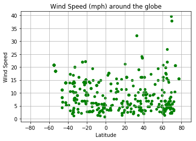
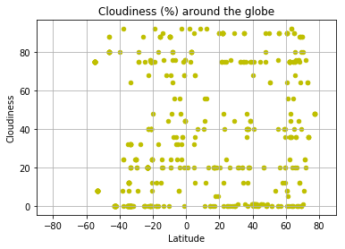

# WeatherPy Analysis

## Question 
The fundamental question that we are trying to answer in this exercise is:
"What's the weather like as we approach the equator?"

## Objective
To visualize the weather of 500+ randomly selected cities across the world of varying distance from the equator. To build a series of scatter plots to showcase the following relationships:

* Temperature (F) vs. Latitude
* Humidity (%) vs. Latitude
* Cloudiness (%) vs. Latitude
* Wind Speed (mph) vs. Latitude

## Technical Considerations
* Use python's library - [random](https://docs.python.org/3/library/random.html#), to generate the random city coordinates to be used. This will ensure that the coordinates are in fact not manually picked, but generated randomly
* Use a python library - [citipy](https://pypi.python.org/pypi/citipy), to get our list of cities from the randomly generated coordinates. This library will give us the nearest city for a given set of coordinates.
* Use the [OpenWeatherMap API](https://openweathermap.org/api) to get the weather data for all the cities that we get from our random coordinates
* Use Matplotlib libraries for Data Visualization

## Observations
From the plots in our analysis we see the following:
* Temperatures are higher on an average in the Southern Hemisphere and are lower in the Northern Hemisphere especially as we move away from the equator. Most cities in the southern hemisphere have temperatures above 50 deg F. Cities in the top 2/3rd of the Northern Hemisphere have temperatures in the range of -10 to 50 deg F.
* Cities near the equator have much higher temperatures than those away from the equator.
* There are a lot more cities with humidity in the 60% to 100% range around the globe. There are more cities in the southern hemisphere with higher humidity levels (80-100%).
* Most cities have wind speeds in the 0 to 20 mph range with more than half in the 0-10mph range.
* Cloudiness in cities is evenly distributed around the globe.

## Conclusion
Cities closer to the equator are hotter than cities away from the equator with more cities in the south of the equator being warmer. Proximity to the equator does not affect other factors like Humidity, Cloudiness or Wind Speed as much as it affects the Temperature

## Analysis Process
### Setting up the list of random cities around the globe
We use the citipy library to generate 150 random positive latitude numbers, negative latitude numbers, positive longitude numbers and negative longitude numbers. This will ensure that we have coordinate samples from all four quadrants of the globe. Furthermore we get random latitudes from two sections 0 to 45 and 45 to 90 in both hemispheres to ensure even distribution of latitudes close to and away from the equator. We generate more than 500 cities because we may not get weather data for some of them later.


```python
# Import Dependencies
from citipy import citipy
import random
import requests as req
import json
import matplotlib.pyplot as plt
import pandas as pd
import time
```


```python
# The API key for the OpenWeatherMap Api
api_key = "7e4ae0373bdeed043f36aeafca9fc7ff"

# The endpoint url for the api call to the OpenWeatherMap api
endpoint_url = "http://api.openweathermap.org/data/2.5/weather?q="
```


```python
# Generate 150 random positive latitude numbers, negative latitude numbers, positive longitude numbers 
# and negative longitude numbers. This will ensure that we have coordinate samples from all four quadrants 
# of the globe. Furthermore we get random latitudes from two sections 0 to 45 and 45 to 90 to ensure even distribution
# of latitudes close to and away from the equator
pos_lats = [random.uniform(0, 45) for x in range(75)]
pos_lats += [random.uniform(45, 90) for x in range(75)]

neg_lats = [random.uniform(0, -45) for x in range(75)]
neg_lats += [random.uniform(-45, -90) for x in range(75)]

pos_lons = [random.uniform(0, 180) for x in range(150)]
neg_lons = [random.uniform(0, -180) for x in range(150)]

# List of coordinates for our cities
coords = []

# Create a combination of positive and negative latitides and longitudes to get our city coordinates
# This will give us a list of (150 * 4) = 600 coordinates
for i in range(150):
    coords.append((pos_lats[i], pos_lons[i]))
    coords.append((pos_lats[i], neg_lons[i]))
    coords.append((neg_lats[i], pos_lons[i]))
    coords.append((neg_lats[i], neg_lons[i]))

# Use the citipy library to get the nearest city for each of the set of coordinates generated above. 
# This should give us a list of 600 random cities along with their country codes
cities = [citipy.nearest_city(coord[0], coord[1]) for coord in coords]
```


```python
# Create a city table with the city names and country codes that we have gathered above. We will add the 
# other weather information for these cities later
cities_df = pd.DataFrame(data = {"City Name": [city.city_name for city in cities],
                                "Country Code": [ city.country_code for city in cities]})
```


```python
# Add columns for the remaining data for all the cities that we will collect
cities_df = pd.concat([cities_df,pd.DataFrame(columns=["City ID", "Latitude", "Longitude", "Temperature", "Pressure", "Humidity", "Cloudiness", "Wind Speed"])])

# Reorder the columns
cities_df = cities_df[["City ID", "City Name", "Country Code", "Latitude", "Longitude", "Temperature", "Pressure", "Humidity", "Cloudiness", "Wind Speed"]]
```

### A sneak peak at the data table with the cities and country codes populated.


```python
cities_df.head()
```


<div>
<table border="1" class="dataframe">
  <thead>
    <tr style="text-align: right;">
      <th></th>
      <th>City ID</th>
      <th>City Name</th>
      <th>Country Code</th>
      <th>Latitude</th>
      <th>Longitude</th>
      <th>Temperature</th>
      <th>Pressure</th>
      <th>Humidity</th>
      <th>Cloudiness</th>
      <th>Wind Speed</th>
    </tr>
  </thead>
  <tbody>
    <tr>
      <th>0</th>
      <td>NaN</td>
      <td>oum hadjer</td>
      <td>td</td>
      <td>NaN</td>
      <td>NaN</td>
      <td>NaN</td>
      <td>NaN</td>
      <td>NaN</td>
      <td>NaN</td>
      <td>NaN</td>
    </tr>
    <tr>
      <th>1</th>
      <td>NaN</td>
      <td>san andres</td>
      <td>co</td>
      <td>NaN</td>
      <td>NaN</td>
      <td>NaN</td>
      <td>NaN</td>
      <td>NaN</td>
      <td>NaN</td>
      <td>NaN</td>
    </tr>
    <tr>
      <th>2</th>
      <td>NaN</td>
      <td>grootfontein</td>
      <td>na</td>
      <td>NaN</td>
      <td>NaN</td>
      <td>NaN</td>
      <td>NaN</td>
      <td>NaN</td>
      <td>NaN</td>
      <td>NaN</td>
    </tr>
    <tr>
      <th>3</th>
      <td>NaN</td>
      <td>marcona</td>
      <td>pe</td>
      <td>NaN</td>
      <td>NaN</td>
      <td>NaN</td>
      <td>NaN</td>
      <td>NaN</td>
      <td>NaN</td>
      <td>NaN</td>
    </tr>
    <tr>
      <th>4</th>
      <td>NaN</td>
      <td>nalut</td>
      <td>ly</td>
      <td>NaN</td>
      <td>NaN</td>
      <td>NaN</td>
      <td>NaN</td>
      <td>NaN</td>
      <td>NaN</td>
      <td>NaN</td>
    </tr>
  </tbody>
</table>
</div>


### Getting the weather data
We now loop through all the cities in our data frame and make an api call to the OpenWeatherMap Api. The Api Key we have allows for no more than 60 calls per minute. So after every 60 calls we pause for a  minute before moving to the next batch of 60 calls. If we get an error for any missing data for a city, we simply skip that city.


```python
## Function that takes in the index value for the cities_df and for the city at that index, 
# gets the weather info via the api call and populates the respective columns at that index

def get_city_weather(index):
    city_str = cities_df.at[index, "City Name"] + "," + cities_df.at[index, "Country Code"]
    target_url = endpoint_url + city_str + "&units=imperial&appid=" + api_key
    
    print("Getting Data for %s with target_url = %s" %(city_str, target_url))
    city_response = req.get(target_url).json()

    # Get the information in a try block to ignore any cities that don't have all the information 
    try:
        cities_df.at[index, "City ID"] = city_response["id"]
        cities_df.at[index, "Latitude"] = city_response["coord"]["lat"]
        cities_df.at[index, "Longitude"] = city_response["coord"]["lon"]
        cities_df.at[index, "Temperature"] = city_response["main"]["temp"]
        cities_df.at[index, "Pressure"] = city_response["main"]["pressure"]
        cities_df.at[index, "Humidity"] = city_response["main"]["humidity"]
        cities_df.at[index, "Cloudiness"] = city_response["clouds"]["all"]
        cities_df.at[index, "Wind Speed"] = city_response["wind"]["speed"]
    except KeyError:
        print("Ignoring row at index " + str(index) + " due to Key Error for " + city_str)


```


```python
# Get the weather data in batches of 60 cities as we have a limit of 60 per minute on api calls
for n in range(0,10):
    for row_index in range(n*60,(n*60)+60):
        get_city_weather(row_index)
    
    # Introduce a sleep time for just a minute for every 60th row because the OpenWeatherMap api has
    # a limit of no more than 60 requests in a minute. We do not need this after the last set.
    if n < 9:
        print("Wait for a minute. We've got data upto city index number : " + str(row_index))
        time.sleep(60)
```

    Getting Data for oum hadjer,td with target_url = http://api.openweathermap.org/data/2.5/weather?q=oum hadjer,td&units=imperial&appid=7e4ae0373bdeed043f36aeafca9fc7ff
    Getting Data for san andres,co with target_url = http://api.openweathermap.org/data/2.5/weather?q=san andres,co&units=imperial&appid=7e4ae0373bdeed043f36aeafca9fc7ff
    Getting Data for grootfontein,na with target_url = http://api.openweathermap.org/data/2.5/weather?q=grootfontein,na&units=imperial&appid=7e4ae0373bdeed043f36aeafca9fc7ff
    Getting Data for marcona,pe with target_url = http://api.openweathermap.org/data/2.5/weather?q=marcona,pe&units=imperial&appid=7e4ae0373bdeed043f36aeafca9fc7ff
    Ignoring row at index 3 due to Key Error for marcona,pe
    Getting Data for nalut,ly with target_url = http://api.openweathermap.org/data/2.5/weather?q=nalut,ly&units=imperial&appid=7e4ae0373bdeed043f36aeafca9fc7ff
    Getting Data for machico,pt with target_url = http://api.openweathermap.org/data/2.5/weather?q=machico,pt&units=imperial&appid=7e4ae0373bdeed043f36aeafca9fc7ff
    Getting Data for benguela,ao with target_url = http://api.openweathermap.org/data/2.5/weather?q=benguela,ao&units=imperial&appid=7e4ae0373bdeed043f36aeafca9fc7ff
    Getting Data for georgetown,sh with target_url = http://api.openweathermap.org/data/2.5/weather?q=georgetown,sh&units=imperial&appid=7e4ae0373bdeed043f36aeafca9fc7ff
    Getting Data for wanning,cn with target_url = http://api.openweathermap.org/data/2.5/weather?q=wanning,cn&units=imperial&appid=7e4ae0373bdeed043f36aeafca9fc7ff
    Getting Data for guerrero negro,mx with target_url = http://api.openweathermap.org/data/2.5/weather?q=guerrero negro,mx&units=imperial&appid=7e4ae0373bdeed043f36aeafca9fc7ff
    Getting Data for busselton,au with target_url = http://api.openweathermap.org/data/2.5/weather?q=busselton,au&units=imperial&appid=7e4ae0373bdeed043f36aeafca9fc7ff
    Getting Data for rikitea,pf with target_url = http://api.openweathermap.org/data/2.5/weather?q=rikitea,pf&units=imperial&appid=7e4ae0373bdeed043f36aeafca9fc7ff
    Getting Data for mandera,ke with target_url = http://api.openweathermap.org/data/2.5/weather?q=mandera,ke&units=imperial&appid=7e4ae0373bdeed043f36aeafca9fc7ff
    Getting Data for puerto ayora,ec with target_url = http://api.openweathermap.org/data/2.5/weather?q=puerto ayora,ec&units=imperial&appid=7e4ae0373bdeed043f36aeafca9fc7ff
    Getting Data for madimba,tz with target_url = http://api.openweathermap.org/data/2.5/weather?q=madimba,tz&units=imperial&appid=7e4ae0373bdeed043f36aeafca9fc7ff
    Getting Data for puerto ayora,ec with target_url = http://api.openweathermap.org/data/2.5/weather?q=puerto ayora,ec&units=imperial&appid=7e4ae0373bdeed043f36aeafca9fc7ff
    Getting Data for igbo ora,ng with target_url = http://api.openweathermap.org/data/2.5/weather?q=igbo ora,ng&units=imperial&appid=7e4ae0373bdeed043f36aeafca9fc7ff
    Getting Data for itarema,br with target_url = http://api.openweathermap.org/data/2.5/weather?q=itarema,br&units=imperial&appid=7e4ae0373bdeed043f36aeafca9fc7ff
    Getting Data for cape town,za with target_url = http://api.openweathermap.org/data/2.5/weather?q=cape town,za&units=imperial&appid=7e4ae0373bdeed043f36aeafca9fc7ff
    Getting Data for cidreira,br with target_url = http://api.openweathermap.org/data/2.5/weather?q=cidreira,br&units=imperial&appid=7e4ae0373bdeed043f36aeafca9fc7ff
    Getting Data for erenhot,cn with target_url = http://api.openweathermap.org/data/2.5/weather?q=erenhot,cn&units=imperial&appid=7e4ae0373bdeed043f36aeafca9fc7ff
    Getting Data for torbay,ca with target_url = http://api.openweathermap.org/data/2.5/weather?q=torbay,ca&units=imperial&appid=7e4ae0373bdeed043f36aeafca9fc7ff
    Getting Data for geraldton,au with target_url = http://api.openweathermap.org/data/2.5/weather?q=geraldton,au&units=imperial&appid=7e4ae0373bdeed043f36aeafca9fc7ff
    Getting Data for imbituba,br with target_url = http://api.openweathermap.org/data/2.5/weather?q=imbituba,br&units=imperial&appid=7e4ae0373bdeed043f36aeafca9fc7ff
    Getting Data for jalu,ly with target_url = http://api.openweathermap.org/data/2.5/weather?q=jalu,ly&units=imperial&appid=7e4ae0373bdeed043f36aeafca9fc7ff
    Getting Data for hamilton,bm with target_url = http://api.openweathermap.org/data/2.5/weather?q=hamilton,bm&units=imperial&appid=7e4ae0373bdeed043f36aeafca9fc7ff
    Getting Data for tsabong,bw with target_url = http://api.openweathermap.org/data/2.5/weather?q=tsabong,bw&units=imperial&appid=7e4ae0373bdeed043f36aeafca9fc7ff
    Getting Data for diego de almagro,cl with target_url = http://api.openweathermap.org/data/2.5/weather?q=diego de almagro,cl&units=imperial&appid=7e4ae0373bdeed043f36aeafca9fc7ff
    Getting Data for shenjiamen,cn with target_url = http://api.openweathermap.org/data/2.5/weather?q=shenjiamen,cn&units=imperial&appid=7e4ae0373bdeed043f36aeafca9fc7ff
    Getting Data for los llanos de aridane,es with target_url = http://api.openweathermap.org/data/2.5/weather?q=los llanos de aridane,es&units=imperial&appid=7e4ae0373bdeed043f36aeafca9fc7ff
    Getting Data for esperance,au with target_url = http://api.openweathermap.org/data/2.5/weather?q=esperance,au&units=imperial&appid=7e4ae0373bdeed043f36aeafca9fc7ff
    Getting Data for arraial do cabo,br with target_url = http://api.openweathermap.org/data/2.5/weather?q=arraial do cabo,br&units=imperial&appid=7e4ae0373bdeed043f36aeafca9fc7ff
    Getting Data for jingdezhen,cn with target_url = http://api.openweathermap.org/data/2.5/weather?q=jingdezhen,cn&units=imperial&appid=7e4ae0373bdeed043f36aeafca9fc7ff
    Getting Data for madera,mx with target_url = http://api.openweathermap.org/data/2.5/weather?q=madera,mx&units=imperial&appid=7e4ae0373bdeed043f36aeafca9fc7ff
    Getting Data for port hedland,au with target_url = http://api.openweathermap.org/data/2.5/weather?q=port hedland,au&units=imperial&appid=7e4ae0373bdeed043f36aeafca9fc7ff
    Getting Data for puerto ayora,ec with target_url = http://api.openweathermap.org/data/2.5/weather?q=puerto ayora,ec&units=imperial&appid=7e4ae0373bdeed043f36aeafca9fc7ff
    Getting Data for butaritari,ki with target_url = http://api.openweathermap.org/data/2.5/weather?q=butaritari,ki&units=imperial&appid=7e4ae0373bdeed043f36aeafca9fc7ff
    Getting Data for matamoros,mx with target_url = http://api.openweathermap.org/data/2.5/weather?q=matamoros,mx&units=imperial&appid=7e4ae0373bdeed043f36aeafca9fc7ff
    Getting Data for ahipara,nz with target_url = http://api.openweathermap.org/data/2.5/weather?q=ahipara,nz&units=imperial&appid=7e4ae0373bdeed043f36aeafca9fc7ff
    Getting Data for lebu,cl with target_url = http://api.openweathermap.org/data/2.5/weather?q=lebu,cl&units=imperial&appid=7e4ae0373bdeed043f36aeafca9fc7ff
    Getting Data for korla,cn with target_url = http://api.openweathermap.org/data/2.5/weather?q=korla,cn&units=imperial&appid=7e4ae0373bdeed043f36aeafca9fc7ff
    Getting Data for kapaa,us with target_url = http://api.openweathermap.org/data/2.5/weather?q=kapaa,us&units=imperial&appid=7e4ae0373bdeed043f36aeafca9fc7ff
    Getting Data for carnarvon,au with target_url = http://api.openweathermap.org/data/2.5/weather?q=carnarvon,au&units=imperial&appid=7e4ae0373bdeed043f36aeafca9fc7ff
    Getting Data for vaini,to with target_url = http://api.openweathermap.org/data/2.5/weather?q=vaini,to&units=imperial&appid=7e4ae0373bdeed043f36aeafca9fc7ff
    Getting Data for butaritari,ki with target_url = http://api.openweathermap.org/data/2.5/weather?q=butaritari,ki&units=imperial&appid=7e4ae0373bdeed043f36aeafca9fc7ff
    Getting Data for tomatlan,mx with target_url = http://api.openweathermap.org/data/2.5/weather?q=tomatlan,mx&units=imperial&appid=7e4ae0373bdeed043f36aeafca9fc7ff
    Getting Data for lolua,tv with target_url = http://api.openweathermap.org/data/2.5/weather?q=lolua,tv&units=imperial&appid=7e4ae0373bdeed043f36aeafca9fc7ff
    Ignoring row at index 46 due to Key Error for lolua,tv
    Getting Data for puerto ayora,ec with target_url = http://api.openweathermap.org/data/2.5/weather?q=puerto ayora,ec&units=imperial&appid=7e4ae0373bdeed043f36aeafca9fc7ff
    Getting Data for sinnar,sd with target_url = http://api.openweathermap.org/data/2.5/weather?q=sinnar,sd&units=imperial&appid=7e4ae0373bdeed043f36aeafca9fc7ff
    Getting Data for kapaa,us with target_url = http://api.openweathermap.org/data/2.5/weather?q=kapaa,us&units=imperial&appid=7e4ae0373bdeed043f36aeafca9fc7ff
    Getting Data for umzimvubu,za with target_url = http://api.openweathermap.org/data/2.5/weather?q=umzimvubu,za&units=imperial&appid=7e4ae0373bdeed043f36aeafca9fc7ff
    Ignoring row at index 50 due to Key Error for umzimvubu,za
    Getting Data for avarua,ck with target_url = http://api.openweathermap.org/data/2.5/weather?q=avarua,ck&units=imperial&appid=7e4ae0373bdeed043f36aeafca9fc7ff
    Getting Data for najran,sa with target_url = http://api.openweathermap.org/data/2.5/weather?q=najran,sa&units=imperial&appid=7e4ae0373bdeed043f36aeafca9fc7ff
    Getting Data for pedernales,do with target_url = http://api.openweathermap.org/data/2.5/weather?q=pedernales,do&units=imperial&appid=7e4ae0373bdeed043f36aeafca9fc7ff
    Getting Data for tsihombe,mg with target_url = http://api.openweathermap.org/data/2.5/weather?q=tsihombe,mg&units=imperial&appid=7e4ae0373bdeed043f36aeafca9fc7ff
    Ignoring row at index 54 due to Key Error for tsihombe,mg
    Getting Data for valparaiso,cl with target_url = http://api.openweathermap.org/data/2.5/weather?q=valparaiso,cl&units=imperial&appid=7e4ae0373bdeed043f36aeafca9fc7ff
    Getting Data for betare oya,cm with target_url = http://api.openweathermap.org/data/2.5/weather?q=betare oya,cm&units=imperial&appid=7e4ae0373bdeed043f36aeafca9fc7ff
    Getting Data for hilo,us with target_url = http://api.openweathermap.org/data/2.5/weather?q=hilo,us&units=imperial&appid=7e4ae0373bdeed043f36aeafca9fc7ff
    Getting Data for mounana,ga with target_url = http://api.openweathermap.org/data/2.5/weather?q=mounana,ga&units=imperial&appid=7e4ae0373bdeed043f36aeafca9fc7ff
    Getting Data for faanui,pf with target_url = http://api.openweathermap.org/data/2.5/weather?q=faanui,pf&units=imperial&appid=7e4ae0373bdeed043f36aeafca9fc7ff
    Wait for a minute. We've got data upto city index number : 59
    Getting Data for butaritari,ki with target_url = http://api.openweathermap.org/data/2.5/weather?q=butaritari,ki&units=imperial&appid=7e4ae0373bdeed043f36aeafca9fc7ff
    Getting Data for kapaa,us with target_url = http://api.openweathermap.org/data/2.5/weather?q=kapaa,us&units=imperial&appid=7e4ae0373bdeed043f36aeafca9fc7ff
    Getting Data for auki,sb with target_url = http://api.openweathermap.org/data/2.5/weather?q=auki,sb&units=imperial&appid=7e4ae0373bdeed043f36aeafca9fc7ff
    Getting Data for vaitupu,wf with target_url = http://api.openweathermap.org/data/2.5/weather?q=vaitupu,wf&units=imperial&appid=7e4ae0373bdeed043f36aeafca9fc7ff
    Ignoring row at index 63 due to Key Error for vaitupu,wf
    Getting Data for bandarbeyla,so with target_url = http://api.openweathermap.org/data/2.5/weather?q=bandarbeyla,so&units=imperial&appid=7e4ae0373bdeed043f36aeafca9fc7ff
    Getting Data for makakilo city,us with target_url = http://api.openweathermap.org/data/2.5/weather?q=makakilo city,us&units=imperial&appid=7e4ae0373bdeed043f36aeafca9fc7ff
    Getting Data for farafangana,mg with target_url = http://api.openweathermap.org/data/2.5/weather?q=farafangana,mg&units=imperial&appid=7e4ae0373bdeed043f36aeafca9fc7ff
    Getting Data for avarua,ck with target_url = http://api.openweathermap.org/data/2.5/weather?q=avarua,ck&units=imperial&appid=7e4ae0373bdeed043f36aeafca9fc7ff
    Getting Data for viransehir,tr with target_url = http://api.openweathermap.org/data/2.5/weather?q=viransehir,tr&units=imperial&appid=7e4ae0373bdeed043f36aeafca9fc7ff
    Getting Data for kapaa,us with target_url = http://api.openweathermap.org/data/2.5/weather?q=kapaa,us&units=imperial&appid=7e4ae0373bdeed043f36aeafca9fc7ff
    Getting Data for richards bay,za with target_url = http://api.openweathermap.org/data/2.5/weather?q=richards bay,za&units=imperial&appid=7e4ae0373bdeed043f36aeafca9fc7ff
    Getting Data for vaini,to with target_url = http://api.openweathermap.org/data/2.5/weather?q=vaini,to&units=imperial&appid=7e4ae0373bdeed043f36aeafca9fc7ff
    Getting Data for bilma,ne with target_url = http://api.openweathermap.org/data/2.5/weather?q=bilma,ne&units=imperial&appid=7e4ae0373bdeed043f36aeafca9fc7ff
    Getting Data for nioro,ml with target_url = http://api.openweathermap.org/data/2.5/weather?q=nioro,ml&units=imperial&appid=7e4ae0373bdeed043f36aeafca9fc7ff
    Ignoring row at index 73 due to Key Error for nioro,ml
    Getting Data for cape town,za with target_url = http://api.openweathermap.org/data/2.5/weather?q=cape town,za&units=imperial&appid=7e4ae0373bdeed043f36aeafca9fc7ff
    Getting Data for jamestown,sh with target_url = http://api.openweathermap.org/data/2.5/weather?q=jamestown,sh&units=imperial&appid=7e4ae0373bdeed043f36aeafca9fc7ff
    Getting Data for airai,pw with target_url = http://api.openweathermap.org/data/2.5/weather?q=airai,pw&units=imperial&appid=7e4ae0373bdeed043f36aeafca9fc7ff
    Ignoring row at index 76 due to Key Error for airai,pw
    Getting Data for bathsheba,bb with target_url = http://api.openweathermap.org/data/2.5/weather?q=bathsheba,bb&units=imperial&appid=7e4ae0373bdeed043f36aeafca9fc7ff
    Getting Data for mareeba,au with target_url = http://api.openweathermap.org/data/2.5/weather?q=mareeba,au&units=imperial&appid=7e4ae0373bdeed043f36aeafca9fc7ff
    Getting Data for rondonopolis,br with target_url = http://api.openweathermap.org/data/2.5/weather?q=rondonopolis,br&units=imperial&appid=7e4ae0373bdeed043f36aeafca9fc7ff
    Getting Data for dicabisagan,ph with target_url = http://api.openweathermap.org/data/2.5/weather?q=dicabisagan,ph&units=imperial&appid=7e4ae0373bdeed043f36aeafca9fc7ff
    Getting Data for barra patuca,hn with target_url = http://api.openweathermap.org/data/2.5/weather?q=barra patuca,hn&units=imperial&appid=7e4ae0373bdeed043f36aeafca9fc7ff
    Getting Data for kupang,id with target_url = http://api.openweathermap.org/data/2.5/weather?q=kupang,id&units=imperial&appid=7e4ae0373bdeed043f36aeafca9fc7ff
    Getting Data for chicama,pe with target_url = http://api.openweathermap.org/data/2.5/weather?q=chicama,pe&units=imperial&appid=7e4ae0373bdeed043f36aeafca9fc7ff
    Getting Data for latung,ph with target_url = http://api.openweathermap.org/data/2.5/weather?q=latung,ph&units=imperial&appid=7e4ae0373bdeed043f36aeafca9fc7ff
    Getting Data for atuona,pf with target_url = http://api.openweathermap.org/data/2.5/weather?q=atuona,pf&units=imperial&appid=7e4ae0373bdeed043f36aeafca9fc7ff
    Getting Data for poso,id with target_url = http://api.openweathermap.org/data/2.5/weather?q=poso,id&units=imperial&appid=7e4ae0373bdeed043f36aeafca9fc7ff
    Getting Data for atuona,pf with target_url = http://api.openweathermap.org/data/2.5/weather?q=atuona,pf&units=imperial&appid=7e4ae0373bdeed043f36aeafca9fc7ff
    Getting Data for hasaki,jp with target_url = http://api.openweathermap.org/data/2.5/weather?q=hasaki,jp&units=imperial&appid=7e4ae0373bdeed043f36aeafca9fc7ff
    Getting Data for hilo,us with target_url = http://api.openweathermap.org/data/2.5/weather?q=hilo,us&units=imperial&appid=7e4ae0373bdeed043f36aeafca9fc7ff
    Getting Data for honiara,sb with target_url = http://api.openweathermap.org/data/2.5/weather?q=honiara,sb&units=imperial&appid=7e4ae0373bdeed043f36aeafca9fc7ff
    Getting Data for tiarei,pf with target_url = http://api.openweathermap.org/data/2.5/weather?q=tiarei,pf&units=imperial&appid=7e4ae0373bdeed043f36aeafca9fc7ff
    Getting Data for butaritari,ki with target_url = http://api.openweathermap.org/data/2.5/weather?q=butaritari,ki&units=imperial&appid=7e4ae0373bdeed043f36aeafca9fc7ff
    Getting Data for boromo,bf with target_url = http://api.openweathermap.org/data/2.5/weather?q=boromo,bf&units=imperial&appid=7e4ae0373bdeed043f36aeafca9fc7ff
    Getting Data for vao,nc with target_url = http://api.openweathermap.org/data/2.5/weather?q=vao,nc&units=imperial&appid=7e4ae0373bdeed043f36aeafca9fc7ff
    Getting Data for jamestown,sh with target_url = http://api.openweathermap.org/data/2.5/weather?q=jamestown,sh&units=imperial&appid=7e4ae0373bdeed043f36aeafca9fc7ff
    Getting Data for jumla,np with target_url = http://api.openweathermap.org/data/2.5/weather?q=jumla,np&units=imperial&appid=7e4ae0373bdeed043f36aeafca9fc7ff
    Getting Data for tifton,us with target_url = http://api.openweathermap.org/data/2.5/weather?q=tifton,us&units=imperial&appid=7e4ae0373bdeed043f36aeafca9fc7ff
    Getting Data for busselton,au with target_url = http://api.openweathermap.org/data/2.5/weather?q=busselton,au&units=imperial&appid=7e4ae0373bdeed043f36aeafca9fc7ff
    Getting Data for castro,cl with target_url = http://api.openweathermap.org/data/2.5/weather?q=castro,cl&units=imperial&appid=7e4ae0373bdeed043f36aeafca9fc7ff
    Getting Data for airai,pw with target_url = http://api.openweathermap.org/data/2.5/weather?q=airai,pw&units=imperial&appid=7e4ae0373bdeed043f36aeafca9fc7ff
    Ignoring row at index 100 due to Key Error for airai,pw
    Getting Data for pinotepa nacional,mx with target_url = http://api.openweathermap.org/data/2.5/weather?q=pinotepa nacional,mx&units=imperial&appid=7e4ae0373bdeed043f36aeafca9fc7ff
    Ignoring row at index 101 due to Key Error for pinotepa nacional,mx
    Getting Data for broken hill,au with target_url = http://api.openweathermap.org/data/2.5/weather?q=broken hill,au&units=imperial&appid=7e4ae0373bdeed043f36aeafca9fc7ff
    Getting Data for pisco,pe with target_url = http://api.openweathermap.org/data/2.5/weather?q=pisco,pe&units=imperial&appid=7e4ae0373bdeed043f36aeafca9fc7ff
    Getting Data for katsuura,jp with target_url = http://api.openweathermap.org/data/2.5/weather?q=katsuura,jp&units=imperial&appid=7e4ae0373bdeed043f36aeafca9fc7ff
    Getting Data for dzilam gonzalez,mx with target_url = http://api.openweathermap.org/data/2.5/weather?q=dzilam gonzalez,mx&units=imperial&appid=7e4ae0373bdeed043f36aeafca9fc7ff
    Getting Data for launceston,au with target_url = http://api.openweathermap.org/data/2.5/weather?q=launceston,au&units=imperial&appid=7e4ae0373bdeed043f36aeafca9fc7ff
    Getting Data for ancud,cl with target_url = http://api.openweathermap.org/data/2.5/weather?q=ancud,cl&units=imperial&appid=7e4ae0373bdeed043f36aeafca9fc7ff
    Getting Data for xam nua,la with target_url = http://api.openweathermap.org/data/2.5/weather?q=xam nua,la&units=imperial&appid=7e4ae0373bdeed043f36aeafca9fc7ff
    Getting Data for ponta do sol,cv with target_url = http://api.openweathermap.org/data/2.5/weather?q=ponta do sol,cv&units=imperial&appid=7e4ae0373bdeed043f36aeafca9fc7ff
    Getting Data for busselton,au with target_url = http://api.openweathermap.org/data/2.5/weather?q=busselton,au&units=imperial&appid=7e4ae0373bdeed043f36aeafca9fc7ff
    Getting Data for chuy,uy with target_url = http://api.openweathermap.org/data/2.5/weather?q=chuy,uy&units=imperial&appid=7e4ae0373bdeed043f36aeafca9fc7ff
    Getting Data for umm lajj,sa with target_url = http://api.openweathermap.org/data/2.5/weather?q=umm lajj,sa&units=imperial&appid=7e4ae0373bdeed043f36aeafca9fc7ff
    Getting Data for adrar,dz with target_url = http://api.openweathermap.org/data/2.5/weather?q=adrar,dz&units=imperial&appid=7e4ae0373bdeed043f36aeafca9fc7ff
    Getting Data for inhambane,mz with target_url = http://api.openweathermap.org/data/2.5/weather?q=inhambane,mz&units=imperial&appid=7e4ae0373bdeed043f36aeafca9fc7ff
    Getting Data for jamestown,sh with target_url = http://api.openweathermap.org/data/2.5/weather?q=jamestown,sh&units=imperial&appid=7e4ae0373bdeed043f36aeafca9fc7ff
    Getting Data for ugoofaaru,mv with target_url = http://api.openweathermap.org/data/2.5/weather?q=ugoofaaru,mv&units=imperial&appid=7e4ae0373bdeed043f36aeafca9fc7ff
    Getting Data for san patricio,mx with target_url = http://api.openweathermap.org/data/2.5/weather?q=san patricio,mx&units=imperial&appid=7e4ae0373bdeed043f36aeafca9fc7ff
    Getting Data for grand gaube,mu with target_url = http://api.openweathermap.org/data/2.5/weather?q=grand gaube,mu&units=imperial&appid=7e4ae0373bdeed043f36aeafca9fc7ff
    Getting Data for rikitea,pf with target_url = http://api.openweathermap.org/data/2.5/weather?q=rikitea,pf&units=imperial&appid=7e4ae0373bdeed043f36aeafca9fc7ff
    Wait for a minute. We've got data upto city index number : 119
    Getting Data for abnub,eg with target_url = http://api.openweathermap.org/data/2.5/weather?q=abnub,eg&units=imperial&appid=7e4ae0373bdeed043f36aeafca9fc7ff
    Getting Data for the valley,ai with target_url = http://api.openweathermap.org/data/2.5/weather?q=the valley,ai&units=imperial&appid=7e4ae0373bdeed043f36aeafca9fc7ff
    Getting Data for mosetse,bw with target_url = http://api.openweathermap.org/data/2.5/weather?q=mosetse,bw&units=imperial&appid=7e4ae0373bdeed043f36aeafca9fc7ff
    Getting Data for mayor pablo lagerenza,py with target_url = http://api.openweathermap.org/data/2.5/weather?q=mayor pablo lagerenza,py&units=imperial&appid=7e4ae0373bdeed043f36aeafca9fc7ff
    Getting Data for miyako,jp with target_url = http://api.openweathermap.org/data/2.5/weather?q=miyako,jp&units=imperial&appid=7e4ae0373bdeed043f36aeafca9fc7ff
    Getting Data for mastic beach,us with target_url = http://api.openweathermap.org/data/2.5/weather?q=mastic beach,us&units=imperial&appid=7e4ae0373bdeed043f36aeafca9fc7ff
    Getting Data for daru,pg with target_url = http://api.openweathermap.org/data/2.5/weather?q=daru,pg&units=imperial&appid=7e4ae0373bdeed043f36aeafca9fc7ff
    Getting Data for porto walter,br with target_url = http://api.openweathermap.org/data/2.5/weather?q=porto walter,br&units=imperial&appid=7e4ae0373bdeed043f36aeafca9fc7ff
    Getting Data for tibati,cm with target_url = http://api.openweathermap.org/data/2.5/weather?q=tibati,cm&units=imperial&appid=7e4ae0373bdeed043f36aeafca9fc7ff
    Getting Data for saint-georges,gf with target_url = http://api.openweathermap.org/data/2.5/weather?q=saint-georges,gf&units=imperial&appid=7e4ae0373bdeed043f36aeafca9fc7ff
    Ignoring row at index 129 due to Key Error for saint-georges,gf
    Getting Data for cape town,za with target_url = http://api.openweathermap.org/data/2.5/weather?q=cape town,za&units=imperial&appid=7e4ae0373bdeed043f36aeafca9fc7ff
    Getting Data for chuy,uy with target_url = http://api.openweathermap.org/data/2.5/weather?q=chuy,uy&units=imperial&appid=7e4ae0373bdeed043f36aeafca9fc7ff
    Getting Data for yumen,cn with target_url = http://api.openweathermap.org/data/2.5/weather?q=yumen,cn&units=imperial&appid=7e4ae0373bdeed043f36aeafca9fc7ff
    Getting Data for goodlettsville,us with target_url = http://api.openweathermap.org/data/2.5/weather?q=goodlettsville,us&units=imperial&appid=7e4ae0373bdeed043f36aeafca9fc7ff
    Getting Data for bengkulu,id with target_url = http://api.openweathermap.org/data/2.5/weather?q=bengkulu,id&units=imperial&appid=7e4ae0373bdeed043f36aeafca9fc7ff
    Ignoring row at index 134 due to Key Error for bengkulu,id
    Getting Data for pisco,pe with target_url = http://api.openweathermap.org/data/2.5/weather?q=pisco,pe&units=imperial&appid=7e4ae0373bdeed043f36aeafca9fc7ff
    Getting Data for arlit,ne with target_url = http://api.openweathermap.org/data/2.5/weather?q=arlit,ne&units=imperial&appid=7e4ae0373bdeed043f36aeafca9fc7ff
    Getting Data for hilo,us with target_url = http://api.openweathermap.org/data/2.5/weather?q=hilo,us&units=imperial&appid=7e4ae0373bdeed043f36aeafca9fc7ff
    Getting Data for cape town,za with target_url = http://api.openweathermap.org/data/2.5/weather?q=cape town,za&units=imperial&appid=7e4ae0373bdeed043f36aeafca9fc7ff
    Getting Data for mataura,pf with target_url = http://api.openweathermap.org/data/2.5/weather?q=mataura,pf&units=imperial&appid=7e4ae0373bdeed043f36aeafca9fc7ff
    Ignoring row at index 139 due to Key Error for mataura,pf
    Getting Data for limbang,my with target_url = http://api.openweathermap.org/data/2.5/weather?q=limbang,my&units=imperial&appid=7e4ae0373bdeed043f36aeafca9fc7ff
    Getting Data for atuona,pf with target_url = http://api.openweathermap.org/data/2.5/weather?q=atuona,pf&units=imperial&appid=7e4ae0373bdeed043f36aeafca9fc7ff
    Getting Data for albany,au with target_url = http://api.openweathermap.org/data/2.5/weather?q=albany,au&units=imperial&appid=7e4ae0373bdeed043f36aeafca9fc7ff
    Getting Data for rikitea,pf with target_url = http://api.openweathermap.org/data/2.5/weather?q=rikitea,pf&units=imperial&appid=7e4ae0373bdeed043f36aeafca9fc7ff
    Getting Data for kurara,in with target_url = http://api.openweathermap.org/data/2.5/weather?q=kurara,in&units=imperial&appid=7e4ae0373bdeed043f36aeafca9fc7ff
    Getting Data for kapaa,us with target_url = http://api.openweathermap.org/data/2.5/weather?q=kapaa,us&units=imperial&appid=7e4ae0373bdeed043f36aeafca9fc7ff
    Getting Data for hithadhoo,mv with target_url = http://api.openweathermap.org/data/2.5/weather?q=hithadhoo,mv&units=imperial&appid=7e4ae0373bdeed043f36aeafca9fc7ff
    Getting Data for samusu,ws with target_url = http://api.openweathermap.org/data/2.5/weather?q=samusu,ws&units=imperial&appid=7e4ae0373bdeed043f36aeafca9fc7ff
    Ignoring row at index 147 due to Key Error for samusu,ws
    Getting Data for san vicente,ph with target_url = http://api.openweathermap.org/data/2.5/weather?q=san vicente,ph&units=imperial&appid=7e4ae0373bdeed043f36aeafca9fc7ff
    Getting Data for hilo,us with target_url = http://api.openweathermap.org/data/2.5/weather?q=hilo,us&units=imperial&appid=7e4ae0373bdeed043f36aeafca9fc7ff
    Getting Data for esperance,au with target_url = http://api.openweathermap.org/data/2.5/weather?q=esperance,au&units=imperial&appid=7e4ae0373bdeed043f36aeafca9fc7ff
    Getting Data for mataura,pf with target_url = http://api.openweathermap.org/data/2.5/weather?q=mataura,pf&units=imperial&appid=7e4ae0373bdeed043f36aeafca9fc7ff
    Ignoring row at index 151 due to Key Error for mataura,pf
    Getting Data for porbandar,in with target_url = http://api.openweathermap.org/data/2.5/weather?q=porbandar,in&units=imperial&appid=7e4ae0373bdeed043f36aeafca9fc7ff
    Getting Data for ponta do sol,cv with target_url = http://api.openweathermap.org/data/2.5/weather?q=ponta do sol,cv&units=imperial&appid=7e4ae0373bdeed043f36aeafca9fc7ff
    Getting Data for hithadhoo,mv with target_url = http://api.openweathermap.org/data/2.5/weather?q=hithadhoo,mv&units=imperial&appid=7e4ae0373bdeed043f36aeafca9fc7ff
    Getting Data for pitimbu,br with target_url = http://api.openweathermap.org/data/2.5/weather?q=pitimbu,br&units=imperial&appid=7e4ae0373bdeed043f36aeafca9fc7ff
    Getting Data for hasaki,jp with target_url = http://api.openweathermap.org/data/2.5/weather?q=hasaki,jp&units=imperial&appid=7e4ae0373bdeed043f36aeafca9fc7ff
    Getting Data for hilo,us with target_url = http://api.openweathermap.org/data/2.5/weather?q=hilo,us&units=imperial&appid=7e4ae0373bdeed043f36aeafca9fc7ff
    Getting Data for poum,nc with target_url = http://api.openweathermap.org/data/2.5/weather?q=poum,nc&units=imperial&appid=7e4ae0373bdeed043f36aeafca9fc7ff
    Getting Data for rikitea,pf with target_url = http://api.openweathermap.org/data/2.5/weather?q=rikitea,pf&units=imperial&appid=7e4ae0373bdeed043f36aeafca9fc7ff
    Getting Data for nikolskoye,ru with target_url = http://api.openweathermap.org/data/2.5/weather?q=nikolskoye,ru&units=imperial&appid=7e4ae0373bdeed043f36aeafca9fc7ff
    Getting Data for lagoa,pt with target_url = http://api.openweathermap.org/data/2.5/weather?q=lagoa,pt&units=imperial&appid=7e4ae0373bdeed043f36aeafca9fc7ff
    Getting Data for sola,vu with target_url = http://api.openweathermap.org/data/2.5/weather?q=sola,vu&units=imperial&appid=7e4ae0373bdeed043f36aeafca9fc7ff
    Getting Data for sao jose da coroa grande,br with target_url = http://api.openweathermap.org/data/2.5/weather?q=sao jose da coroa grande,br&units=imperial&appid=7e4ae0373bdeed043f36aeafca9fc7ff
    Getting Data for jogbani,in with target_url = http://api.openweathermap.org/data/2.5/weather?q=jogbani,in&units=imperial&appid=7e4ae0373bdeed043f36aeafca9fc7ff
    Getting Data for los llanos de aridane,es with target_url = http://api.openweathermap.org/data/2.5/weather?q=los llanos de aridane,es&units=imperial&appid=7e4ae0373bdeed043f36aeafca9fc7ff
    Getting Data for bengkulu,id with target_url = http://api.openweathermap.org/data/2.5/weather?q=bengkulu,id&units=imperial&appid=7e4ae0373bdeed043f36aeafca9fc7ff
    Ignoring row at index 166 due to Key Error for bengkulu,id
    Getting Data for georgetown,sh with target_url = http://api.openweathermap.org/data/2.5/weather?q=georgetown,sh&units=imperial&appid=7e4ae0373bdeed043f36aeafca9fc7ff
    Getting Data for urumqi,cn with target_url = http://api.openweathermap.org/data/2.5/weather?q=urumqi,cn&units=imperial&appid=7e4ae0373bdeed043f36aeafca9fc7ff
    Ignoring row at index 168 due to Key Error for urumqi,cn
    Getting Data for lagoa,pt with target_url = http://api.openweathermap.org/data/2.5/weather?q=lagoa,pt&units=imperial&appid=7e4ae0373bdeed043f36aeafca9fc7ff
    Getting Data for carnarvon,au with target_url = http://api.openweathermap.org/data/2.5/weather?q=carnarvon,au&units=imperial&appid=7e4ae0373bdeed043f36aeafca9fc7ff
    Getting Data for vila velha,br with target_url = http://api.openweathermap.org/data/2.5/weather?q=vila velha,br&units=imperial&appid=7e4ae0373bdeed043f36aeafca9fc7ff
    Getting Data for neyshabur,ir with target_url = http://api.openweathermap.org/data/2.5/weather?q=neyshabur,ir&units=imperial&appid=7e4ae0373bdeed043f36aeafca9fc7ff
    Getting Data for kapaa,us with target_url = http://api.openweathermap.org/data/2.5/weather?q=kapaa,us&units=imperial&appid=7e4ae0373bdeed043f36aeafca9fc7ff
    Getting Data for cap malheureux,mu with target_url = http://api.openweathermap.org/data/2.5/weather?q=cap malheureux,mu&units=imperial&appid=7e4ae0373bdeed043f36aeafca9fc7ff
    Getting Data for halalo,wf with target_url = http://api.openweathermap.org/data/2.5/weather?q=halalo,wf&units=imperial&appid=7e4ae0373bdeed043f36aeafca9fc7ff
    Ignoring row at index 175 due to Key Error for halalo,wf
    Getting Data for bandarbeyla,so with target_url = http://api.openweathermap.org/data/2.5/weather?q=bandarbeyla,so&units=imperial&appid=7e4ae0373bdeed043f36aeafca9fc7ff
    Getting Data for cayenne,gf with target_url = http://api.openweathermap.org/data/2.5/weather?q=cayenne,gf&units=imperial&appid=7e4ae0373bdeed043f36aeafca9fc7ff
    Getting Data for saint-philippe,re with target_url = http://api.openweathermap.org/data/2.5/weather?q=saint-philippe,re&units=imperial&appid=7e4ae0373bdeed043f36aeafca9fc7ff
    Getting Data for pocos de caldas,br with target_url = http://api.openweathermap.org/data/2.5/weather?q=pocos de caldas,br&units=imperial&appid=7e4ae0373bdeed043f36aeafca9fc7ff
    Wait for a minute. We've got data upto city index number : 179
    Getting Data for dindigul,in with target_url = http://api.openweathermap.org/data/2.5/weather?q=dindigul,in&units=imperial&appid=7e4ae0373bdeed043f36aeafca9fc7ff
    Getting Data for kapaa,us with target_url = http://api.openweathermap.org/data/2.5/weather?q=kapaa,us&units=imperial&appid=7e4ae0373bdeed043f36aeafca9fc7ff
    Getting Data for hithadhoo,mv with target_url = http://api.openweathermap.org/data/2.5/weather?q=hithadhoo,mv&units=imperial&appid=7e4ae0373bdeed043f36aeafca9fc7ff
    Getting Data for lufilufi,ws with target_url = http://api.openweathermap.org/data/2.5/weather?q=lufilufi,ws&units=imperial&appid=7e4ae0373bdeed043f36aeafca9fc7ff
    Getting Data for sukhumi,ge with target_url = http://api.openweathermap.org/data/2.5/weather?q=sukhumi,ge&units=imperial&appid=7e4ae0373bdeed043f36aeafca9fc7ff
    Ignoring row at index 184 due to Key Error for sukhumi,ge
    Getting Data for carballo,es with target_url = http://api.openweathermap.org/data/2.5/weather?q=carballo,es&units=imperial&appid=7e4ae0373bdeed043f36aeafca9fc7ff
    Getting Data for richards bay,za with target_url = http://api.openweathermap.org/data/2.5/weather?q=richards bay,za&units=imperial&appid=7e4ae0373bdeed043f36aeafca9fc7ff
    Getting Data for jamestown,sh with target_url = http://api.openweathermap.org/data/2.5/weather?q=jamestown,sh&units=imperial&appid=7e4ae0373bdeed043f36aeafca9fc7ff
    Getting Data for nikolskoye,ru with target_url = http://api.openweathermap.org/data/2.5/weather?q=nikolskoye,ru&units=imperial&appid=7e4ae0373bdeed043f36aeafca9fc7ff
    Getting Data for provideniya,ru with target_url = http://api.openweathermap.org/data/2.5/weather?q=provideniya,ru&units=imperial&appid=7e4ae0373bdeed043f36aeafca9fc7ff
    Getting Data for asau,tv with target_url = http://api.openweathermap.org/data/2.5/weather?q=asau,tv&units=imperial&appid=7e4ae0373bdeed043f36aeafca9fc7ff
    Ignoring row at index 190 due to Key Error for asau,tv
    Getting Data for vaitupu,wf with target_url = http://api.openweathermap.org/data/2.5/weather?q=vaitupu,wf&units=imperial&appid=7e4ae0373bdeed043f36aeafca9fc7ff
    Ignoring row at index 191 due to Key Error for vaitupu,wf
    Getting Data for matara,lk with target_url = http://api.openweathermap.org/data/2.5/weather?q=matara,lk&units=imperial&appid=7e4ae0373bdeed043f36aeafca9fc7ff
    Getting Data for touros,br with target_url = http://api.openweathermap.org/data/2.5/weather?q=touros,br&units=imperial&appid=7e4ae0373bdeed043f36aeafca9fc7ff
    Getting Data for hithadhoo,mv with target_url = http://api.openweathermap.org/data/2.5/weather?q=hithadhoo,mv&units=imperial&appid=7e4ae0373bdeed043f36aeafca9fc7ff
    Getting Data for cabedelo,br with target_url = http://api.openweathermap.org/data/2.5/weather?q=cabedelo,br&units=imperial&appid=7e4ae0373bdeed043f36aeafca9fc7ff
    Getting Data for nebbi,ug with target_url = http://api.openweathermap.org/data/2.5/weather?q=nebbi,ug&units=imperial&appid=7e4ae0373bdeed043f36aeafca9fc7ff
    Getting Data for samusu,ws with target_url = http://api.openweathermap.org/data/2.5/weather?q=samusu,ws&units=imperial&appid=7e4ae0373bdeed043f36aeafca9fc7ff
    Ignoring row at index 197 due to Key Error for samusu,ws
    Getting Data for nguruka,tz with target_url = http://api.openweathermap.org/data/2.5/weather?q=nguruka,tz&units=imperial&appid=7e4ae0373bdeed043f36aeafca9fc7ff
    Getting Data for samusu,ws with target_url = http://api.openweathermap.org/data/2.5/weather?q=samusu,ws&units=imperial&appid=7e4ae0373bdeed043f36aeafca9fc7ff
    Ignoring row at index 199 due to Key Error for samusu,ws
    Getting Data for jalu,ly with target_url = http://api.openweathermap.org/data/2.5/weather?q=jalu,ly&units=imperial&appid=7e4ae0373bdeed043f36aeafca9fc7ff
    Getting Data for codrington,ag with target_url = http://api.openweathermap.org/data/2.5/weather?q=codrington,ag&units=imperial&appid=7e4ae0373bdeed043f36aeafca9fc7ff
    Ignoring row at index 201 due to Key Error for codrington,ag
    Getting Data for kang,bw with target_url = http://api.openweathermap.org/data/2.5/weather?q=kang,bw&units=imperial&appid=7e4ae0373bdeed043f36aeafca9fc7ff
    Getting Data for sertanopolis,br with target_url = http://api.openweathermap.org/data/2.5/weather?q=sertanopolis,br&units=imperial&appid=7e4ae0373bdeed043f36aeafca9fc7ff
    Getting Data for salalah,om with target_url = http://api.openweathermap.org/data/2.5/weather?q=salalah,om&units=imperial&appid=7e4ae0373bdeed043f36aeafca9fc7ff
    Getting Data for bathsheba,bb with target_url = http://api.openweathermap.org/data/2.5/weather?q=bathsheba,bb&units=imperial&appid=7e4ae0373bdeed043f36aeafca9fc7ff
    Getting Data for saint-philippe,re with target_url = http://api.openweathermap.org/data/2.5/weather?q=saint-philippe,re&units=imperial&appid=7e4ae0373bdeed043f36aeafca9fc7ff
    Getting Data for maldonado,uy with target_url = http://api.openweathermap.org/data/2.5/weather?q=maldonado,uy&units=imperial&appid=7e4ae0373bdeed043f36aeafca9fc7ff
    Getting Data for kaithal,in with target_url = http://api.openweathermap.org/data/2.5/weather?q=kaithal,in&units=imperial&appid=7e4ae0373bdeed043f36aeafca9fc7ff
    Getting Data for ponta delgada,pt with target_url = http://api.openweathermap.org/data/2.5/weather?q=ponta delgada,pt&units=imperial&appid=7e4ae0373bdeed043f36aeafca9fc7ff
    Getting Data for hithadhoo,mv with target_url = http://api.openweathermap.org/data/2.5/weather?q=hithadhoo,mv&units=imperial&appid=7e4ae0373bdeed043f36aeafca9fc7ff
    Getting Data for sao jose da coroa grande,br with target_url = http://api.openweathermap.org/data/2.5/weather?q=sao jose da coroa grande,br&units=imperial&appid=7e4ae0373bdeed043f36aeafca9fc7ff
    Getting Data for severo-kurilsk,ru with target_url = http://api.openweathermap.org/data/2.5/weather?q=severo-kurilsk,ru&units=imperial&appid=7e4ae0373bdeed043f36aeafca9fc7ff
    Getting Data for lockhart,us with target_url = http://api.openweathermap.org/data/2.5/weather?q=lockhart,us&units=imperial&appid=7e4ae0373bdeed043f36aeafca9fc7ff
    Getting Data for tadine,nc with target_url = http://api.openweathermap.org/data/2.5/weather?q=tadine,nc&units=imperial&appid=7e4ae0373bdeed043f36aeafca9fc7ff
    Getting Data for puerto ayora,ec with target_url = http://api.openweathermap.org/data/2.5/weather?q=puerto ayora,ec&units=imperial&appid=7e4ae0373bdeed043f36aeafca9fc7ff
    Getting Data for nishihara,jp with target_url = http://api.openweathermap.org/data/2.5/weather?q=nishihara,jp&units=imperial&appid=7e4ae0373bdeed043f36aeafca9fc7ff
    Getting Data for paraiso,mx with target_url = http://api.openweathermap.org/data/2.5/weather?q=paraiso,mx&units=imperial&appid=7e4ae0373bdeed043f36aeafca9fc7ff
    Getting Data for tual,id with target_url = http://api.openweathermap.org/data/2.5/weather?q=tual,id&units=imperial&appid=7e4ae0373bdeed043f36aeafca9fc7ff
    Getting Data for puerto ayora,ec with target_url = http://api.openweathermap.org/data/2.5/weather?q=puerto ayora,ec&units=imperial&appid=7e4ae0373bdeed043f36aeafca9fc7ff
    Getting Data for mecca,sa with target_url = http://api.openweathermap.org/data/2.5/weather?q=mecca,sa&units=imperial&appid=7e4ae0373bdeed043f36aeafca9fc7ff
    Getting Data for cabo san lucas,mx with target_url = http://api.openweathermap.org/data/2.5/weather?q=cabo san lucas,mx&units=imperial&appid=7e4ae0373bdeed043f36aeafca9fc7ff
    Getting Data for margate,za with target_url = http://api.openweathermap.org/data/2.5/weather?q=margate,za&units=imperial&appid=7e4ae0373bdeed043f36aeafca9fc7ff
    Getting Data for rikitea,pf with target_url = http://api.openweathermap.org/data/2.5/weather?q=rikitea,pf&units=imperial&appid=7e4ae0373bdeed043f36aeafca9fc7ff
    Getting Data for abashiri,jp with target_url = http://api.openweathermap.org/data/2.5/weather?q=abashiri,jp&units=imperial&appid=7e4ae0373bdeed043f36aeafca9fc7ff
    Getting Data for pierre,us with target_url = http://api.openweathermap.org/data/2.5/weather?q=pierre,us&units=imperial&appid=7e4ae0373bdeed043f36aeafca9fc7ff
    Getting Data for broken hill,au with target_url = http://api.openweathermap.org/data/2.5/weather?q=broken hill,au&units=imperial&appid=7e4ae0373bdeed043f36aeafca9fc7ff
    Getting Data for lebu,cl with target_url = http://api.openweathermap.org/data/2.5/weather?q=lebu,cl&units=imperial&appid=7e4ae0373bdeed043f36aeafca9fc7ff
    Getting Data for mahibadhoo,mv with target_url = http://api.openweathermap.org/data/2.5/weather?q=mahibadhoo,mv&units=imperial&appid=7e4ae0373bdeed043f36aeafca9fc7ff
    Getting Data for makakilo city,us with target_url = http://api.openweathermap.org/data/2.5/weather?q=makakilo city,us&units=imperial&appid=7e4ae0373bdeed043f36aeafca9fc7ff
    Getting Data for saint-philippe,re with target_url = http://api.openweathermap.org/data/2.5/weather?q=saint-philippe,re&units=imperial&appid=7e4ae0373bdeed043f36aeafca9fc7ff
    Getting Data for avarua,ck with target_url = http://api.openweathermap.org/data/2.5/weather?q=avarua,ck&units=imperial&appid=7e4ae0373bdeed043f36aeafca9fc7ff
    Getting Data for yumen,cn with target_url = http://api.openweathermap.org/data/2.5/weather?q=yumen,cn&units=imperial&appid=7e4ae0373bdeed043f36aeafca9fc7ff
    Getting Data for saint george,bm with target_url = http://api.openweathermap.org/data/2.5/weather?q=saint george,bm&units=imperial&appid=7e4ae0373bdeed043f36aeafca9fc7ff
    Getting Data for busselton,au with target_url = http://api.openweathermap.org/data/2.5/weather?q=busselton,au&units=imperial&appid=7e4ae0373bdeed043f36aeafca9fc7ff
    Getting Data for viedma,ar with target_url = http://api.openweathermap.org/data/2.5/weather?q=viedma,ar&units=imperial&appid=7e4ae0373bdeed043f36aeafca9fc7ff
    Getting Data for herat,af with target_url = http://api.openweathermap.org/data/2.5/weather?q=herat,af&units=imperial&appid=7e4ae0373bdeed043f36aeafca9fc7ff
    Getting Data for ribeira grande,pt with target_url = http://api.openweathermap.org/data/2.5/weather?q=ribeira grande,pt&units=imperial&appid=7e4ae0373bdeed043f36aeafca9fc7ff
    Getting Data for saint-philippe,re with target_url = http://api.openweathermap.org/data/2.5/weather?q=saint-philippe,re&units=imperial&appid=7e4ae0373bdeed043f36aeafca9fc7ff
    Getting Data for cidreira,br with target_url = http://api.openweathermap.org/data/2.5/weather?q=cidreira,br&units=imperial&appid=7e4ae0373bdeed043f36aeafca9fc7ff
    Wait for a minute. We've got data upto city index number : 239
    Getting Data for malavalli,in with target_url = http://api.openweathermap.org/data/2.5/weather?q=malavalli,in&units=imperial&appid=7e4ae0373bdeed043f36aeafca9fc7ff
    Getting Data for sao filipe,cv with target_url = http://api.openweathermap.org/data/2.5/weather?q=sao filipe,cv&units=imperial&appid=7e4ae0373bdeed043f36aeafca9fc7ff
    Getting Data for mahebourg,mu with target_url = http://api.openweathermap.org/data/2.5/weather?q=mahebourg,mu&units=imperial&appid=7e4ae0373bdeed043f36aeafca9fc7ff
    Getting Data for laguna,br with target_url = http://api.openweathermap.org/data/2.5/weather?q=laguna,br&units=imperial&appid=7e4ae0373bdeed043f36aeafca9fc7ff
    Ignoring row at index 243 due to Key Error for laguna,br
    Getting Data for sahrak,af with target_url = http://api.openweathermap.org/data/2.5/weather?q=sahrak,af&units=imperial&appid=7e4ae0373bdeed043f36aeafca9fc7ff
    Ignoring row at index 244 due to Key Error for sahrak,af
    Getting Data for kapaa,us with target_url = http://api.openweathermap.org/data/2.5/weather?q=kapaa,us&units=imperial&appid=7e4ae0373bdeed043f36aeafca9fc7ff
    Getting Data for grand gaube,mu with target_url = http://api.openweathermap.org/data/2.5/weather?q=grand gaube,mu&units=imperial&appid=7e4ae0373bdeed043f36aeafca9fc7ff
    Getting Data for halalo,wf with target_url = http://api.openweathermap.org/data/2.5/weather?q=halalo,wf&units=imperial&appid=7e4ae0373bdeed043f36aeafca9fc7ff
    Ignoring row at index 247 due to Key Error for halalo,wf
    Getting Data for kampong chhnang,kh with target_url = http://api.openweathermap.org/data/2.5/weather?q=kampong chhnang,kh&units=imperial&appid=7e4ae0373bdeed043f36aeafca9fc7ff
    Getting Data for ewa beach,us with target_url = http://api.openweathermap.org/data/2.5/weather?q=ewa beach,us&units=imperial&appid=7e4ae0373bdeed043f36aeafca9fc7ff
    Getting Data for labuhan,id with target_url = http://api.openweathermap.org/data/2.5/weather?q=labuhan,id&units=imperial&appid=7e4ae0373bdeed043f36aeafca9fc7ff
    Getting Data for samusu,ws with target_url = http://api.openweathermap.org/data/2.5/weather?q=samusu,ws&units=imperial&appid=7e4ae0373bdeed043f36aeafca9fc7ff
    Ignoring row at index 251 due to Key Error for samusu,ws
    Getting Data for butaritari,ki with target_url = http://api.openweathermap.org/data/2.5/weather?q=butaritari,ki&units=imperial&appid=7e4ae0373bdeed043f36aeafca9fc7ff
    Getting Data for cayenne,gf with target_url = http://api.openweathermap.org/data/2.5/weather?q=cayenne,gf&units=imperial&appid=7e4ae0373bdeed043f36aeafca9fc7ff
    Getting Data for poya,nc with target_url = http://api.openweathermap.org/data/2.5/weather?q=poya,nc&units=imperial&appid=7e4ae0373bdeed043f36aeafca9fc7ff
    Getting Data for santo antonio de posse,br with target_url = http://api.openweathermap.org/data/2.5/weather?q=santo antonio de posse,br&units=imperial&appid=7e4ae0373bdeed043f36aeafca9fc7ff
    Getting Data for severo-kurilsk,ru with target_url = http://api.openweathermap.org/data/2.5/weather?q=severo-kurilsk,ru&units=imperial&appid=7e4ae0373bdeed043f36aeafca9fc7ff
    Getting Data for ribeira grande,pt with target_url = http://api.openweathermap.org/data/2.5/weather?q=ribeira grande,pt&units=imperial&appid=7e4ae0373bdeed043f36aeafca9fc7ff
    Getting Data for kirakira,sb with target_url = http://api.openweathermap.org/data/2.5/weather?q=kirakira,sb&units=imperial&appid=7e4ae0373bdeed043f36aeafca9fc7ff
    Getting Data for salvador,br with target_url = http://api.openweathermap.org/data/2.5/weather?q=salvador,br&units=imperial&appid=7e4ae0373bdeed043f36aeafca9fc7ff
    Getting Data for torbat-e jam,ir with target_url = http://api.openweathermap.org/data/2.5/weather?q=torbat-e jam,ir&units=imperial&appid=7e4ae0373bdeed043f36aeafca9fc7ff
    Getting Data for kapaa,us with target_url = http://api.openweathermap.org/data/2.5/weather?q=kapaa,us&units=imperial&appid=7e4ae0373bdeed043f36aeafca9fc7ff
    Getting Data for saint-philippe,re with target_url = http://api.openweathermap.org/data/2.5/weather?q=saint-philippe,re&units=imperial&appid=7e4ae0373bdeed043f36aeafca9fc7ff
    Getting Data for vaini,to with target_url = http://api.openweathermap.org/data/2.5/weather?q=vaini,to&units=imperial&appid=7e4ae0373bdeed043f36aeafca9fc7ff
    Getting Data for butaritari,ki with target_url = http://api.openweathermap.org/data/2.5/weather?q=butaritari,ki&units=imperial&appid=7e4ae0373bdeed043f36aeafca9fc7ff
    Getting Data for penjamo,mx with target_url = http://api.openweathermap.org/data/2.5/weather?q=penjamo,mx&units=imperial&appid=7e4ae0373bdeed043f36aeafca9fc7ff
    Getting Data for tabiauea,ki with target_url = http://api.openweathermap.org/data/2.5/weather?q=tabiauea,ki&units=imperial&appid=7e4ae0373bdeed043f36aeafca9fc7ff
    Ignoring row at index 266 due to Key Error for tabiauea,ki
    Getting Data for puerto ayora,ec with target_url = http://api.openweathermap.org/data/2.5/weather?q=puerto ayora,ec&units=imperial&appid=7e4ae0373bdeed043f36aeafca9fc7ff
    Getting Data for namatanai,pg with target_url = http://api.openweathermap.org/data/2.5/weather?q=namatanai,pg&units=imperial&appid=7e4ae0373bdeed043f36aeafca9fc7ff
    Getting Data for miraflores,co with target_url = http://api.openweathermap.org/data/2.5/weather?q=miraflores,co&units=imperial&appid=7e4ae0373bdeed043f36aeafca9fc7ff
    Getting Data for yeppoon,au with target_url = http://api.openweathermap.org/data/2.5/weather?q=yeppoon,au&units=imperial&appid=7e4ae0373bdeed043f36aeafca9fc7ff
    Getting Data for iquique,cl with target_url = http://api.openweathermap.org/data/2.5/weather?q=iquique,cl&units=imperial&appid=7e4ae0373bdeed043f36aeafca9fc7ff
    Getting Data for aligudarz,ir with target_url = http://api.openweathermap.org/data/2.5/weather?q=aligudarz,ir&units=imperial&appid=7e4ae0373bdeed043f36aeafca9fc7ff
    Getting Data for roswell,us with target_url = http://api.openweathermap.org/data/2.5/weather?q=roswell,us&units=imperial&appid=7e4ae0373bdeed043f36aeafca9fc7ff
    Getting Data for taolanaro,mg with target_url = http://api.openweathermap.org/data/2.5/weather?q=taolanaro,mg&units=imperial&appid=7e4ae0373bdeed043f36aeafca9fc7ff
    Ignoring row at index 274 due to Key Error for taolanaro,mg
    Getting Data for puerto ayora,ec with target_url = http://api.openweathermap.org/data/2.5/weather?q=puerto ayora,ec&units=imperial&appid=7e4ae0373bdeed043f36aeafca9fc7ff
    Getting Data for tortoli,it with target_url = http://api.openweathermap.org/data/2.5/weather?q=tortoli,it&units=imperial&appid=7e4ae0373bdeed043f36aeafca9fc7ff
    Getting Data for springfield,us with target_url = http://api.openweathermap.org/data/2.5/weather?q=springfield,us&units=imperial&appid=7e4ae0373bdeed043f36aeafca9fc7ff
    Getting Data for cape town,za with target_url = http://api.openweathermap.org/data/2.5/weather?q=cape town,za&units=imperial&appid=7e4ae0373bdeed043f36aeafca9fc7ff
    Getting Data for lebu,cl with target_url = http://api.openweathermap.org/data/2.5/weather?q=lebu,cl&units=imperial&appid=7e4ae0373bdeed043f36aeafca9fc7ff
    Getting Data for tongliao,cn with target_url = http://api.openweathermap.org/data/2.5/weather?q=tongliao,cn&units=imperial&appid=7e4ae0373bdeed043f36aeafca9fc7ff
    Getting Data for torbay,ca with target_url = http://api.openweathermap.org/data/2.5/weather?q=torbay,ca&units=imperial&appid=7e4ae0373bdeed043f36aeafca9fc7ff
    Getting Data for maumere,id with target_url = http://api.openweathermap.org/data/2.5/weather?q=maumere,id&units=imperial&appid=7e4ae0373bdeed043f36aeafca9fc7ff
    Getting Data for araguaina,br with target_url = http://api.openweathermap.org/data/2.5/weather?q=araguaina,br&units=imperial&appid=7e4ae0373bdeed043f36aeafca9fc7ff
    Getting Data for bengkalis,id with target_url = http://api.openweathermap.org/data/2.5/weather?q=bengkalis,id&units=imperial&appid=7e4ae0373bdeed043f36aeafca9fc7ff
    Ignoring row at index 284 due to Key Error for bengkalis,id
    Getting Data for tabou,ci with target_url = http://api.openweathermap.org/data/2.5/weather?q=tabou,ci&units=imperial&appid=7e4ae0373bdeed043f36aeafca9fc7ff
    Getting Data for palabuhanratu,id with target_url = http://api.openweathermap.org/data/2.5/weather?q=palabuhanratu,id&units=imperial&appid=7e4ae0373bdeed043f36aeafca9fc7ff
    Ignoring row at index 286 due to Key Error for palabuhanratu,id
    Getting Data for jamestown,sh with target_url = http://api.openweathermap.org/data/2.5/weather?q=jamestown,sh&units=imperial&appid=7e4ae0373bdeed043f36aeafca9fc7ff
    Getting Data for karatau,kz with target_url = http://api.openweathermap.org/data/2.5/weather?q=karatau,kz&units=imperial&appid=7e4ae0373bdeed043f36aeafca9fc7ff
    Getting Data for kincardine,ca with target_url = http://api.openweathermap.org/data/2.5/weather?q=kincardine,ca&units=imperial&appid=7e4ae0373bdeed043f36aeafca9fc7ff
    Getting Data for grand river south east,mu with target_url = http://api.openweathermap.org/data/2.5/weather?q=grand river south east,mu&units=imperial&appid=7e4ae0373bdeed043f36aeafca9fc7ff
    Ignoring row at index 290 due to Key Error for grand river south east,mu
    Getting Data for marcona,pe with target_url = http://api.openweathermap.org/data/2.5/weather?q=marcona,pe&units=imperial&appid=7e4ae0373bdeed043f36aeafca9fc7ff
    Ignoring row at index 291 due to Key Error for marcona,pe
    Getting Data for butaritari,ki with target_url = http://api.openweathermap.org/data/2.5/weather?q=butaritari,ki&units=imperial&appid=7e4ae0373bdeed043f36aeafca9fc7ff
    Getting Data for port-de-paix,ht with target_url = http://api.openweathermap.org/data/2.5/weather?q=port-de-paix,ht&units=imperial&appid=7e4ae0373bdeed043f36aeafca9fc7ff
    Ignoring row at index 293 due to Key Error for port-de-paix,ht
    Getting Data for waipawa,nz with target_url = http://api.openweathermap.org/data/2.5/weather?q=waipawa,nz&units=imperial&appid=7e4ae0373bdeed043f36aeafca9fc7ff
    Getting Data for ancud,cl with target_url = http://api.openweathermap.org/data/2.5/weather?q=ancud,cl&units=imperial&appid=7e4ae0373bdeed043f36aeafca9fc7ff
    Getting Data for hawalli,kw with target_url = http://api.openweathermap.org/data/2.5/weather?q=hawalli,kw&units=imperial&appid=7e4ae0373bdeed043f36aeafca9fc7ff
    Ignoring row at index 296 due to Key Error for hawalli,kw
    Getting Data for tiznit,ma with target_url = http://api.openweathermap.org/data/2.5/weather?q=tiznit,ma&units=imperial&appid=7e4ae0373bdeed043f36aeafca9fc7ff
    Getting Data for mogadishu,so with target_url = http://api.openweathermap.org/data/2.5/weather?q=mogadishu,so&units=imperial&appid=7e4ae0373bdeed043f36aeafca9fc7ff
    Getting Data for harper,lr with target_url = http://api.openweathermap.org/data/2.5/weather?q=harper,lr&units=imperial&appid=7e4ae0373bdeed043f36aeafca9fc7ff
    Wait for a minute. We've got data upto city index number : 299
    Getting Data for komsomolskiy,ru with target_url = http://api.openweathermap.org/data/2.5/weather?q=komsomolskiy,ru&units=imperial&appid=7e4ae0373bdeed043f36aeafca9fc7ff
    Getting Data for qaanaaq,gl with target_url = http://api.openweathermap.org/data/2.5/weather?q=qaanaaq,gl&units=imperial&appid=7e4ae0373bdeed043f36aeafca9fc7ff
    Getting Data for kaitangata,nz with target_url = http://api.openweathermap.org/data/2.5/weather?q=kaitangata,nz&units=imperial&appid=7e4ae0373bdeed043f36aeafca9fc7ff
    Getting Data for ushuaia,ar with target_url = http://api.openweathermap.org/data/2.5/weather?q=ushuaia,ar&units=imperial&appid=7e4ae0373bdeed043f36aeafca9fc7ff
    Getting Data for magadan,ru with target_url = http://api.openweathermap.org/data/2.5/weather?q=magadan,ru&units=imperial&appid=7e4ae0373bdeed043f36aeafca9fc7ff
    Getting Data for attawapiskat,ca with target_url = http://api.openweathermap.org/data/2.5/weather?q=attawapiskat,ca&units=imperial&appid=7e4ae0373bdeed043f36aeafca9fc7ff
    Ignoring row at index 305 due to Key Error for attawapiskat,ca
    Getting Data for hobart,au with target_url = http://api.openweathermap.org/data/2.5/weather?q=hobart,au&units=imperial&appid=7e4ae0373bdeed043f36aeafca9fc7ff
    Getting Data for punta arenas,cl with target_url = http://api.openweathermap.org/data/2.5/weather?q=punta arenas,cl&units=imperial&appid=7e4ae0373bdeed043f36aeafca9fc7ff
    Getting Data for kargasok,ru with target_url = http://api.openweathermap.org/data/2.5/weather?q=kargasok,ru&units=imperial&appid=7e4ae0373bdeed043f36aeafca9fc7ff
    Getting Data for sorvag,fo with target_url = http://api.openweathermap.org/data/2.5/weather?q=sorvag,fo&units=imperial&appid=7e4ae0373bdeed043f36aeafca9fc7ff
    Ignoring row at index 309 due to Key Error for sorvag,fo
    Getting Data for mahebourg,mu with target_url = http://api.openweathermap.org/data/2.5/weather?q=mahebourg,mu&units=imperial&appid=7e4ae0373bdeed043f36aeafca9fc7ff
    Getting Data for saldanha,za with target_url = http://api.openweathermap.org/data/2.5/weather?q=saldanha,za&units=imperial&appid=7e4ae0373bdeed043f36aeafca9fc7ff
    Getting Data for talnakh,ru with target_url = http://api.openweathermap.org/data/2.5/weather?q=talnakh,ru&units=imperial&appid=7e4ae0373bdeed043f36aeafca9fc7ff
    Getting Data for barentsburg,sj with target_url = http://api.openweathermap.org/data/2.5/weather?q=barentsburg,sj&units=imperial&appid=7e4ae0373bdeed043f36aeafca9fc7ff
    Ignoring row at index 313 due to Key Error for barentsburg,sj
    Getting Data for busselton,au with target_url = http://api.openweathermap.org/data/2.5/weather?q=busselton,au&units=imperial&appid=7e4ae0373bdeed043f36aeafca9fc7ff
    Getting Data for hermanus,za with target_url = http://api.openweathermap.org/data/2.5/weather?q=hermanus,za&units=imperial&appid=7e4ae0373bdeed043f36aeafca9fc7ff
    Getting Data for mirnyy,ru with target_url = http://api.openweathermap.org/data/2.5/weather?q=mirnyy,ru&units=imperial&appid=7e4ae0373bdeed043f36aeafca9fc7ff
    Getting Data for olafsvik,is with target_url = http://api.openweathermap.org/data/2.5/weather?q=olafsvik,is&units=imperial&appid=7e4ae0373bdeed043f36aeafca9fc7ff
    Ignoring row at index 317 due to Key Error for olafsvik,is
    Getting Data for albany,au with target_url = http://api.openweathermap.org/data/2.5/weather?q=albany,au&units=imperial&appid=7e4ae0373bdeed043f36aeafca9fc7ff
    Getting Data for ushuaia,ar with target_url = http://api.openweathermap.org/data/2.5/weather?q=ushuaia,ar&units=imperial&appid=7e4ae0373bdeed043f36aeafca9fc7ff
    Getting Data for longyearbyen,sj with target_url = http://api.openweathermap.org/data/2.5/weather?q=longyearbyen,sj&units=imperial&appid=7e4ae0373bdeed043f36aeafca9fc7ff
    Getting Data for mys shmidta,ru with target_url = http://api.openweathermap.org/data/2.5/weather?q=mys shmidta,ru&units=imperial&appid=7e4ae0373bdeed043f36aeafca9fc7ff
    Ignoring row at index 321 due to Key Error for mys shmidta,ru
    Getting Data for hermanus,za with target_url = http://api.openweathermap.org/data/2.5/weather?q=hermanus,za&units=imperial&appid=7e4ae0373bdeed043f36aeafca9fc7ff
    Getting Data for vaini,to with target_url = http://api.openweathermap.org/data/2.5/weather?q=vaini,to&units=imperial&appid=7e4ae0373bdeed043f36aeafca9fc7ff
    Getting Data for smolenka,ru with target_url = http://api.openweathermap.org/data/2.5/weather?q=smolenka,ru&units=imperial&appid=7e4ae0373bdeed043f36aeafca9fc7ff
    Getting Data for kodiak,us with target_url = http://api.openweathermap.org/data/2.5/weather?q=kodiak,us&units=imperial&appid=7e4ae0373bdeed043f36aeafca9fc7ff
    Getting Data for albany,au with target_url = http://api.openweathermap.org/data/2.5/weather?q=albany,au&units=imperial&appid=7e4ae0373bdeed043f36aeafca9fc7ff
    Getting Data for mataura,pf with target_url = http://api.openweathermap.org/data/2.5/weather?q=mataura,pf&units=imperial&appid=7e4ae0373bdeed043f36aeafca9fc7ff
    Ignoring row at index 327 due to Key Error for mataura,pf
    Getting Data for khatanga,ru with target_url = http://api.openweathermap.org/data/2.5/weather?q=khatanga,ru&units=imperial&appid=7e4ae0373bdeed043f36aeafca9fc7ff
    Getting Data for narsaq,gl with target_url = http://api.openweathermap.org/data/2.5/weather?q=narsaq,gl&units=imperial&appid=7e4ae0373bdeed043f36aeafca9fc7ff
    Getting Data for albany,au with target_url = http://api.openweathermap.org/data/2.5/weather?q=albany,au&units=imperial&appid=7e4ae0373bdeed043f36aeafca9fc7ff
    Getting Data for ushuaia,ar with target_url = http://api.openweathermap.org/data/2.5/weather?q=ushuaia,ar&units=imperial&appid=7e4ae0373bdeed043f36aeafca9fc7ff
    Getting Data for sentyabrskiy,ru with target_url = http://api.openweathermap.org/data/2.5/weather?q=sentyabrskiy,ru&units=imperial&appid=7e4ae0373bdeed043f36aeafca9fc7ff
    Ignoring row at index 332 due to Key Error for sentyabrskiy,ru
    Getting Data for ferrol,es with target_url = http://api.openweathermap.org/data/2.5/weather?q=ferrol,es&units=imperial&appid=7e4ae0373bdeed043f36aeafca9fc7ff
    Getting Data for hobart,au with target_url = http://api.openweathermap.org/data/2.5/weather?q=hobart,au&units=imperial&appid=7e4ae0373bdeed043f36aeafca9fc7ff
    Getting Data for cape town,za with target_url = http://api.openweathermap.org/data/2.5/weather?q=cape town,za&units=imperial&appid=7e4ae0373bdeed043f36aeafca9fc7ff
    Getting Data for longyearbyen,sj with target_url = http://api.openweathermap.org/data/2.5/weather?q=longyearbyen,sj&units=imperial&appid=7e4ae0373bdeed043f36aeafca9fc7ff
    Getting Data for upernavik,gl with target_url = http://api.openweathermap.org/data/2.5/weather?q=upernavik,gl&units=imperial&appid=7e4ae0373bdeed043f36aeafca9fc7ff
    Getting Data for port elizabeth,za with target_url = http://api.openweathermap.org/data/2.5/weather?q=port elizabeth,za&units=imperial&appid=7e4ae0373bdeed043f36aeafca9fc7ff
    Getting Data for ushuaia,ar with target_url = http://api.openweathermap.org/data/2.5/weather?q=ushuaia,ar&units=imperial&appid=7e4ae0373bdeed043f36aeafca9fc7ff
    Getting Data for nikolskoye,ru with target_url = http://api.openweathermap.org/data/2.5/weather?q=nikolskoye,ru&units=imperial&appid=7e4ae0373bdeed043f36aeafca9fc7ff
    Getting Data for chapais,ca with target_url = http://api.openweathermap.org/data/2.5/weather?q=chapais,ca&units=imperial&appid=7e4ae0373bdeed043f36aeafca9fc7ff
    Getting Data for bluff,nz with target_url = http://api.openweathermap.org/data/2.5/weather?q=bluff,nz&units=imperial&appid=7e4ae0373bdeed043f36aeafca9fc7ff
    Getting Data for ushuaia,ar with target_url = http://api.openweathermap.org/data/2.5/weather?q=ushuaia,ar&units=imperial&appid=7e4ae0373bdeed043f36aeafca9fc7ff
    Getting Data for khonuu,ru with target_url = http://api.openweathermap.org/data/2.5/weather?q=khonuu,ru&units=imperial&appid=7e4ae0373bdeed043f36aeafca9fc7ff
    Ignoring row at index 344 due to Key Error for khonuu,ru
    Getting Data for pangnirtung,ca with target_url = http://api.openweathermap.org/data/2.5/weather?q=pangnirtung,ca&units=imperial&appid=7e4ae0373bdeed043f36aeafca9fc7ff
    Getting Data for hobart,au with target_url = http://api.openweathermap.org/data/2.5/weather?q=hobart,au&units=imperial&appid=7e4ae0373bdeed043f36aeafca9fc7ff
    Getting Data for ushuaia,ar with target_url = http://api.openweathermap.org/data/2.5/weather?q=ushuaia,ar&units=imperial&appid=7e4ae0373bdeed043f36aeafca9fc7ff
    Getting Data for saskylakh,ru with target_url = http://api.openweathermap.org/data/2.5/weather?q=saskylakh,ru&units=imperial&appid=7e4ae0373bdeed043f36aeafca9fc7ff
    Getting Data for barrow,us with target_url = http://api.openweathermap.org/data/2.5/weather?q=barrow,us&units=imperial&appid=7e4ae0373bdeed043f36aeafca9fc7ff
    Getting Data for albany,au with target_url = http://api.openweathermap.org/data/2.5/weather?q=albany,au&units=imperial&appid=7e4ae0373bdeed043f36aeafca9fc7ff
    Getting Data for mataura,pf with target_url = http://api.openweathermap.org/data/2.5/weather?q=mataura,pf&units=imperial&appid=7e4ae0373bdeed043f36aeafca9fc7ff
    Ignoring row at index 351 due to Key Error for mataura,pf
    Getting Data for zlatoustovsk,ru with target_url = http://api.openweathermap.org/data/2.5/weather?q=zlatoustovsk,ru&units=imperial&appid=7e4ae0373bdeed043f36aeafca9fc7ff
    Ignoring row at index 352 due to Key Error for zlatoustovsk,ru
    Getting Data for geraldton,ca with target_url = http://api.openweathermap.org/data/2.5/weather?q=geraldton,ca&units=imperial&appid=7e4ae0373bdeed043f36aeafca9fc7ff
    Getting Data for new norfolk,au with target_url = http://api.openweathermap.org/data/2.5/weather?q=new norfolk,au&units=imperial&appid=7e4ae0373bdeed043f36aeafca9fc7ff
    Getting Data for punta arenas,cl with target_url = http://api.openweathermap.org/data/2.5/weather?q=punta arenas,cl&units=imperial&appid=7e4ae0373bdeed043f36aeafca9fc7ff
    Getting Data for beringovskiy,ru with target_url = http://api.openweathermap.org/data/2.5/weather?q=beringovskiy,ru&units=imperial&appid=7e4ae0373bdeed043f36aeafca9fc7ff
    Getting Data for kodiak,us with target_url = http://api.openweathermap.org/data/2.5/weather?q=kodiak,us&units=imperial&appid=7e4ae0373bdeed043f36aeafca9fc7ff
    Getting Data for kaitangata,nz with target_url = http://api.openweathermap.org/data/2.5/weather?q=kaitangata,nz&units=imperial&appid=7e4ae0373bdeed043f36aeafca9fc7ff
    Getting Data for mataura,pf with target_url = http://api.openweathermap.org/data/2.5/weather?q=mataura,pf&units=imperial&appid=7e4ae0373bdeed043f36aeafca9fc7ff
    Ignoring row at index 359 due to Key Error for mataura,pf
    Wait for a minute. We've got data upto city index number : 359
    Getting Data for belushya guba,ru with target_url = http://api.openweathermap.org/data/2.5/weather?q=belushya guba,ru&units=imperial&appid=7e4ae0373bdeed043f36aeafca9fc7ff
    Ignoring row at index 360 due to Key Error for belushya guba,ru
    Getting Data for thompson,ca with target_url = http://api.openweathermap.org/data/2.5/weather?q=thompson,ca&units=imperial&appid=7e4ae0373bdeed043f36aeafca9fc7ff
    Getting Data for taolanaro,mg with target_url = http://api.openweathermap.org/data/2.5/weather?q=taolanaro,mg&units=imperial&appid=7e4ae0373bdeed043f36aeafca9fc7ff
    Ignoring row at index 362 due to Key Error for taolanaro,mg
    Getting Data for castro,cl with target_url = http://api.openweathermap.org/data/2.5/weather?q=castro,cl&units=imperial&appid=7e4ae0373bdeed043f36aeafca9fc7ff
    Getting Data for brae,gb with target_url = http://api.openweathermap.org/data/2.5/weather?q=brae,gb&units=imperial&appid=7e4ae0373bdeed043f36aeafca9fc7ff
    Getting Data for lavrentiya,ru with target_url = http://api.openweathermap.org/data/2.5/weather?q=lavrentiya,ru&units=imperial&appid=7e4ae0373bdeed043f36aeafca9fc7ff
    Getting Data for hermanus,za with target_url = http://api.openweathermap.org/data/2.5/weather?q=hermanus,za&units=imperial&appid=7e4ae0373bdeed043f36aeafca9fc7ff
    Getting Data for vaini,to with target_url = http://api.openweathermap.org/data/2.5/weather?q=vaini,to&units=imperial&appid=7e4ae0373bdeed043f36aeafca9fc7ff
    Getting Data for baykit,ru with target_url = http://api.openweathermap.org/data/2.5/weather?q=baykit,ru&units=imperial&appid=7e4ae0373bdeed043f36aeafca9fc7ff
    Getting Data for barrow,us with target_url = http://api.openweathermap.org/data/2.5/weather?q=barrow,us&units=imperial&appid=7e4ae0373bdeed043f36aeafca9fc7ff
    Getting Data for busselton,au with target_url = http://api.openweathermap.org/data/2.5/weather?q=busselton,au&units=imperial&appid=7e4ae0373bdeed043f36aeafca9fc7ff
    Getting Data for mataura,pf with target_url = http://api.openweathermap.org/data/2.5/weather?q=mataura,pf&units=imperial&appid=7e4ae0373bdeed043f36aeafca9fc7ff
    Ignoring row at index 371 due to Key Error for mataura,pf
    Getting Data for barentsburg,sj with target_url = http://api.openweathermap.org/data/2.5/weather?q=barentsburg,sj&units=imperial&appid=7e4ae0373bdeed043f36aeafca9fc7ff
    Ignoring row at index 372 due to Key Error for barentsburg,sj
    Getting Data for barrow,us with target_url = http://api.openweathermap.org/data/2.5/weather?q=barrow,us&units=imperial&appid=7e4ae0373bdeed043f36aeafca9fc7ff
    Getting Data for hermanus,za with target_url = http://api.openweathermap.org/data/2.5/weather?q=hermanus,za&units=imperial&appid=7e4ae0373bdeed043f36aeafca9fc7ff
    Getting Data for mataura,pf with target_url = http://api.openweathermap.org/data/2.5/weather?q=mataura,pf&units=imperial&appid=7e4ae0373bdeed043f36aeafca9fc7ff
    Ignoring row at index 375 due to Key Error for mataura,pf
    Getting Data for ostrovnoy,ru with target_url = http://api.openweathermap.org/data/2.5/weather?q=ostrovnoy,ru&units=imperial&appid=7e4ae0373bdeed043f36aeafca9fc7ff
    Getting Data for barrow,us with target_url = http://api.openweathermap.org/data/2.5/weather?q=barrow,us&units=imperial&appid=7e4ae0373bdeed043f36aeafca9fc7ff
    Getting Data for east london,za with target_url = http://api.openweathermap.org/data/2.5/weather?q=east london,za&units=imperial&appid=7e4ae0373bdeed043f36aeafca9fc7ff
    Getting Data for mataura,pf with target_url = http://api.openweathermap.org/data/2.5/weather?q=mataura,pf&units=imperial&appid=7e4ae0373bdeed043f36aeafca9fc7ff
    Ignoring row at index 379 due to Key Error for mataura,pf
    Getting Data for vostok,ru with target_url = http://api.openweathermap.org/data/2.5/weather?q=vostok,ru&units=imperial&appid=7e4ae0373bdeed043f36aeafca9fc7ff
    Getting Data for swan river,ca with target_url = http://api.openweathermap.org/data/2.5/weather?q=swan river,ca&units=imperial&appid=7e4ae0373bdeed043f36aeafca9fc7ff
    Getting Data for hobart,au with target_url = http://api.openweathermap.org/data/2.5/weather?q=hobart,au&units=imperial&appid=7e4ae0373bdeed043f36aeafca9fc7ff
    Getting Data for punta arenas,cl with target_url = http://api.openweathermap.org/data/2.5/weather?q=punta arenas,cl&units=imperial&appid=7e4ae0373bdeed043f36aeafca9fc7ff
    Getting Data for srednekolymsk,ru with target_url = http://api.openweathermap.org/data/2.5/weather?q=srednekolymsk,ru&units=imperial&appid=7e4ae0373bdeed043f36aeafca9fc7ff
    Getting Data for aasiaat,gl with target_url = http://api.openweathermap.org/data/2.5/weather?q=aasiaat,gl&units=imperial&appid=7e4ae0373bdeed043f36aeafca9fc7ff
    Getting Data for bluff,nz with target_url = http://api.openweathermap.org/data/2.5/weather?q=bluff,nz&units=imperial&appid=7e4ae0373bdeed043f36aeafca9fc7ff
    Getting Data for ushuaia,ar with target_url = http://api.openweathermap.org/data/2.5/weather?q=ushuaia,ar&units=imperial&appid=7e4ae0373bdeed043f36aeafca9fc7ff
    Getting Data for dikson,ru with target_url = http://api.openweathermap.org/data/2.5/weather?q=dikson,ru&units=imperial&appid=7e4ae0373bdeed043f36aeafca9fc7ff
    Getting Data for barrow,us with target_url = http://api.openweathermap.org/data/2.5/weather?q=barrow,us&units=imperial&appid=7e4ae0373bdeed043f36aeafca9fc7ff
    Getting Data for mahebourg,mu with target_url = http://api.openweathermap.org/data/2.5/weather?q=mahebourg,mu&units=imperial&appid=7e4ae0373bdeed043f36aeafca9fc7ff
    Getting Data for vaini,to with target_url = http://api.openweathermap.org/data/2.5/weather?q=vaini,to&units=imperial&appid=7e4ae0373bdeed043f36aeafca9fc7ff
    Getting Data for dikson,ru with target_url = http://api.openweathermap.org/data/2.5/weather?q=dikson,ru&units=imperial&appid=7e4ae0373bdeed043f36aeafca9fc7ff
    Getting Data for upernavik,gl with target_url = http://api.openweathermap.org/data/2.5/weather?q=upernavik,gl&units=imperial&appid=7e4ae0373bdeed043f36aeafca9fc7ff
    Getting Data for saint-philippe,re with target_url = http://api.openweathermap.org/data/2.5/weather?q=saint-philippe,re&units=imperial&appid=7e4ae0373bdeed043f36aeafca9fc7ff
    Getting Data for ushuaia,ar with target_url = http://api.openweathermap.org/data/2.5/weather?q=ushuaia,ar&units=imperial&appid=7e4ae0373bdeed043f36aeafca9fc7ff
    Getting Data for saskylakh,ru with target_url = http://api.openweathermap.org/data/2.5/weather?q=saskylakh,ru&units=imperial&appid=7e4ae0373bdeed043f36aeafca9fc7ff
    Getting Data for yellowknife,ca with target_url = http://api.openweathermap.org/data/2.5/weather?q=yellowknife,ca&units=imperial&appid=7e4ae0373bdeed043f36aeafca9fc7ff
    Getting Data for albany,au with target_url = http://api.openweathermap.org/data/2.5/weather?q=albany,au&units=imperial&appid=7e4ae0373bdeed043f36aeafca9fc7ff
    Getting Data for punta arenas,cl with target_url = http://api.openweathermap.org/data/2.5/weather?q=punta arenas,cl&units=imperial&appid=7e4ae0373bdeed043f36aeafca9fc7ff
    Getting Data for hami,cn with target_url = http://api.openweathermap.org/data/2.5/weather?q=hami,cn&units=imperial&appid=7e4ae0373bdeed043f36aeafca9fc7ff
    Getting Data for livingston,us with target_url = http://api.openweathermap.org/data/2.5/weather?q=livingston,us&units=imperial&appid=7e4ae0373bdeed043f36aeafca9fc7ff
    Getting Data for busselton,au with target_url = http://api.openweathermap.org/data/2.5/weather?q=busselton,au&units=imperial&appid=7e4ae0373bdeed043f36aeafca9fc7ff
    Getting Data for punta arenas,cl with target_url = http://api.openweathermap.org/data/2.5/weather?q=punta arenas,cl&units=imperial&appid=7e4ae0373bdeed043f36aeafca9fc7ff
    Getting Data for batagay-alyta,ru with target_url = http://api.openweathermap.org/data/2.5/weather?q=batagay-alyta,ru&units=imperial&appid=7e4ae0373bdeed043f36aeafca9fc7ff
    Getting Data for nome,us with target_url = http://api.openweathermap.org/data/2.5/weather?q=nome,us&units=imperial&appid=7e4ae0373bdeed043f36aeafca9fc7ff
    Getting Data for new norfolk,au with target_url = http://api.openweathermap.org/data/2.5/weather?q=new norfolk,au&units=imperial&appid=7e4ae0373bdeed043f36aeafca9fc7ff
    Getting Data for mataura,pf with target_url = http://api.openweathermap.org/data/2.5/weather?q=mataura,pf&units=imperial&appid=7e4ae0373bdeed043f36aeafca9fc7ff
    Ignoring row at index 407 due to Key Error for mataura,pf
    Getting Data for severo-kurilsk,ru with target_url = http://api.openweathermap.org/data/2.5/weather?q=severo-kurilsk,ru&units=imperial&appid=7e4ae0373bdeed043f36aeafca9fc7ff
    Getting Data for torbay,ca with target_url = http://api.openweathermap.org/data/2.5/weather?q=torbay,ca&units=imperial&appid=7e4ae0373bdeed043f36aeafca9fc7ff
    Getting Data for bluff,nz with target_url = http://api.openweathermap.org/data/2.5/weather?q=bluff,nz&units=imperial&appid=7e4ae0373bdeed043f36aeafca9fc7ff
    Getting Data for ushuaia,ar with target_url = http://api.openweathermap.org/data/2.5/weather?q=ushuaia,ar&units=imperial&appid=7e4ae0373bdeed043f36aeafca9fc7ff
    Getting Data for vardo,no with target_url = http://api.openweathermap.org/data/2.5/weather?q=vardo,no&units=imperial&appid=7e4ae0373bdeed043f36aeafca9fc7ff
    Getting Data for tuktoyaktuk,ca with target_url = http://api.openweathermap.org/data/2.5/weather?q=tuktoyaktuk,ca&units=imperial&appid=7e4ae0373bdeed043f36aeafca9fc7ff
    Getting Data for port alfred,za with target_url = http://api.openweathermap.org/data/2.5/weather?q=port alfred,za&units=imperial&appid=7e4ae0373bdeed043f36aeafca9fc7ff
    Getting Data for rikitea,pf with target_url = http://api.openweathermap.org/data/2.5/weather?q=rikitea,pf&units=imperial&appid=7e4ae0373bdeed043f36aeafca9fc7ff
    Getting Data for pevek,ru with target_url = http://api.openweathermap.org/data/2.5/weather?q=pevek,ru&units=imperial&appid=7e4ae0373bdeed043f36aeafca9fc7ff
    Getting Data for tasiilaq,gl with target_url = http://api.openweathermap.org/data/2.5/weather?q=tasiilaq,gl&units=imperial&appid=7e4ae0373bdeed043f36aeafca9fc7ff
    Getting Data for bluff,nz with target_url = http://api.openweathermap.org/data/2.5/weather?q=bluff,nz&units=imperial&appid=7e4ae0373bdeed043f36aeafca9fc7ff
    Getting Data for mar del plata,ar with target_url = http://api.openweathermap.org/data/2.5/weather?q=mar del plata,ar&units=imperial&appid=7e4ae0373bdeed043f36aeafca9fc7ff
    Wait for a minute. We've got data upto city index number : 419
    Getting Data for teya,ru with target_url = http://api.openweathermap.org/data/2.5/weather?q=teya,ru&units=imperial&appid=7e4ae0373bdeed043f36aeafca9fc7ff
    Getting Data for pangnirtung,ca with target_url = http://api.openweathermap.org/data/2.5/weather?q=pangnirtung,ca&units=imperial&appid=7e4ae0373bdeed043f36aeafca9fc7ff
    Getting Data for busselton,au with target_url = http://api.openweathermap.org/data/2.5/weather?q=busselton,au&units=imperial&appid=7e4ae0373bdeed043f36aeafca9fc7ff
    Getting Data for ushuaia,ar with target_url = http://api.openweathermap.org/data/2.5/weather?q=ushuaia,ar&units=imperial&appid=7e4ae0373bdeed043f36aeafca9fc7ff
    Getting Data for arvika,se with target_url = http://api.openweathermap.org/data/2.5/weather?q=arvika,se&units=imperial&appid=7e4ae0373bdeed043f36aeafca9fc7ff
    Getting Data for kodiak,us with target_url = http://api.openweathermap.org/data/2.5/weather?q=kodiak,us&units=imperial&appid=7e4ae0373bdeed043f36aeafca9fc7ff
    Getting Data for hermanus,za with target_url = http://api.openweathermap.org/data/2.5/weather?q=hermanus,za&units=imperial&appid=7e4ae0373bdeed043f36aeafca9fc7ff
    Getting Data for mataura,pf with target_url = http://api.openweathermap.org/data/2.5/weather?q=mataura,pf&units=imperial&appid=7e4ae0373bdeed043f36aeafca9fc7ff
    Ignoring row at index 427 due to Key Error for mataura,pf
    Getting Data for amderma,ru with target_url = http://api.openweathermap.org/data/2.5/weather?q=amderma,ru&units=imperial&appid=7e4ae0373bdeed043f36aeafca9fc7ff
    Ignoring row at index 428 due to Key Error for amderma,ru
    Getting Data for qaanaaq,gl with target_url = http://api.openweathermap.org/data/2.5/weather?q=qaanaaq,gl&units=imperial&appid=7e4ae0373bdeed043f36aeafca9fc7ff
    Getting Data for taolanaro,mg with target_url = http://api.openweathermap.org/data/2.5/weather?q=taolanaro,mg&units=imperial&appid=7e4ae0373bdeed043f36aeafca9fc7ff
    Ignoring row at index 430 due to Key Error for taolanaro,mg
    Getting Data for punta arenas,cl with target_url = http://api.openweathermap.org/data/2.5/weather?q=punta arenas,cl&units=imperial&appid=7e4ae0373bdeed043f36aeafca9fc7ff
    Getting Data for erzin,ru with target_url = http://api.openweathermap.org/data/2.5/weather?q=erzin,ru&units=imperial&appid=7e4ae0373bdeed043f36aeafca9fc7ff
    Getting Data for orchard homes,us with target_url = http://api.openweathermap.org/data/2.5/weather?q=orchard homes,us&units=imperial&appid=7e4ae0373bdeed043f36aeafca9fc7ff
    Getting Data for busselton,au with target_url = http://api.openweathermap.org/data/2.5/weather?q=busselton,au&units=imperial&appid=7e4ae0373bdeed043f36aeafca9fc7ff
    Getting Data for rikitea,pf with target_url = http://api.openweathermap.org/data/2.5/weather?q=rikitea,pf&units=imperial&appid=7e4ae0373bdeed043f36aeafca9fc7ff
    Getting Data for longyearbyen,sj with target_url = http://api.openweathermap.org/data/2.5/weather?q=longyearbyen,sj&units=imperial&appid=7e4ae0373bdeed043f36aeafca9fc7ff
    Getting Data for yellowknife,ca with target_url = http://api.openweathermap.org/data/2.5/weather?q=yellowknife,ca&units=imperial&appid=7e4ae0373bdeed043f36aeafca9fc7ff
    Getting Data for kruisfontein,za with target_url = http://api.openweathermap.org/data/2.5/weather?q=kruisfontein,za&units=imperial&appid=7e4ae0373bdeed043f36aeafca9fc7ff
    Getting Data for punta arenas,cl with target_url = http://api.openweathermap.org/data/2.5/weather?q=punta arenas,cl&units=imperial&appid=7e4ae0373bdeed043f36aeafca9fc7ff
    Getting Data for vyazemskiy,ru with target_url = http://api.openweathermap.org/data/2.5/weather?q=vyazemskiy,ru&units=imperial&appid=7e4ae0373bdeed043f36aeafca9fc7ff
    Getting Data for dingle,ie with target_url = http://api.openweathermap.org/data/2.5/weather?q=dingle,ie&units=imperial&appid=7e4ae0373bdeed043f36aeafca9fc7ff
    Getting Data for new norfolk,au with target_url = http://api.openweathermap.org/data/2.5/weather?q=new norfolk,au&units=imperial&appid=7e4ae0373bdeed043f36aeafca9fc7ff
    Getting Data for cidreira,br with target_url = http://api.openweathermap.org/data/2.5/weather?q=cidreira,br&units=imperial&appid=7e4ae0373bdeed043f36aeafca9fc7ff
    Getting Data for tiksi,ru with target_url = http://api.openweathermap.org/data/2.5/weather?q=tiksi,ru&units=imperial&appid=7e4ae0373bdeed043f36aeafca9fc7ff
    Getting Data for barrow,us with target_url = http://api.openweathermap.org/data/2.5/weather?q=barrow,us&units=imperial&appid=7e4ae0373bdeed043f36aeafca9fc7ff
    Getting Data for albany,au with target_url = http://api.openweathermap.org/data/2.5/weather?q=albany,au&units=imperial&appid=7e4ae0373bdeed043f36aeafca9fc7ff
    Getting Data for mataura,pf with target_url = http://api.openweathermap.org/data/2.5/weather?q=mataura,pf&units=imperial&appid=7e4ae0373bdeed043f36aeafca9fc7ff
    Ignoring row at index 447 due to Key Error for mataura,pf
    Getting Data for saskylakh,ru with target_url = http://api.openweathermap.org/data/2.5/weather?q=saskylakh,ru&units=imperial&appid=7e4ae0373bdeed043f36aeafca9fc7ff
    Getting Data for clyde river,ca with target_url = http://api.openweathermap.org/data/2.5/weather?q=clyde river,ca&units=imperial&appid=7e4ae0373bdeed043f36aeafca9fc7ff
    Getting Data for albany,au with target_url = http://api.openweathermap.org/data/2.5/weather?q=albany,au&units=imperial&appid=7e4ae0373bdeed043f36aeafca9fc7ff
    Getting Data for ushuaia,ar with target_url = http://api.openweathermap.org/data/2.5/weather?q=ushuaia,ar&units=imperial&appid=7e4ae0373bdeed043f36aeafca9fc7ff
    Getting Data for pevek,ru with target_url = http://api.openweathermap.org/data/2.5/weather?q=pevek,ru&units=imperial&appid=7e4ae0373bdeed043f36aeafca9fc7ff
    Getting Data for tuktoyaktuk,ca with target_url = http://api.openweathermap.org/data/2.5/weather?q=tuktoyaktuk,ca&units=imperial&appid=7e4ae0373bdeed043f36aeafca9fc7ff
    Getting Data for bluff,nz with target_url = http://api.openweathermap.org/data/2.5/weather?q=bluff,nz&units=imperial&appid=7e4ae0373bdeed043f36aeafca9fc7ff
    Getting Data for rikitea,pf with target_url = http://api.openweathermap.org/data/2.5/weather?q=rikitea,pf&units=imperial&appid=7e4ae0373bdeed043f36aeafca9fc7ff
    Getting Data for gornyak,ru with target_url = http://api.openweathermap.org/data/2.5/weather?q=gornyak,ru&units=imperial&appid=7e4ae0373bdeed043f36aeafca9fc7ff
    Getting Data for kodiak,us with target_url = http://api.openweathermap.org/data/2.5/weather?q=kodiak,us&units=imperial&appid=7e4ae0373bdeed043f36aeafca9fc7ff
    Getting Data for busselton,au with target_url = http://api.openweathermap.org/data/2.5/weather?q=busselton,au&units=imperial&appid=7e4ae0373bdeed043f36aeafca9fc7ff
    Getting Data for mataura,pf with target_url = http://api.openweathermap.org/data/2.5/weather?q=mataura,pf&units=imperial&appid=7e4ae0373bdeed043f36aeafca9fc7ff
    Ignoring row at index 459 due to Key Error for mataura,pf
    Getting Data for nikolskoye,ru with target_url = http://api.openweathermap.org/data/2.5/weather?q=nikolskoye,ru&units=imperial&appid=7e4ae0373bdeed043f36aeafca9fc7ff
    Getting Data for dingle,ie with target_url = http://api.openweathermap.org/data/2.5/weather?q=dingle,ie&units=imperial&appid=7e4ae0373bdeed043f36aeafca9fc7ff
    Getting Data for bluff,nz with target_url = http://api.openweathermap.org/data/2.5/weather?q=bluff,nz&units=imperial&appid=7e4ae0373bdeed043f36aeafca9fc7ff
    Getting Data for cape town,za with target_url = http://api.openweathermap.org/data/2.5/weather?q=cape town,za&units=imperial&appid=7e4ae0373bdeed043f36aeafca9fc7ff
    Getting Data for beringovskiy,ru with target_url = http://api.openweathermap.org/data/2.5/weather?q=beringovskiy,ru&units=imperial&appid=7e4ae0373bdeed043f36aeafca9fc7ff
    Getting Data for vanderhoof,ca with target_url = http://api.openweathermap.org/data/2.5/weather?q=vanderhoof,ca&units=imperial&appid=7e4ae0373bdeed043f36aeafca9fc7ff
    Getting Data for dunedin,nz with target_url = http://api.openweathermap.org/data/2.5/weather?q=dunedin,nz&units=imperial&appid=7e4ae0373bdeed043f36aeafca9fc7ff
    Getting Data for rikitea,pf with target_url = http://api.openweathermap.org/data/2.5/weather?q=rikitea,pf&units=imperial&appid=7e4ae0373bdeed043f36aeafca9fc7ff
    Getting Data for tlmace,sk with target_url = http://api.openweathermap.org/data/2.5/weather?q=tlmace,sk&units=imperial&appid=7e4ae0373bdeed043f36aeafca9fc7ff
    Getting Data for fort frances,ca with target_url = http://api.openweathermap.org/data/2.5/weather?q=fort frances,ca&units=imperial&appid=7e4ae0373bdeed043f36aeafca9fc7ff
    Getting Data for bredasdorp,za with target_url = http://api.openweathermap.org/data/2.5/weather?q=bredasdorp,za&units=imperial&appid=7e4ae0373bdeed043f36aeafca9fc7ff
    Getting Data for castro,cl with target_url = http://api.openweathermap.org/data/2.5/weather?q=castro,cl&units=imperial&appid=7e4ae0373bdeed043f36aeafca9fc7ff
    Getting Data for krasnyy chikoy,ru with target_url = http://api.openweathermap.org/data/2.5/weather?q=krasnyy chikoy,ru&units=imperial&appid=7e4ae0373bdeed043f36aeafca9fc7ff
    Getting Data for betsiamites,ca with target_url = http://api.openweathermap.org/data/2.5/weather?q=betsiamites,ca&units=imperial&appid=7e4ae0373bdeed043f36aeafca9fc7ff
    Getting Data for albany,au with target_url = http://api.openweathermap.org/data/2.5/weather?q=albany,au&units=imperial&appid=7e4ae0373bdeed043f36aeafca9fc7ff
    Getting Data for ushuaia,ar with target_url = http://api.openweathermap.org/data/2.5/weather?q=ushuaia,ar&units=imperial&appid=7e4ae0373bdeed043f36aeafca9fc7ff
    Getting Data for khatanga,ru with target_url = http://api.openweathermap.org/data/2.5/weather?q=khatanga,ru&units=imperial&appid=7e4ae0373bdeed043f36aeafca9fc7ff
    Getting Data for thompson,ca with target_url = http://api.openweathermap.org/data/2.5/weather?q=thompson,ca&units=imperial&appid=7e4ae0373bdeed043f36aeafca9fc7ff
    Getting Data for busselton,au with target_url = http://api.openweathermap.org/data/2.5/weather?q=busselton,au&units=imperial&appid=7e4ae0373bdeed043f36aeafca9fc7ff
    Getting Data for castro,cl with target_url = http://api.openweathermap.org/data/2.5/weather?q=castro,cl&units=imperial&appid=7e4ae0373bdeed043f36aeafca9fc7ff
    Wait for a minute. We've got data upto city index number : 479
    Getting Data for kurchum,kz with target_url = http://api.openweathermap.org/data/2.5/weather?q=kurchum,kz&units=imperial&appid=7e4ae0373bdeed043f36aeafca9fc7ff
    Getting Data for sitka,us with target_url = http://api.openweathermap.org/data/2.5/weather?q=sitka,us&units=imperial&appid=7e4ae0373bdeed043f36aeafca9fc7ff
    Getting Data for busselton,au with target_url = http://api.openweathermap.org/data/2.5/weather?q=busselton,au&units=imperial&appid=7e4ae0373bdeed043f36aeafca9fc7ff
    Getting Data for rikitea,pf with target_url = http://api.openweathermap.org/data/2.5/weather?q=rikitea,pf&units=imperial&appid=7e4ae0373bdeed043f36aeafca9fc7ff
    Getting Data for amderma,ru with target_url = http://api.openweathermap.org/data/2.5/weather?q=amderma,ru&units=imperial&appid=7e4ae0373bdeed043f36aeafca9fc7ff
    Ignoring row at index 484 due to Key Error for amderma,ru
    Getting Data for qaanaaq,gl with target_url = http://api.openweathermap.org/data/2.5/weather?q=qaanaaq,gl&units=imperial&appid=7e4ae0373bdeed043f36aeafca9fc7ff
    Getting Data for saint-philippe,re with target_url = http://api.openweathermap.org/data/2.5/weather?q=saint-philippe,re&units=imperial&appid=7e4ae0373bdeed043f36aeafca9fc7ff
    Getting Data for castro,cl with target_url = http://api.openweathermap.org/data/2.5/weather?q=castro,cl&units=imperial&appid=7e4ae0373bdeed043f36aeafca9fc7ff
    Getting Data for beringovskiy,ru with target_url = http://api.openweathermap.org/data/2.5/weather?q=beringovskiy,ru&units=imperial&appid=7e4ae0373bdeed043f36aeafca9fc7ff
    Getting Data for vestmannaeyjar,is with target_url = http://api.openweathermap.org/data/2.5/weather?q=vestmannaeyjar,is&units=imperial&appid=7e4ae0373bdeed043f36aeafca9fc7ff
    Getting Data for kaitangata,nz with target_url = http://api.openweathermap.org/data/2.5/weather?q=kaitangata,nz&units=imperial&appid=7e4ae0373bdeed043f36aeafca9fc7ff
    Getting Data for ushuaia,ar with target_url = http://api.openweathermap.org/data/2.5/weather?q=ushuaia,ar&units=imperial&appid=7e4ae0373bdeed043f36aeafca9fc7ff
    Getting Data for vilyuysk,ru with target_url = http://api.openweathermap.org/data/2.5/weather?q=vilyuysk,ru&units=imperial&appid=7e4ae0373bdeed043f36aeafca9fc7ff
    Getting Data for norman wells,ca with target_url = http://api.openweathermap.org/data/2.5/weather?q=norman wells,ca&units=imperial&appid=7e4ae0373bdeed043f36aeafca9fc7ff
    Getting Data for albany,au with target_url = http://api.openweathermap.org/data/2.5/weather?q=albany,au&units=imperial&appid=7e4ae0373bdeed043f36aeafca9fc7ff
    Getting Data for rikitea,pf with target_url = http://api.openweathermap.org/data/2.5/weather?q=rikitea,pf&units=imperial&appid=7e4ae0373bdeed043f36aeafca9fc7ff
    Getting Data for saskylakh,ru with target_url = http://api.openweathermap.org/data/2.5/weather?q=saskylakh,ru&units=imperial&appid=7e4ae0373bdeed043f36aeafca9fc7ff
    Getting Data for tuktoyaktuk,ca with target_url = http://api.openweathermap.org/data/2.5/weather?q=tuktoyaktuk,ca&units=imperial&appid=7e4ae0373bdeed043f36aeafca9fc7ff
    Getting Data for albany,au with target_url = http://api.openweathermap.org/data/2.5/weather?q=albany,au&units=imperial&appid=7e4ae0373bdeed043f36aeafca9fc7ff
    Getting Data for mataura,pf with target_url = http://api.openweathermap.org/data/2.5/weather?q=mataura,pf&units=imperial&appid=7e4ae0373bdeed043f36aeafca9fc7ff
    Ignoring row at index 499 due to Key Error for mataura,pf
    Getting Data for onega,ru with target_url = http://api.openweathermap.org/data/2.5/weather?q=onega,ru&units=imperial&appid=7e4ae0373bdeed043f36aeafca9fc7ff
    Getting Data for fairbanks,us with target_url = http://api.openweathermap.org/data/2.5/weather?q=fairbanks,us&units=imperial&appid=7e4ae0373bdeed043f36aeafca9fc7ff
    Getting Data for east london,za with target_url = http://api.openweathermap.org/data/2.5/weather?q=east london,za&units=imperial&appid=7e4ae0373bdeed043f36aeafca9fc7ff
    Getting Data for mataura,pf with target_url = http://api.openweathermap.org/data/2.5/weather?q=mataura,pf&units=imperial&appid=7e4ae0373bdeed043f36aeafca9fc7ff
    Ignoring row at index 503 due to Key Error for mataura,pf
    Getting Data for saskylakh,ru with target_url = http://api.openweathermap.org/data/2.5/weather?q=saskylakh,ru&units=imperial&appid=7e4ae0373bdeed043f36aeafca9fc7ff
    Getting Data for mys shmidta,ru with target_url = http://api.openweathermap.org/data/2.5/weather?q=mys shmidta,ru&units=imperial&appid=7e4ae0373bdeed043f36aeafca9fc7ff
    Ignoring row at index 505 due to Key Error for mys shmidta,ru
    Getting Data for albany,au with target_url = http://api.openweathermap.org/data/2.5/weather?q=albany,au&units=imperial&appid=7e4ae0373bdeed043f36aeafca9fc7ff
    Getting Data for vaini,to with target_url = http://api.openweathermap.org/data/2.5/weather?q=vaini,to&units=imperial&appid=7e4ae0373bdeed043f36aeafca9fc7ff
    Getting Data for chokurdakh,ru with target_url = http://api.openweathermap.org/data/2.5/weather?q=chokurdakh,ru&units=imperial&appid=7e4ae0373bdeed043f36aeafca9fc7ff
    Getting Data for barentsburg,sj with target_url = http://api.openweathermap.org/data/2.5/weather?q=barentsburg,sj&units=imperial&appid=7e4ae0373bdeed043f36aeafca9fc7ff
    Ignoring row at index 509 due to Key Error for barentsburg,sj
    Getting Data for hobart,au with target_url = http://api.openweathermap.org/data/2.5/weather?q=hobart,au&units=imperial&appid=7e4ae0373bdeed043f36aeafca9fc7ff
    Getting Data for hermanus,za with target_url = http://api.openweathermap.org/data/2.5/weather?q=hermanus,za&units=imperial&appid=7e4ae0373bdeed043f36aeafca9fc7ff
    Getting Data for baicheng,cn with target_url = http://api.openweathermap.org/data/2.5/weather?q=baicheng,cn&units=imperial&appid=7e4ae0373bdeed043f36aeafca9fc7ff
    Getting Data for houlton,us with target_url = http://api.openweathermap.org/data/2.5/weather?q=houlton,us&units=imperial&appid=7e4ae0373bdeed043f36aeafca9fc7ff
    Getting Data for albany,au with target_url = http://api.openweathermap.org/data/2.5/weather?q=albany,au&units=imperial&appid=7e4ae0373bdeed043f36aeafca9fc7ff
    Getting Data for ushuaia,ar with target_url = http://api.openweathermap.org/data/2.5/weather?q=ushuaia,ar&units=imperial&appid=7e4ae0373bdeed043f36aeafca9fc7ff
    Getting Data for sharkan,ru with target_url = http://api.openweathermap.org/data/2.5/weather?q=sharkan,ru&units=imperial&appid=7e4ae0373bdeed043f36aeafca9fc7ff
    Getting Data for vestmannaeyjar,is with target_url = http://api.openweathermap.org/data/2.5/weather?q=vestmannaeyjar,is&units=imperial&appid=7e4ae0373bdeed043f36aeafca9fc7ff
    Getting Data for port alfred,za with target_url = http://api.openweathermap.org/data/2.5/weather?q=port alfred,za&units=imperial&appid=7e4ae0373bdeed043f36aeafca9fc7ff
    Getting Data for ushuaia,ar with target_url = http://api.openweathermap.org/data/2.5/weather?q=ushuaia,ar&units=imperial&appid=7e4ae0373bdeed043f36aeafca9fc7ff
    Getting Data for petropavlovsk-kamchatskiy,ru with target_url = http://api.openweathermap.org/data/2.5/weather?q=petropavlovsk-kamchatskiy,ru&units=imperial&appid=7e4ae0373bdeed043f36aeafca9fc7ff
    Getting Data for dingle,ie with target_url = http://api.openweathermap.org/data/2.5/weather?q=dingle,ie&units=imperial&appid=7e4ae0373bdeed043f36aeafca9fc7ff
    Getting Data for bluff,nz with target_url = http://api.openweathermap.org/data/2.5/weather?q=bluff,nz&units=imperial&appid=7e4ae0373bdeed043f36aeafca9fc7ff
    Getting Data for arraial do cabo,br with target_url = http://api.openweathermap.org/data/2.5/weather?q=arraial do cabo,br&units=imperial&appid=7e4ae0373bdeed043f36aeafca9fc7ff
    Getting Data for khor,ru with target_url = http://api.openweathermap.org/data/2.5/weather?q=khor,ru&units=imperial&appid=7e4ae0373bdeed043f36aeafca9fc7ff
    Getting Data for lagoa,pt with target_url = http://api.openweathermap.org/data/2.5/weather?q=lagoa,pt&units=imperial&appid=7e4ae0373bdeed043f36aeafca9fc7ff
    Getting Data for new norfolk,au with target_url = http://api.openweathermap.org/data/2.5/weather?q=new norfolk,au&units=imperial&appid=7e4ae0373bdeed043f36aeafca9fc7ff
    Getting Data for chuy,uy with target_url = http://api.openweathermap.org/data/2.5/weather?q=chuy,uy&units=imperial&appid=7e4ae0373bdeed043f36aeafca9fc7ff
    Getting Data for khandyga,ru with target_url = http://api.openweathermap.org/data/2.5/weather?q=khandyga,ru&units=imperial&appid=7e4ae0373bdeed043f36aeafca9fc7ff
    Getting Data for thompson,ca with target_url = http://api.openweathermap.org/data/2.5/weather?q=thompson,ca&units=imperial&appid=7e4ae0373bdeed043f36aeafca9fc7ff
    Getting Data for new norfolk,au with target_url = http://api.openweathermap.org/data/2.5/weather?q=new norfolk,au&units=imperial&appid=7e4ae0373bdeed043f36aeafca9fc7ff
    Getting Data for punta arenas,cl with target_url = http://api.openweathermap.org/data/2.5/weather?q=punta arenas,cl&units=imperial&appid=7e4ae0373bdeed043f36aeafca9fc7ff
    Getting Data for digoin,fr with target_url = http://api.openweathermap.org/data/2.5/weather?q=digoin,fr&units=imperial&appid=7e4ae0373bdeed043f36aeafca9fc7ff
    Getting Data for sitka,us with target_url = http://api.openweathermap.org/data/2.5/weather?q=sitka,us&units=imperial&appid=7e4ae0373bdeed043f36aeafca9fc7ff
    Getting Data for cape town,za with target_url = http://api.openweathermap.org/data/2.5/weather?q=cape town,za&units=imperial&appid=7e4ae0373bdeed043f36aeafca9fc7ff
    Getting Data for rikitea,pf with target_url = http://api.openweathermap.org/data/2.5/weather?q=rikitea,pf&units=imperial&appid=7e4ae0373bdeed043f36aeafca9fc7ff
    Getting Data for pevek,ru with target_url = http://api.openweathermap.org/data/2.5/weather?q=pevek,ru&units=imperial&appid=7e4ae0373bdeed043f36aeafca9fc7ff
    Getting Data for aklavik,ca with target_url = http://api.openweathermap.org/data/2.5/weather?q=aklavik,ca&units=imperial&appid=7e4ae0373bdeed043f36aeafca9fc7ff
    Getting Data for dunedin,nz with target_url = http://api.openweathermap.org/data/2.5/weather?q=dunedin,nz&units=imperial&appid=7e4ae0373bdeed043f36aeafca9fc7ff
    Getting Data for rikitea,pf with target_url = http://api.openweathermap.org/data/2.5/weather?q=rikitea,pf&units=imperial&appid=7e4ae0373bdeed043f36aeafca9fc7ff
    Wait for a minute. We've got data upto city index number : 539
    Getting Data for darhan,mn with target_url = http://api.openweathermap.org/data/2.5/weather?q=darhan,mn&units=imperial&appid=7e4ae0373bdeed043f36aeafca9fc7ff
    Getting Data for ucluelet,ca with target_url = http://api.openweathermap.org/data/2.5/weather?q=ucluelet,ca&units=imperial&appid=7e4ae0373bdeed043f36aeafca9fc7ff
    Getting Data for albany,au with target_url = http://api.openweathermap.org/data/2.5/weather?q=albany,au&units=imperial&appid=7e4ae0373bdeed043f36aeafca9fc7ff
    Getting Data for rikitea,pf with target_url = http://api.openweathermap.org/data/2.5/weather?q=rikitea,pf&units=imperial&appid=7e4ae0373bdeed043f36aeafca9fc7ff
    Getting Data for karaidel,ru with target_url = http://api.openweathermap.org/data/2.5/weather?q=karaidel,ru&units=imperial&appid=7e4ae0373bdeed043f36aeafca9fc7ff
    Getting Data for ketchikan,us with target_url = http://api.openweathermap.org/data/2.5/weather?q=ketchikan,us&units=imperial&appid=7e4ae0373bdeed043f36aeafca9fc7ff
    Getting Data for taolanaro,mg with target_url = http://api.openweathermap.org/data/2.5/weather?q=taolanaro,mg&units=imperial&appid=7e4ae0373bdeed043f36aeafca9fc7ff
    Ignoring row at index 546 due to Key Error for taolanaro,mg
    Getting Data for rikitea,pf with target_url = http://api.openweathermap.org/data/2.5/weather?q=rikitea,pf&units=imperial&appid=7e4ae0373bdeed043f36aeafca9fc7ff
    Getting Data for dzhusaly,kz with target_url = http://api.openweathermap.org/data/2.5/weather?q=dzhusaly,kz&units=imperial&appid=7e4ae0373bdeed043f36aeafca9fc7ff
    Ignoring row at index 548 due to Key Error for dzhusaly,kz
    Getting Data for kodiak,us with target_url = http://api.openweathermap.org/data/2.5/weather?q=kodiak,us&units=imperial&appid=7e4ae0373bdeed043f36aeafca9fc7ff
    Getting Data for taolanaro,mg with target_url = http://api.openweathermap.org/data/2.5/weather?q=taolanaro,mg&units=imperial&appid=7e4ae0373bdeed043f36aeafca9fc7ff
    Ignoring row at index 550 due to Key Error for taolanaro,mg
    Getting Data for mataura,pf with target_url = http://api.openweathermap.org/data/2.5/weather?q=mataura,pf&units=imperial&appid=7e4ae0373bdeed043f36aeafca9fc7ff
    Ignoring row at index 551 due to Key Error for mataura,pf
    Getting Data for longyearbyen,sj with target_url = http://api.openweathermap.org/data/2.5/weather?q=longyearbyen,sj&units=imperial&appid=7e4ae0373bdeed043f36aeafca9fc7ff
    Getting Data for upernavik,gl with target_url = http://api.openweathermap.org/data/2.5/weather?q=upernavik,gl&units=imperial&appid=7e4ae0373bdeed043f36aeafca9fc7ff
    Getting Data for bredasdorp,za with target_url = http://api.openweathermap.org/data/2.5/weather?q=bredasdorp,za&units=imperial&appid=7e4ae0373bdeed043f36aeafca9fc7ff
    Getting Data for ushuaia,ar with target_url = http://api.openweathermap.org/data/2.5/weather?q=ushuaia,ar&units=imperial&appid=7e4ae0373bdeed043f36aeafca9fc7ff
    Getting Data for lensk,ru with target_url = http://api.openweathermap.org/data/2.5/weather?q=lensk,ru&units=imperial&appid=7e4ae0373bdeed043f36aeafca9fc7ff
    Getting Data for provideniya,ru with target_url = http://api.openweathermap.org/data/2.5/weather?q=provideniya,ru&units=imperial&appid=7e4ae0373bdeed043f36aeafca9fc7ff
    Getting Data for albany,au with target_url = http://api.openweathermap.org/data/2.5/weather?q=albany,au&units=imperial&appid=7e4ae0373bdeed043f36aeafca9fc7ff
    Getting Data for vaini,to with target_url = http://api.openweathermap.org/data/2.5/weather?q=vaini,to&units=imperial&appid=7e4ae0373bdeed043f36aeafca9fc7ff
    Getting Data for barentsburg,sj with target_url = http://api.openweathermap.org/data/2.5/weather?q=barentsburg,sj&units=imperial&appid=7e4ae0373bdeed043f36aeafca9fc7ff
    Ignoring row at index 560 due to Key Error for barentsburg,sj
    Getting Data for tasiilaq,gl with target_url = http://api.openweathermap.org/data/2.5/weather?q=tasiilaq,gl&units=imperial&appid=7e4ae0373bdeed043f36aeafca9fc7ff
    Getting Data for hermanus,za with target_url = http://api.openweathermap.org/data/2.5/weather?q=hermanus,za&units=imperial&appid=7e4ae0373bdeed043f36aeafca9fc7ff
    Getting Data for ushuaia,ar with target_url = http://api.openweathermap.org/data/2.5/weather?q=ushuaia,ar&units=imperial&appid=7e4ae0373bdeed043f36aeafca9fc7ff
    Getting Data for evensk,ru with target_url = http://api.openweathermap.org/data/2.5/weather?q=evensk,ru&units=imperial&appid=7e4ae0373bdeed043f36aeafca9fc7ff
    Getting Data for pangnirtung,ca with target_url = http://api.openweathermap.org/data/2.5/weather?q=pangnirtung,ca&units=imperial&appid=7e4ae0373bdeed043f36aeafca9fc7ff
    Getting Data for tuatapere,nz with target_url = http://api.openweathermap.org/data/2.5/weather?q=tuatapere,nz&units=imperial&appid=7e4ae0373bdeed043f36aeafca9fc7ff
    Getting Data for ushuaia,ar with target_url = http://api.openweathermap.org/data/2.5/weather?q=ushuaia,ar&units=imperial&appid=7e4ae0373bdeed043f36aeafca9fc7ff
    Getting Data for dikson,ru with target_url = http://api.openweathermap.org/data/2.5/weather?q=dikson,ru&units=imperial&appid=7e4ae0373bdeed043f36aeafca9fc7ff
    Getting Data for illoqqortoormiut,gl with target_url = http://api.openweathermap.org/data/2.5/weather?q=illoqqortoormiut,gl&units=imperial&appid=7e4ae0373bdeed043f36aeafca9fc7ff
    Ignoring row at index 569 due to Key Error for illoqqortoormiut,gl
    Getting Data for busselton,au with target_url = http://api.openweathermap.org/data/2.5/weather?q=busselton,au&units=imperial&appid=7e4ae0373bdeed043f36aeafca9fc7ff
    Getting Data for ushuaia,ar with target_url = http://api.openweathermap.org/data/2.5/weather?q=ushuaia,ar&units=imperial&appid=7e4ae0373bdeed043f36aeafca9fc7ff
    Getting Data for moron,mn with target_url = http://api.openweathermap.org/data/2.5/weather?q=moron,mn&units=imperial&appid=7e4ae0373bdeed043f36aeafca9fc7ff
    Getting Data for bonavista,ca with target_url = http://api.openweathermap.org/data/2.5/weather?q=bonavista,ca&units=imperial&appid=7e4ae0373bdeed043f36aeafca9fc7ff
    Getting Data for busselton,au with target_url = http://api.openweathermap.org/data/2.5/weather?q=busselton,au&units=imperial&appid=7e4ae0373bdeed043f36aeafca9fc7ff
    Getting Data for ushuaia,ar with target_url = http://api.openweathermap.org/data/2.5/weather?q=ushuaia,ar&units=imperial&appid=7e4ae0373bdeed043f36aeafca9fc7ff
    Getting Data for arman,ru with target_url = http://api.openweathermap.org/data/2.5/weather?q=arman,ru&units=imperial&appid=7e4ae0373bdeed043f36aeafca9fc7ff
    Getting Data for saint anthony,ca with target_url = http://api.openweathermap.org/data/2.5/weather?q=saint anthony,ca&units=imperial&appid=7e4ae0373bdeed043f36aeafca9fc7ff
    Ignoring row at index 577 due to Key Error for saint anthony,ca
    Getting Data for hobart,au with target_url = http://api.openweathermap.org/data/2.5/weather?q=hobart,au&units=imperial&appid=7e4ae0373bdeed043f36aeafca9fc7ff
    Getting Data for ushuaia,ar with target_url = http://api.openweathermap.org/data/2.5/weather?q=ushuaia,ar&units=imperial&appid=7e4ae0373bdeed043f36aeafca9fc7ff
    Getting Data for chokurdakh,ru with target_url = http://api.openweathermap.org/data/2.5/weather?q=chokurdakh,ru&units=imperial&appid=7e4ae0373bdeed043f36aeafca9fc7ff
    Getting Data for illoqqortoormiut,gl with target_url = http://api.openweathermap.org/data/2.5/weather?q=illoqqortoormiut,gl&units=imperial&appid=7e4ae0373bdeed043f36aeafca9fc7ff
    Ignoring row at index 581 due to Key Error for illoqqortoormiut,gl
    Getting Data for bluff,nz with target_url = http://api.openweathermap.org/data/2.5/weather?q=bluff,nz&units=imperial&appid=7e4ae0373bdeed043f36aeafca9fc7ff
    Getting Data for mar del plata,ar with target_url = http://api.openweathermap.org/data/2.5/weather?q=mar del plata,ar&units=imperial&appid=7e4ae0373bdeed043f36aeafca9fc7ff
    Getting Data for beringovskiy,ru with target_url = http://api.openweathermap.org/data/2.5/weather?q=beringovskiy,ru&units=imperial&appid=7e4ae0373bdeed043f36aeafca9fc7ff
    Getting Data for chute-aux-outardes,ca with target_url = http://api.openweathermap.org/data/2.5/weather?q=chute-aux-outardes,ca&units=imperial&appid=7e4ae0373bdeed043f36aeafca9fc7ff
    Getting Data for christchurch,nz with target_url = http://api.openweathermap.org/data/2.5/weather?q=christchurch,nz&units=imperial&appid=7e4ae0373bdeed043f36aeafca9fc7ff
    Getting Data for rio gallegos,ar with target_url = http://api.openweathermap.org/data/2.5/weather?q=rio gallegos,ar&units=imperial&appid=7e4ae0373bdeed043f36aeafca9fc7ff
    Getting Data for krutaya gorka,ru with target_url = http://api.openweathermap.org/data/2.5/weather?q=krutaya gorka,ru&units=imperial&appid=7e4ae0373bdeed043f36aeafca9fc7ff
    Getting Data for provideniya,ru with target_url = http://api.openweathermap.org/data/2.5/weather?q=provideniya,ru&units=imperial&appid=7e4ae0373bdeed043f36aeafca9fc7ff
    Getting Data for souillac,mu with target_url = http://api.openweathermap.org/data/2.5/weather?q=souillac,mu&units=imperial&appid=7e4ae0373bdeed043f36aeafca9fc7ff
    Getting Data for vaini,to with target_url = http://api.openweathermap.org/data/2.5/weather?q=vaini,to&units=imperial&appid=7e4ae0373bdeed043f36aeafca9fc7ff
    Getting Data for talnakh,ru with target_url = http://api.openweathermap.org/data/2.5/weather?q=talnakh,ru&units=imperial&appid=7e4ae0373bdeed043f36aeafca9fc7ff
    Getting Data for aklavik,ca with target_url = http://api.openweathermap.org/data/2.5/weather?q=aklavik,ca&units=imperial&appid=7e4ae0373bdeed043f36aeafca9fc7ff
    Getting Data for busselton,au with target_url = http://api.openweathermap.org/data/2.5/weather?q=busselton,au&units=imperial&appid=7e4ae0373bdeed043f36aeafca9fc7ff
    Getting Data for rikitea,pf with target_url = http://api.openweathermap.org/data/2.5/weather?q=rikitea,pf&units=imperial&appid=7e4ae0373bdeed043f36aeafca9fc7ff
    Getting Data for kuusamo,fi with target_url = http://api.openweathermap.org/data/2.5/weather?q=kuusamo,fi&units=imperial&appid=7e4ae0373bdeed043f36aeafca9fc7ff
    Getting Data for sisimiut,gl with target_url = http://api.openweathermap.org/data/2.5/weather?q=sisimiut,gl&units=imperial&appid=7e4ae0373bdeed043f36aeafca9fc7ff
    Getting Data for port elizabeth,za with target_url = http://api.openweathermap.org/data/2.5/weather?q=port elizabeth,za&units=imperial&appid=7e4ae0373bdeed043f36aeafca9fc7ff
    Getting Data for rawson,ar with target_url = http://api.openweathermap.org/data/2.5/weather?q=rawson,ar&units=imperial&appid=7e4ae0373bdeed043f36aeafca9fc7ff


### Data cleanup and a sneak peak at our final data
We now remove any rows that do not have some weather data. We also convert all the numeric columns to float for the visualizations


```python
print("Total number of cities before dropping empty data: " + str(len(cities_df)))
```

    Total number of cities before dropping empty data: 600


```python
# Delete the rows with the cities that have no data
cities_df.dropna(inplace=True)
print("Total number of cities after dropping empty data: " + str(len(cities_df)))
```

    Total number of cities after dropping empty data: 529


```python
# Sneak peak at our data
cities_df.head()
```


<div>
<table border="1" class="dataframe">
  <thead>
    <tr style="text-align: right;">
      <th></th>
      <th>City ID</th>
      <th>City Name</th>
      <th>Country Code</th>
      <th>Latitude</th>
      <th>Longitude</th>
      <th>Temperature</th>
      <th>Pressure</th>
      <th>Humidity</th>
      <th>Cloudiness</th>
      <th>Wind Speed</th>
    </tr>
  </thead>
  <tbody>
    <tr>
      <th>0</th>
      <td>2426370</td>
      <td>oum hadjer</td>
      <td>td</td>
      <td>13.3</td>
      <td>19.7</td>
      <td>86.27</td>
      <td>971.63</td>
      <td>46</td>
      <td>8</td>
      <td>3.27</td>
    </tr>
    <tr>
      <th>1</th>
      <td>7522928</td>
      <td>san andres</td>
      <td>co</td>
      <td>8.22</td>
      <td>-76.58</td>
      <td>87.8</td>
      <td>1013</td>
      <td>58</td>
      <td>20</td>
      <td>13.87</td>
    </tr>
    <tr>
      <th>2</th>
      <td>3357114</td>
      <td>grootfontein</td>
      <td>na</td>
      <td>-19.56</td>
      <td>18.1</td>
      <td>64.22</td>
      <td>866.25</td>
      <td>98</td>
      <td>48</td>
      <td>6.73</td>
    </tr>
    <tr>
      <th>4</th>
      <td>2214433</td>
      <td>nalut</td>
      <td>ly</td>
      <td>31.86</td>
      <td>10.98</td>
      <td>56.66</td>
      <td>959.07</td>
      <td>60</td>
      <td>68</td>
      <td>5.5</td>
    </tr>
    <tr>
      <th>5</th>
      <td>2266895</td>
      <td>machico</td>
      <td>pt</td>
      <td>32.7</td>
      <td>-16.77</td>
      <td>60.8</td>
      <td>1008</td>
      <td>67</td>
      <td>75</td>
      <td>2.24</td>
    </tr>
  </tbody>
</table>
</div>


```python
# For our visualizations we will convert all the numeric columns to float
cities_df['Latitude'] = cities_df['Latitude'].astype(float)
cities_df['Longitude'] = cities_df['Longitude'].astype(float)
cities_df['Temperature'] = cities_df['Temperature'].astype(float)
cities_df['Pressure'] = cities_df['Pressure'].astype(float)
cities_df['Humidity'] = cities_df['Humidity'].astype(float)
cities_df['Cloudiness'] = cities_df['Cloudiness'].astype(float)
cities_df['Wind Speed'] = cities_df['Wind Speed'].astype(float)

cities_df.info()
```

    <class 'pandas.core.frame.DataFrame'>
    Int64Index: 529 entries, 0 to 599
    Data columns (total 10 columns):
    City ID         529 non-null object
    City Name       529 non-null object
    Country Code    529 non-null object
    Latitude        529 non-null float64
    Longitude       529 non-null float64
    Temperature     529 non-null float64
    Pressure        529 non-null float64
    Humidity        529 non-null float64
    Cloudiness      529 non-null float64
    Wind Speed      529 non-null float64
    dtypes: float64(7), object(3)
    memory usage: 45.5+ KB


## Visualizations for the various weather parameters

### City Temperatures around the Globe
Visualization of the temperatures in cities across various latitudes


```python
cities_df.plot(kind='scatter', x='Latitude', y='Temperature', color='r', title="Temperature (F) around the globe", grid=True, xlim=(-90,90))
plt.show()
```


### City Humidity levels around the Globe
Visualization of the humidity levels in cities across various latitudes


```python
cities_df.plot(kind='scatter', x='Latitude', y='Humidity', title="Humidity (%) around the globe", grid=True, xlim=(-90,90))
plt.show()
```


### Wind Speeds in cities around the Globe
Visualization of the wind speeds in cities across various latitudes


```python
cities_df.plot(kind='scatter', x='Latitude', y='Wind Speed', color='g', title="Wind Speed (mph) around the globe", grid=True, xlim=(-90,90))
plt.show()
```





### Cloudiness in cities around the Globe
Visualization of the cloudiness in cities across various latitudes


```python
cities_df.plot(kind='scatter', x='Latitude', y='Cloudiness', color='y', title="Cloudiness (%) around the globe", grid=True, xlim=(-90,90))
plt.show()
```




