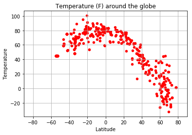

# WeatherPy Analysis

## Question 
The fundamental question that we are trying to answer in this exercise is:
"What's the weather like as we approach the equator?"

## Objective
To visualize the weather of 500+ randomly selected cities across the world of varying distance from the equator. To build a series of scatter plots to showcase the following relationships:

* Temperature (F) vs. Latitude
* Humidity (%) vs. Latitude
* Cloudiness (%) vs. Latitude
* Wind Speed (mph) vs. Latitude

## Technical Considerations
* Use python's library - [random](https://docs.python.org/3/library/random.html#), to generate the random city coordinates to be used. This will ensure that the coordinates are in fact not manually picked, but generated randomly
* Use a python library - [citipy](https://pypi.python.org/pypi/citipy), to get our list of cities from the randomly generated coordinates. This library will give us the nearest city for a given set of coordinates.
* Use the [OpenWeatherMap API](https://openweathermap.org/api) to get the weather data for all the cities that we get from our random coordinates
* Use Matplotlib libraries for Data Visualization

## Observations
From the plots in our analysis we see the following:
* Temperatures are higher on an average in the Southern Hemisphere and are lower in the Northern Hemisphere especially as we move away from the equator. Most cities in the southern hemisphere have temperatures above 50 deg F. Cities in the top 2/3rd of the Northern Hemisphere have temperatures in the range of -10 to 50 deg F.
* Cities near the equator have much higher temperatures than those away from the equator.
* There are a lot more cities with humidity in the 60% to 100% range around the globe. There are more cities in the southern hemisphere with higher humidity levels (80-100%).
* Most cities have wind speeds in the 0 to 20 mph range with more than half in the 0-10mph range.
* Cloudiness in cities is evenly distributed around the globe.

## Conclusion
Cities closer to the equator are hotter than cities away from the equator with more cities in the south of the equator being warmer. Proximity to the equator does not affect other factors like Humidity, Cloudiness or Wind Speed as much as it affects the Temperature

## Analysis Process
### Setting up the list of random cities around the globe
We use the citipy library to generate 150 random positive latitude numbers, negative latitude numbers, positive longitude numbers and negative longitude numbers. This will ensure that we have coordinate samples from all four quadrants of the globe. Furthermore we get random latitudes from two sections 0 to 45 and 45 to 90 in both hemispheres to ensure even distribution of latitudes close to and away from the equator. We generate more than 500 cities because we may not get weather data for some of them later.


```python
# Import Dependencies
from citipy import citipy
import random
import requests as req
import json
import matplotlib.pyplot as plt
import pandas as pd
import time
import config
```


```python
# The endpoint url for the api call to the OpenWeatherMap api
endpoint_url = "http://api.openweathermap.org/data/2.5/weather?q="
```


```python
# Generate 150 random positive latitude numbers, negative latitude numbers, positive longitude numbers 
# and negative longitude numbers. This will ensure that we have coordinate samples from all four quadrants 
# of the globe. Furthermore we get random latitudes from two sections 0 to 45 and 45 to 90 to ensure even distribution
# of latitudes close to and away from the equator
pos_lats = [random.uniform(0, 45) for x in range(75)]
pos_lats += [random.uniform(45, 90) for x in range(75)]

neg_lats = [random.uniform(0, -45) for x in range(75)]
neg_lats += [random.uniform(-45, -90) for x in range(75)]

pos_lons = [random.uniform(0, 180) for x in range(150)]
neg_lons = [random.uniform(0, -180) for x in range(150)]

# List of coordinates for our cities
coords = []

# Create a combination of positive and negative latitides and longitudes to get our city coordinates
# This will give us a list of (150 * 4) = 600 coordinates
for i in range(150):
    coords.append((pos_lats[i], pos_lons[i]))
    coords.append((pos_lats[i], neg_lons[i]))
    coords.append((neg_lats[i], pos_lons[i]))
    coords.append((neg_lats[i], neg_lons[i]))

# Use the citipy library to get the nearest city for each of the set of coordinates generated above. 
# This should give us a list of 600 random cities along with their country codes
cities = [citipy.nearest_city(coord[0], coord[1]) for coord in coords]
```


```python
# Create a city table with the city names and country codes that we have gathered above. We will add the 
# other weather information for these cities later
cities_df = pd.DataFrame(data = {"City Name": [city.city_name for city in cities],
                                "Country Code": [ city.country_code for city in cities]})
```


```python
# Add columns for the remaining data for all the cities that we will collect
cities_df = pd.concat([cities_df,pd.DataFrame(columns=["City ID", "Latitude", "Longitude", "Temperature", "Pressure", "Humidity", "Cloudiness", "Wind Speed"])])

# Reorder the columns
cities_df = cities_df[["City ID", "City Name", "Country Code", "Latitude", "Longitude", "Temperature", "Pressure", "Humidity", "Cloudiness", "Wind Speed"]]
```

### A sneak peak at the data table with the cities and country codes populated.


```python
cities_df.head()
```


<div>
<table border="1" class="dataframe">
  <thead>
    <tr style="text-align: right;">
      <th></th>
      <th>City ID</th>
      <th>City Name</th>
      <th>Country Code</th>
      <th>Latitude</th>
      <th>Longitude</th>
      <th>Temperature</th>
      <th>Pressure</th>
      <th>Humidity</th>
      <th>Cloudiness</th>
      <th>Wind Speed</th>
    </tr>
  </thead>
  <tbody>
    <tr>
      <th>0</th>
      <td>NaN</td>
      <td>lorengau</td>
      <td>pg</td>
      <td>NaN</td>
      <td>NaN</td>
      <td>NaN</td>
      <td>NaN</td>
      <td>NaN</td>
      <td>NaN</td>
      <td>NaN</td>
    </tr>
    <tr>
      <th>1</th>
      <td>NaN</td>
      <td>bonfim</td>
      <td>br</td>
      <td>NaN</td>
      <td>NaN</td>
      <td>NaN</td>
      <td>NaN</td>
      <td>NaN</td>
      <td>NaN</td>
      <td>NaN</td>
    </tr>
    <tr>
      <th>2</th>
      <td>NaN</td>
      <td>lorengau</td>
      <td>pg</td>
      <td>NaN</td>
      <td>NaN</td>
      <td>NaN</td>
      <td>NaN</td>
      <td>NaN</td>
      <td>NaN</td>
      <td>NaN</td>
    </tr>
    <tr>
      <th>3</th>
      <td>NaN</td>
      <td>itacoatiara</td>
      <td>br</td>
      <td>NaN</td>
      <td>NaN</td>
      <td>NaN</td>
      <td>NaN</td>
      <td>NaN</td>
      <td>NaN</td>
      <td>NaN</td>
    </tr>
    <tr>
      <th>4</th>
      <td>NaN</td>
      <td>rafraf</td>
      <td>tn</td>
      <td>NaN</td>
      <td>NaN</td>
      <td>NaN</td>
      <td>NaN</td>
      <td>NaN</td>
      <td>NaN</td>
      <td>NaN</td>
    </tr>
  </tbody>
</table>
</div>


### Getting the weather data
We now loop through all the cities in our data frame and make an api call to the OpenWeatherMap Api. The Api Key we have allows for no more than 60 calls per minute. So after every 60 calls we pause for a  minute before moving to the next batch of 60 calls. If we get an error for any missing data for a city, we simply skip that city.


```python
## Function that takes in the index value for the cities_df and for the city at that index, 
# gets the weather info via the api call and populates the respective columns at that index

def get_city_weather(index):
    city_str = cities_df.at[index, "City Name"] + "," + cities_df.at[index, "Country Code"]
    target_url = endpoint_url + city_str + "&units=imperial&appid=" + config.api_key
    
    print("Getting Data for %s with target_url = %s" %(city_str, target_url))
    city_response = req.get(target_url).json()

    # Get the information in a try block to ignore any cities that don't have all the information 
    try:
        cities_df.at[index, "City ID"] = city_response["id"]
        cities_df.at[index, "Latitude"] = city_response["coord"]["lat"]
        cities_df.at[index, "Longitude"] = city_response["coord"]["lon"]
        cities_df.at[index, "Temperature"] = city_response["main"]["temp"]
        cities_df.at[index, "Pressure"] = city_response["main"]["pressure"]
        cities_df.at[index, "Humidity"] = city_response["main"]["humidity"]
        cities_df.at[index, "Cloudiness"] = city_response["clouds"]["all"]
        cities_df.at[index, "Wind Speed"] = city_response["wind"]["speed"]
    except KeyError:
        print("Ignoring row at index " + str(index) + " due to Key Error for " + city_str)


```


```python
# Get the weather data in batches of 60 cities as we have a limit of 60 per minute on api calls
for n in range(0,10):
    for row_index in range(n*60,(n*60)+60):
        get_city_weather(row_index)
    
    # Introduce a sleep time for just a minute for every 60th row because the OpenWeatherMap api has
    # a limit of no more than 60 requests in a minute. We do not need this after the last set.
    if n < 9:
        print("Wait for a minute. We've got data upto city index number : " + str(row_index))
        time.sleep(60)
```

    Getting Data for lorengau,pg with target_url = http://api.openweathermap.org/data/2.5/weather?q=lorengau,pg&units=imperial&appid=7e4ae0373bdeed043f36aeafca9fc7ff
    Getting Data for bonfim,br with target_url = http://api.openweathermap.org/data/2.5/weather?q=bonfim,br&units=imperial&appid=7e4ae0373bdeed043f36aeafca9fc7ff
    Getting Data for lorengau,pg with target_url = http://api.openweathermap.org/data/2.5/weather?q=lorengau,pg&units=imperial&appid=7e4ae0373bdeed043f36aeafca9fc7ff
    Getting Data for itacoatiara,br with target_url = http://api.openweathermap.org/data/2.5/weather?q=itacoatiara,br&units=imperial&appid=7e4ae0373bdeed043f36aeafca9fc7ff
    Getting Data for rafraf,tn with target_url = http://api.openweathermap.org/data/2.5/weather?q=rafraf,tn&units=imperial&appid=7e4ae0373bdeed043f36aeafca9fc7ff
    Getting Data for kapaa,us with target_url = http://api.openweathermap.org/data/2.5/weather?q=kapaa,us&units=imperial&appid=7e4ae0373bdeed043f36aeafca9fc7ff
    Getting Data for opuwo,na with target_url = http://api.openweathermap.org/data/2.5/weather?q=opuwo,na&units=imperial&appid=7e4ae0373bdeed043f36aeafca9fc7ff
    Getting Data for pangai,to with target_url = http://api.openweathermap.org/data/2.5/weather?q=pangai,to&units=imperial&appid=7e4ae0373bdeed043f36aeafca9fc7ff
    Getting Data for tongliao,cn with target_url = http://api.openweathermap.org/data/2.5/weather?q=tongliao,cn&units=imperial&appid=7e4ae0373bdeed043f36aeafca9fc7ff
    Getting Data for louisbourg,ca with target_url = http://api.openweathermap.org/data/2.5/weather?q=louisbourg,ca&units=imperial&appid=7e4ae0373bdeed043f36aeafca9fc7ff
    Ignoring row at index 9 due to Key Error for louisbourg,ca
    Getting Data for northam,au with target_url = http://api.openweathermap.org/data/2.5/weather?q=northam,au&units=imperial&appid=7e4ae0373bdeed043f36aeafca9fc7ff
    Getting Data for goya,ar with target_url = http://api.openweathermap.org/data/2.5/weather?q=goya,ar&units=imperial&appid=7e4ae0373bdeed043f36aeafca9fc7ff
    Getting Data for kalat,pk with target_url = http://api.openweathermap.org/data/2.5/weather?q=kalat,pk&units=imperial&appid=7e4ae0373bdeed043f36aeafca9fc7ff
    Getting Data for ribeira grande,pt with target_url = http://api.openweathermap.org/data/2.5/weather?q=ribeira grande,pt&units=imperial&appid=7e4ae0373bdeed043f36aeafca9fc7ff
    Getting Data for saint-philippe,re with target_url = http://api.openweathermap.org/data/2.5/weather?q=saint-philippe,re&units=imperial&appid=7e4ae0373bdeed043f36aeafca9fc7ff
    Getting Data for cidreira,br with target_url = http://api.openweathermap.org/data/2.5/weather?q=cidreira,br&units=imperial&appid=7e4ae0373bdeed043f36aeafca9fc7ff
    Getting Data for buluang,ph with target_url = http://api.openweathermap.org/data/2.5/weather?q=buluang,ph&units=imperial&appid=7e4ae0373bdeed043f36aeafca9fc7ff
    Getting Data for corn island,ni with target_url = http://api.openweathermap.org/data/2.5/weather?q=corn island,ni&units=imperial&appid=7e4ae0373bdeed043f36aeafca9fc7ff
    Getting Data for albany,au with target_url = http://api.openweathermap.org/data/2.5/weather?q=albany,au&units=imperial&appid=7e4ae0373bdeed043f36aeafca9fc7ff
    Getting Data for lebu,cl with target_url = http://api.openweathermap.org/data/2.5/weather?q=lebu,cl&units=imperial&appid=7e4ae0373bdeed043f36aeafca9fc7ff
    Getting Data for honjo,jp with target_url = http://api.openweathermap.org/data/2.5/weather?q=honjo,jp&units=imperial&appid=7e4ae0373bdeed043f36aeafca9fc7ff
    Getting Data for kapaa,us with target_url = http://api.openweathermap.org/data/2.5/weather?q=kapaa,us&units=imperial&appid=7e4ae0373bdeed043f36aeafca9fc7ff
    Getting Data for mount isa,au with target_url = http://api.openweathermap.org/data/2.5/weather?q=mount isa,au&units=imperial&appid=7e4ae0373bdeed043f36aeafca9fc7ff
    Getting Data for alofi,nu with target_url = http://api.openweathermap.org/data/2.5/weather?q=alofi,nu&units=imperial&appid=7e4ae0373bdeed043f36aeafca9fc7ff
    Getting Data for pemangkat,id with target_url = http://api.openweathermap.org/data/2.5/weather?q=pemangkat,id&units=imperial&appid=7e4ae0373bdeed043f36aeafca9fc7ff
    Ignoring row at index 24 due to Key Error for pemangkat,id
    Getting Data for manta,ec with target_url = http://api.openweathermap.org/data/2.5/weather?q=manta,ec&units=imperial&appid=7e4ae0373bdeed043f36aeafca9fc7ff
    Getting Data for geraldton,au with target_url = http://api.openweathermap.org/data/2.5/weather?q=geraldton,au&units=imperial&appid=7e4ae0373bdeed043f36aeafca9fc7ff
    Getting Data for coquimbo,cl with target_url = http://api.openweathermap.org/data/2.5/weather?q=coquimbo,cl&units=imperial&appid=7e4ae0373bdeed043f36aeafca9fc7ff
    Getting Data for namatanai,pg with target_url = http://api.openweathermap.org/data/2.5/weather?q=namatanai,pg&units=imperial&appid=7e4ae0373bdeed043f36aeafca9fc7ff
    Getting Data for atuona,pf with target_url = http://api.openweathermap.org/data/2.5/weather?q=atuona,pf&units=imperial&appid=7e4ae0373bdeed043f36aeafca9fc7ff
    Getting Data for batemans bay,au with target_url = http://api.openweathermap.org/data/2.5/weather?q=batemans bay,au&units=imperial&appid=7e4ae0373bdeed043f36aeafca9fc7ff
    Getting Data for rikitea,pf with target_url = http://api.openweathermap.org/data/2.5/weather?q=rikitea,pf&units=imperial&appid=7e4ae0373bdeed043f36aeafca9fc7ff
    Getting Data for erseke,al with target_url = http://api.openweathermap.org/data/2.5/weather?q=erseke,al&units=imperial&appid=7e4ae0373bdeed043f36aeafca9fc7ff
    Getting Data for eureka,us with target_url = http://api.openweathermap.org/data/2.5/weather?q=eureka,us&units=imperial&appid=7e4ae0373bdeed043f36aeafca9fc7ff
    Getting Data for manyana,bw with target_url = http://api.openweathermap.org/data/2.5/weather?q=manyana,bw&units=imperial&appid=7e4ae0373bdeed043f36aeafca9fc7ff
    Getting Data for rikitea,pf with target_url = http://api.openweathermap.org/data/2.5/weather?q=rikitea,pf&units=imperial&appid=7e4ae0373bdeed043f36aeafca9fc7ff
    Getting Data for gushikawa,jp with target_url = http://api.openweathermap.org/data/2.5/weather?q=gushikawa,jp&units=imperial&appid=7e4ae0373bdeed043f36aeafca9fc7ff
    Getting Data for hilo,us with target_url = http://api.openweathermap.org/data/2.5/weather?q=hilo,us&units=imperial&appid=7e4ae0373bdeed043f36aeafca9fc7ff
    Getting Data for katherine,au with target_url = http://api.openweathermap.org/data/2.5/weather?q=katherine,au&units=imperial&appid=7e4ae0373bdeed043f36aeafca9fc7ff
    Getting Data for fare,pf with target_url = http://api.openweathermap.org/data/2.5/weather?q=fare,pf&units=imperial&appid=7e4ae0373bdeed043f36aeafca9fc7ff
    Getting Data for butaritari,ki with target_url = http://api.openweathermap.org/data/2.5/weather?q=butaritari,ki&units=imperial&appid=7e4ae0373bdeed043f36aeafca9fc7ff
    Getting Data for la libertad,sv with target_url = http://api.openweathermap.org/data/2.5/weather?q=la libertad,sv&units=imperial&appid=7e4ae0373bdeed043f36aeafca9fc7ff
    Getting Data for rungata,ki with target_url = http://api.openweathermap.org/data/2.5/weather?q=rungata,ki&units=imperial&appid=7e4ae0373bdeed043f36aeafca9fc7ff
    Ignoring row at index 42 due to Key Error for rungata,ki
    Getting Data for san cristobal,ec with target_url = http://api.openweathermap.org/data/2.5/weather?q=san cristobal,ec&units=imperial&appid=7e4ae0373bdeed043f36aeafca9fc7ff
    Getting Data for kutum,sd with target_url = http://api.openweathermap.org/data/2.5/weather?q=kutum,sd&units=imperial&appid=7e4ae0373bdeed043f36aeafca9fc7ff
    Getting Data for sandy bay,hn with target_url = http://api.openweathermap.org/data/2.5/weather?q=sandy bay,hn&units=imperial&appid=7e4ae0373bdeed043f36aeafca9fc7ff
    Getting Data for kuruman,za with target_url = http://api.openweathermap.org/data/2.5/weather?q=kuruman,za&units=imperial&appid=7e4ae0373bdeed043f36aeafca9fc7ff
    Getting Data for coquimbo,cl with target_url = http://api.openweathermap.org/data/2.5/weather?q=coquimbo,cl&units=imperial&appid=7e4ae0373bdeed043f36aeafca9fc7ff
    Getting Data for baruun-urt,mn with target_url = http://api.openweathermap.org/data/2.5/weather?q=baruun-urt,mn&units=imperial&appid=7e4ae0373bdeed043f36aeafca9fc7ff
    Getting Data for eau claire,us with target_url = http://api.openweathermap.org/data/2.5/weather?q=eau claire,us&units=imperial&appid=7e4ae0373bdeed043f36aeafca9fc7ff
    Getting Data for collie,au with target_url = http://api.openweathermap.org/data/2.5/weather?q=collie,au&units=imperial&appid=7e4ae0373bdeed043f36aeafca9fc7ff
    Getting Data for lebu,cl with target_url = http://api.openweathermap.org/data/2.5/weather?q=lebu,cl&units=imperial&appid=7e4ae0373bdeed043f36aeafca9fc7ff
    Getting Data for tawkar,sd with target_url = http://api.openweathermap.org/data/2.5/weather?q=tawkar,sd&units=imperial&appid=7e4ae0373bdeed043f36aeafca9fc7ff
    Ignoring row at index 52 due to Key Error for tawkar,sd
    Getting Data for constitucion,mx with target_url = http://api.openweathermap.org/data/2.5/weather?q=constitucion,mx&units=imperial&appid=7e4ae0373bdeed043f36aeafca9fc7ff
    Getting Data for richards bay,za with target_url = http://api.openweathermap.org/data/2.5/weather?q=richards bay,za&units=imperial&appid=7e4ae0373bdeed043f36aeafca9fc7ff
    Getting Data for rikitea,pf with target_url = http://api.openweathermap.org/data/2.5/weather?q=rikitea,pf&units=imperial&appid=7e4ae0373bdeed043f36aeafca9fc7ff
    Getting Data for najran,sa with target_url = http://api.openweathermap.org/data/2.5/weather?q=najran,sa&units=imperial&appid=7e4ae0373bdeed043f36aeafca9fc7ff
    Getting Data for gao,ml with target_url = http://api.openweathermap.org/data/2.5/weather?q=gao,ml&units=imperial&appid=7e4ae0373bdeed043f36aeafca9fc7ff
    Getting Data for victoria,sc with target_url = http://api.openweathermap.org/data/2.5/weather?q=victoria,sc&units=imperial&appid=7e4ae0373bdeed043f36aeafca9fc7ff
    Getting Data for jamestown,sh with target_url = http://api.openweathermap.org/data/2.5/weather?q=jamestown,sh&units=imperial&appid=7e4ae0373bdeed043f36aeafca9fc7ff
    Wait for a minute. We've got data upto city index number : 59
    Getting Data for kizukuri,jp with target_url = http://api.openweathermap.org/data/2.5/weather?q=kizukuri,jp&units=imperial&appid=7e4ae0373bdeed043f36aeafca9fc7ff
    Getting Data for rabo de peixe,pt with target_url = http://api.openweathermap.org/data/2.5/weather?q=rabo de peixe,pt&units=imperial&appid=7e4ae0373bdeed043f36aeafca9fc7ff
    Getting Data for broken hill,au with target_url = http://api.openweathermap.org/data/2.5/weather?q=broken hill,au&units=imperial&appid=7e4ae0373bdeed043f36aeafca9fc7ff
    Getting Data for vila velha,br with target_url = http://api.openweathermap.org/data/2.5/weather?q=vila velha,br&units=imperial&appid=7e4ae0373bdeed043f36aeafca9fc7ff
    Getting Data for hobyo,so with target_url = http://api.openweathermap.org/data/2.5/weather?q=hobyo,so&units=imperial&appid=7e4ae0373bdeed043f36aeafca9fc7ff
    Getting Data for cayenne,gf with target_url = http://api.openweathermap.org/data/2.5/weather?q=cayenne,gf&units=imperial&appid=7e4ae0373bdeed043f36aeafca9fc7ff
    Getting Data for mogadishu,so with target_url = http://api.openweathermap.org/data/2.5/weather?q=mogadishu,so&units=imperial&appid=7e4ae0373bdeed043f36aeafca9fc7ff
    Getting Data for moju,br with target_url = http://api.openweathermap.org/data/2.5/weather?q=moju,br&units=imperial&appid=7e4ae0373bdeed043f36aeafca9fc7ff
    Getting Data for bahar,ir with target_url = http://api.openweathermap.org/data/2.5/weather?q=bahar,ir&units=imperial&appid=7e4ae0373bdeed043f36aeafca9fc7ff
    Getting Data for ribeira grande,pt with target_url = http://api.openweathermap.org/data/2.5/weather?q=ribeira grande,pt&units=imperial&appid=7e4ae0373bdeed043f36aeafca9fc7ff
    Getting Data for farafangana,mg with target_url = http://api.openweathermap.org/data/2.5/weather?q=farafangana,mg&units=imperial&appid=7e4ae0373bdeed043f36aeafca9fc7ff
    Getting Data for sao joao da barra,br with target_url = http://api.openweathermap.org/data/2.5/weather?q=sao joao da barra,br&units=imperial&appid=7e4ae0373bdeed043f36aeafca9fc7ff
    Getting Data for waddan,ly with target_url = http://api.openweathermap.org/data/2.5/weather?q=waddan,ly&units=imperial&appid=7e4ae0373bdeed043f36aeafca9fc7ff
    Getting Data for tiznit,ma with target_url = http://api.openweathermap.org/data/2.5/weather?q=tiznit,ma&units=imperial&appid=7e4ae0373bdeed043f36aeafca9fc7ff
    Getting Data for kasongo-lunda,cd with target_url = http://api.openweathermap.org/data/2.5/weather?q=kasongo-lunda,cd&units=imperial&appid=7e4ae0373bdeed043f36aeafca9fc7ff
    Getting Data for georgetown,sh with target_url = http://api.openweathermap.org/data/2.5/weather?q=georgetown,sh&units=imperial&appid=7e4ae0373bdeed043f36aeafca9fc7ff
    Getting Data for butaritari,ki with target_url = http://api.openweathermap.org/data/2.5/weather?q=butaritari,ki&units=imperial&appid=7e4ae0373bdeed043f36aeafca9fc7ff
    Getting Data for iracoubo,gf with target_url = http://api.openweathermap.org/data/2.5/weather?q=iracoubo,gf&units=imperial&appid=7e4ae0373bdeed043f36aeafca9fc7ff
    Getting Data for kaeo,nz with target_url = http://api.openweathermap.org/data/2.5/weather?q=kaeo,nz&units=imperial&appid=7e4ae0373bdeed043f36aeafca9fc7ff
    Getting Data for tapes,br with target_url = http://api.openweathermap.org/data/2.5/weather?q=tapes,br&units=imperial&appid=7e4ae0373bdeed043f36aeafca9fc7ff
    Getting Data for juba,sd with target_url = http://api.openweathermap.org/data/2.5/weather?q=juba,sd&units=imperial&appid=7e4ae0373bdeed043f36aeafca9fc7ff
    Ignoring row at index 80 due to Key Error for juba,sd
    Getting Data for hilo,us with target_url = http://api.openweathermap.org/data/2.5/weather?q=hilo,us&units=imperial&appid=7e4ae0373bdeed043f36aeafca9fc7ff
    Getting Data for mutare,zw with target_url = http://api.openweathermap.org/data/2.5/weather?q=mutare,zw&units=imperial&appid=7e4ae0373bdeed043f36aeafca9fc7ff
    Getting Data for avarua,ck with target_url = http://api.openweathermap.org/data/2.5/weather?q=avarua,ck&units=imperial&appid=7e4ae0373bdeed043f36aeafca9fc7ff
    Getting Data for lasa,cn with target_url = http://api.openweathermap.org/data/2.5/weather?q=lasa,cn&units=imperial&appid=7e4ae0373bdeed043f36aeafca9fc7ff
    Ignoring row at index 84 due to Key Error for lasa,cn
    Getting Data for ponta do sol,pt with target_url = http://api.openweathermap.org/data/2.5/weather?q=ponta do sol,pt&units=imperial&appid=7e4ae0373bdeed043f36aeafca9fc7ff
    Getting Data for geraldton,au with target_url = http://api.openweathermap.org/data/2.5/weather?q=geraldton,au&units=imperial&appid=7e4ae0373bdeed043f36aeafca9fc7ff
    Getting Data for sao joao da barra,br with target_url = http://api.openweathermap.org/data/2.5/weather?q=sao joao da barra,br&units=imperial&appid=7e4ae0373bdeed043f36aeafca9fc7ff
    Getting Data for abu dhabi,ae with target_url = http://api.openweathermap.org/data/2.5/weather?q=abu dhabi,ae&units=imperial&appid=7e4ae0373bdeed043f36aeafca9fc7ff
    Getting Data for tecuala,mx with target_url = http://api.openweathermap.org/data/2.5/weather?q=tecuala,mx&units=imperial&appid=7e4ae0373bdeed043f36aeafca9fc7ff
    Getting Data for le port,re with target_url = http://api.openweathermap.org/data/2.5/weather?q=le port,re&units=imperial&appid=7e4ae0373bdeed043f36aeafca9fc7ff
    Getting Data for puerto ayora,ec with target_url = http://api.openweathermap.org/data/2.5/weather?q=puerto ayora,ec&units=imperial&appid=7e4ae0373bdeed043f36aeafca9fc7ff
    Getting Data for gat,ly with target_url = http://api.openweathermap.org/data/2.5/weather?q=gat,ly&units=imperial&appid=7e4ae0373bdeed043f36aeafca9fc7ff
    Ignoring row at index 92 due to Key Error for gat,ly
    Getting Data for ponta do sol,cv with target_url = http://api.openweathermap.org/data/2.5/weather?q=ponta do sol,cv&units=imperial&appid=7e4ae0373bdeed043f36aeafca9fc7ff
    Getting Data for namibe,ao with target_url = http://api.openweathermap.org/data/2.5/weather?q=namibe,ao&units=imperial&appid=7e4ae0373bdeed043f36aeafca9fc7ff
    Getting Data for conde,br with target_url = http://api.openweathermap.org/data/2.5/weather?q=conde,br&units=imperial&appid=7e4ae0373bdeed043f36aeafca9fc7ff
    Getting Data for airai,pw with target_url = http://api.openweathermap.org/data/2.5/weather?q=airai,pw&units=imperial&appid=7e4ae0373bdeed043f36aeafca9fc7ff
    Ignoring row at index 96 due to Key Error for airai,pw
    Getting Data for atuona,pf with target_url = http://api.openweathermap.org/data/2.5/weather?q=atuona,pf&units=imperial&appid=7e4ae0373bdeed043f36aeafca9fc7ff
    Getting Data for alyangula,au with target_url = http://api.openweathermap.org/data/2.5/weather?q=alyangula,au&units=imperial&appid=7e4ae0373bdeed043f36aeafca9fc7ff
    Getting Data for atuona,pf with target_url = http://api.openweathermap.org/data/2.5/weather?q=atuona,pf&units=imperial&appid=7e4ae0373bdeed043f36aeafca9fc7ff
    Getting Data for cam ranh,vn with target_url = http://api.openweathermap.org/data/2.5/weather?q=cam ranh,vn&units=imperial&appid=7e4ae0373bdeed043f36aeafca9fc7ff
    Getting Data for makakilo city,us with target_url = http://api.openweathermap.org/data/2.5/weather?q=makakilo city,us&units=imperial&appid=7e4ae0373bdeed043f36aeafca9fc7ff
    Getting Data for jatiroto,id with target_url = http://api.openweathermap.org/data/2.5/weather?q=jatiroto,id&units=imperial&appid=7e4ae0373bdeed043f36aeafca9fc7ff
    Getting Data for samusu,ws with target_url = http://api.openweathermap.org/data/2.5/weather?q=samusu,ws&units=imperial&appid=7e4ae0373bdeed043f36aeafca9fc7ff
    Ignoring row at index 103 due to Key Error for samusu,ws
    Getting Data for butaritari,ki with target_url = http://api.openweathermap.org/data/2.5/weather?q=butaritari,ki&units=imperial&appid=7e4ae0373bdeed043f36aeafca9fc7ff
    Getting Data for san patricio,mx with target_url = http://api.openweathermap.org/data/2.5/weather?q=san patricio,mx&units=imperial&appid=7e4ae0373bdeed043f36aeafca9fc7ff
    Getting Data for vao,nc with target_url = http://api.openweathermap.org/data/2.5/weather?q=vao,nc&units=imperial&appid=7e4ae0373bdeed043f36aeafca9fc7ff
    Getting Data for rikitea,pf with target_url = http://api.openweathermap.org/data/2.5/weather?q=rikitea,pf&units=imperial&appid=7e4ae0373bdeed043f36aeafca9fc7ff
    Getting Data for basco,ph with target_url = http://api.openweathermap.org/data/2.5/weather?q=basco,ph&units=imperial&appid=7e4ae0373bdeed043f36aeafca9fc7ff
    Getting Data for saint-francois,gp with target_url = http://api.openweathermap.org/data/2.5/weather?q=saint-francois,gp&units=imperial&appid=7e4ae0373bdeed043f36aeafca9fc7ff
    Getting Data for port hedland,au with target_url = http://api.openweathermap.org/data/2.5/weather?q=port hedland,au&units=imperial&appid=7e4ae0373bdeed043f36aeafca9fc7ff
    Getting Data for ampere,br with target_url = http://api.openweathermap.org/data/2.5/weather?q=ampere,br&units=imperial&appid=7e4ae0373bdeed043f36aeafca9fc7ff
    Getting Data for tongchuan,cn with target_url = http://api.openweathermap.org/data/2.5/weather?q=tongchuan,cn&units=imperial&appid=7e4ae0373bdeed043f36aeafca9fc7ff
    Getting Data for greenfield,us with target_url = http://api.openweathermap.org/data/2.5/weather?q=greenfield,us&units=imperial&appid=7e4ae0373bdeed043f36aeafca9fc7ff
    Getting Data for carnarvon,au with target_url = http://api.openweathermap.org/data/2.5/weather?q=carnarvon,au&units=imperial&appid=7e4ae0373bdeed043f36aeafca9fc7ff
    Getting Data for rikitea,pf with target_url = http://api.openweathermap.org/data/2.5/weather?q=rikitea,pf&units=imperial&appid=7e4ae0373bdeed043f36aeafca9fc7ff
    Getting Data for of,tr with target_url = http://api.openweathermap.org/data/2.5/weather?q=of,tr&units=imperial&appid=7e4ae0373bdeed043f36aeafca9fc7ff
    Getting Data for eureka,us with target_url = http://api.openweathermap.org/data/2.5/weather?q=eureka,us&units=imperial&appid=7e4ae0373bdeed043f36aeafca9fc7ff
    Getting Data for morondava,mg with target_url = http://api.openweathermap.org/data/2.5/weather?q=morondava,mg&units=imperial&appid=7e4ae0373bdeed043f36aeafca9fc7ff
    Getting Data for rikitea,pf with target_url = http://api.openweathermap.org/data/2.5/weather?q=rikitea,pf&units=imperial&appid=7e4ae0373bdeed043f36aeafca9fc7ff
    Wait for a minute. We've got data upto city index number : 119
    Getting Data for licata,it with target_url = http://api.openweathermap.org/data/2.5/weather?q=licata,it&units=imperial&appid=7e4ae0373bdeed043f36aeafca9fc7ff
    Getting Data for kapaa,us with target_url = http://api.openweathermap.org/data/2.5/weather?q=kapaa,us&units=imperial&appid=7e4ae0373bdeed043f36aeafca9fc7ff
    Getting Data for cape town,za with target_url = http://api.openweathermap.org/data/2.5/weather?q=cape town,za&units=imperial&appid=7e4ae0373bdeed043f36aeafca9fc7ff
    Getting Data for vaini,to with target_url = http://api.openweathermap.org/data/2.5/weather?q=vaini,to&units=imperial&appid=7e4ae0373bdeed043f36aeafca9fc7ff
    Getting Data for korla,cn with target_url = http://api.openweathermap.org/data/2.5/weather?q=korla,cn&units=imperial&appid=7e4ae0373bdeed043f36aeafca9fc7ff
    Getting Data for bethel,us with target_url = http://api.openweathermap.org/data/2.5/weather?q=bethel,us&units=imperial&appid=7e4ae0373bdeed043f36aeafca9fc7ff
    Getting Data for hithadhoo,mv with target_url = http://api.openweathermap.org/data/2.5/weather?q=hithadhoo,mv&units=imperial&appid=7e4ae0373bdeed043f36aeafca9fc7ff
    Getting Data for lotofaga,ws with target_url = http://api.openweathermap.org/data/2.5/weather?q=lotofaga,ws&units=imperial&appid=7e4ae0373bdeed043f36aeafca9fc7ff
    Getting Data for develi,tr with target_url = http://api.openweathermap.org/data/2.5/weather?q=develi,tr&units=imperial&appid=7e4ae0373bdeed043f36aeafca9fc7ff
    Getting Data for nantucket,us with target_url = http://api.openweathermap.org/data/2.5/weather?q=nantucket,us&units=imperial&appid=7e4ae0373bdeed043f36aeafca9fc7ff
    Getting Data for nsanje,mw with target_url = http://api.openweathermap.org/data/2.5/weather?q=nsanje,mw&units=imperial&appid=7e4ae0373bdeed043f36aeafca9fc7ff
    Getting Data for chimore,bo with target_url = http://api.openweathermap.org/data/2.5/weather?q=chimore,bo&units=imperial&appid=7e4ae0373bdeed043f36aeafca9fc7ff
    Getting Data for yumen,cn with target_url = http://api.openweathermap.org/data/2.5/weather?q=yumen,cn&units=imperial&appid=7e4ae0373bdeed043f36aeafca9fc7ff
    Getting Data for nantucket,us with target_url = http://api.openweathermap.org/data/2.5/weather?q=nantucket,us&units=imperial&appid=7e4ae0373bdeed043f36aeafca9fc7ff
    Getting Data for bengkulu,id with target_url = http://api.openweathermap.org/data/2.5/weather?q=bengkulu,id&units=imperial&appid=7e4ae0373bdeed043f36aeafca9fc7ff
    Ignoring row at index 134 due to Key Error for bengkulu,id
    Getting Data for manoel urbano,br with target_url = http://api.openweathermap.org/data/2.5/weather?q=manoel urbano,br&units=imperial&appid=7e4ae0373bdeed043f36aeafca9fc7ff
    Getting Data for ormara,pk with target_url = http://api.openweathermap.org/data/2.5/weather?q=ormara,pk&units=imperial&appid=7e4ae0373bdeed043f36aeafca9fc7ff
    Getting Data for taoudenni,ml with target_url = http://api.openweathermap.org/data/2.5/weather?q=taoudenni,ml&units=imperial&appid=7e4ae0373bdeed043f36aeafca9fc7ff
    Getting Data for souillac,mu with target_url = http://api.openweathermap.org/data/2.5/weather?q=souillac,mu&units=imperial&appid=7e4ae0373bdeed043f36aeafca9fc7ff
    Getting Data for jamestown,sh with target_url = http://api.openweathermap.org/data/2.5/weather?q=jamestown,sh&units=imperial&appid=7e4ae0373bdeed043f36aeafca9fc7ff
    Getting Data for kerki,tm with target_url = http://api.openweathermap.org/data/2.5/weather?q=kerki,tm&units=imperial&appid=7e4ae0373bdeed043f36aeafca9fc7ff
    Ignoring row at index 140 due to Key Error for kerki,tm
    Getting Data for kapaa,us with target_url = http://api.openweathermap.org/data/2.5/weather?q=kapaa,us&units=imperial&appid=7e4ae0373bdeed043f36aeafca9fc7ff
    Getting Data for hithadhoo,mv with target_url = http://api.openweathermap.org/data/2.5/weather?q=hithadhoo,mv&units=imperial&appid=7e4ae0373bdeed043f36aeafca9fc7ff
    Getting Data for samusu,ws with target_url = http://api.openweathermap.org/data/2.5/weather?q=samusu,ws&units=imperial&appid=7e4ae0373bdeed043f36aeafca9fc7ff
    Ignoring row at index 143 due to Key Error for samusu,ws
    Getting Data for taitung,tw with target_url = http://api.openweathermap.org/data/2.5/weather?q=taitung,tw&units=imperial&appid=7e4ae0373bdeed043f36aeafca9fc7ff
    Getting Data for lompoc,us with target_url = http://api.openweathermap.org/data/2.5/weather?q=lompoc,us&units=imperial&appid=7e4ae0373bdeed043f36aeafca9fc7ff
    Getting Data for katobu,id with target_url = http://api.openweathermap.org/data/2.5/weather?q=katobu,id&units=imperial&appid=7e4ae0373bdeed043f36aeafca9fc7ff
    Getting Data for atuona,pf with target_url = http://api.openweathermap.org/data/2.5/weather?q=atuona,pf&units=imperial&appid=7e4ae0373bdeed043f36aeafca9fc7ff
    Getting Data for salalah,om with target_url = http://api.openweathermap.org/data/2.5/weather?q=salalah,om&units=imperial&appid=7e4ae0373bdeed043f36aeafca9fc7ff
    Getting Data for makakilo city,us with target_url = http://api.openweathermap.org/data/2.5/weather?q=makakilo city,us&units=imperial&appid=7e4ae0373bdeed043f36aeafca9fc7ff
    Getting Data for victoria,sc with target_url = http://api.openweathermap.org/data/2.5/weather?q=victoria,sc&units=imperial&appid=7e4ae0373bdeed043f36aeafca9fc7ff
    Getting Data for samusu,ws with target_url = http://api.openweathermap.org/data/2.5/weather?q=samusu,ws&units=imperial&appid=7e4ae0373bdeed043f36aeafca9fc7ff
    Ignoring row at index 151 due to Key Error for samusu,ws
    Getting Data for severo-kurilsk,ru with target_url = http://api.openweathermap.org/data/2.5/weather?q=severo-kurilsk,ru&units=imperial&appid=7e4ae0373bdeed043f36aeafca9fc7ff
    Getting Data for des plaines,us with target_url = http://api.openweathermap.org/data/2.5/weather?q=des plaines,us&units=imperial&appid=7e4ae0373bdeed043f36aeafca9fc7ff
    Getting Data for honiara,sb with target_url = http://api.openweathermap.org/data/2.5/weather?q=honiara,sb&units=imperial&appid=7e4ae0373bdeed043f36aeafca9fc7ff
    Getting Data for sechura,pe with target_url = http://api.openweathermap.org/data/2.5/weather?q=sechura,pe&units=imperial&appid=7e4ae0373bdeed043f36aeafca9fc7ff
    Getting Data for sarakhs,ir with target_url = http://api.openweathermap.org/data/2.5/weather?q=sarakhs,ir&units=imperial&appid=7e4ae0373bdeed043f36aeafca9fc7ff
    Getting Data for vila franca do campo,pt with target_url = http://api.openweathermap.org/data/2.5/weather?q=vila franca do campo,pt&units=imperial&appid=7e4ae0373bdeed043f36aeafca9fc7ff
    Getting Data for saint-philippe,re with target_url = http://api.openweathermap.org/data/2.5/weather?q=saint-philippe,re&units=imperial&appid=7e4ae0373bdeed043f36aeafca9fc7ff
    Getting Data for arraial do cabo,br with target_url = http://api.openweathermap.org/data/2.5/weather?q=arraial do cabo,br&units=imperial&appid=7e4ae0373bdeed043f36aeafca9fc7ff
    Getting Data for salalah,om with target_url = http://api.openweathermap.org/data/2.5/weather?q=salalah,om&units=imperial&appid=7e4ae0373bdeed043f36aeafca9fc7ff
    Getting Data for sinnamary,gf with target_url = http://api.openweathermap.org/data/2.5/weather?q=sinnamary,gf&units=imperial&appid=7e4ae0373bdeed043f36aeafca9fc7ff
    Getting Data for saint-joseph,re with target_url = http://api.openweathermap.org/data/2.5/weather?q=saint-joseph,re&units=imperial&appid=7e4ae0373bdeed043f36aeafca9fc7ff
    Getting Data for laguna,br with target_url = http://api.openweathermap.org/data/2.5/weather?q=laguna,br&units=imperial&appid=7e4ae0373bdeed043f36aeafca9fc7ff
    Ignoring row at index 163 due to Key Error for laguna,br
    Getting Data for ternate,id with target_url = http://api.openweathermap.org/data/2.5/weather?q=ternate,id&units=imperial&appid=7e4ae0373bdeed043f36aeafca9fc7ff
    Getting Data for rivera,co with target_url = http://api.openweathermap.org/data/2.5/weather?q=rivera,co&units=imperial&appid=7e4ae0373bdeed043f36aeafca9fc7ff
    Getting Data for atambua,id with target_url = http://api.openweathermap.org/data/2.5/weather?q=atambua,id&units=imperial&appid=7e4ae0373bdeed043f36aeafca9fc7ff
    Getting Data for contamana,pe with target_url = http://api.openweathermap.org/data/2.5/weather?q=contamana,pe&units=imperial&appid=7e4ae0373bdeed043f36aeafca9fc7ff
    Getting Data for sur,om with target_url = http://api.openweathermap.org/data/2.5/weather?q=sur,om&units=imperial&appid=7e4ae0373bdeed043f36aeafca9fc7ff
    Getting Data for hilo,us with target_url = http://api.openweathermap.org/data/2.5/weather?q=hilo,us&units=imperial&appid=7e4ae0373bdeed043f36aeafca9fc7ff
    Getting Data for souillac,mu with target_url = http://api.openweathermap.org/data/2.5/weather?q=souillac,mu&units=imperial&appid=7e4ae0373bdeed043f36aeafca9fc7ff
    Getting Data for mataura,pf with target_url = http://api.openweathermap.org/data/2.5/weather?q=mataura,pf&units=imperial&appid=7e4ae0373bdeed043f36aeafca9fc7ff
    Ignoring row at index 171 due to Key Error for mataura,pf
    Getting Data for butaritari,ki with target_url = http://api.openweathermap.org/data/2.5/weather?q=butaritari,ki&units=imperial&appid=7e4ae0373bdeed043f36aeafca9fc7ff
    Getting Data for cabo san lucas,mx with target_url = http://api.openweathermap.org/data/2.5/weather?q=cabo san lucas,mx&units=imperial&appid=7e4ae0373bdeed043f36aeafca9fc7ff
    Getting Data for hastings,nz with target_url = http://api.openweathermap.org/data/2.5/weather?q=hastings,nz&units=imperial&appid=7e4ae0373bdeed043f36aeafca9fc7ff
    Getting Data for rikitea,pf with target_url = http://api.openweathermap.org/data/2.5/weather?q=rikitea,pf&units=imperial&appid=7e4ae0373bdeed043f36aeafca9fc7ff
    Getting Data for castenaso,it with target_url = http://api.openweathermap.org/data/2.5/weather?q=castenaso,it&units=imperial&appid=7e4ae0373bdeed043f36aeafca9fc7ff
    Getting Data for provideniya,ru with target_url = http://api.openweathermap.org/data/2.5/weather?q=provideniya,ru&units=imperial&appid=7e4ae0373bdeed043f36aeafca9fc7ff
    Getting Data for saldanha,za with target_url = http://api.openweathermap.org/data/2.5/weather?q=saldanha,za&units=imperial&appid=7e4ae0373bdeed043f36aeafca9fc7ff
    Getting Data for vaini,to with target_url = http://api.openweathermap.org/data/2.5/weather?q=vaini,to&units=imperial&appid=7e4ae0373bdeed043f36aeafca9fc7ff
    Wait for a minute. We've got data upto city index number : 179
    Getting Data for panjab,af with target_url = http://api.openweathermap.org/data/2.5/weather?q=panjab,af&units=imperial&appid=7e4ae0373bdeed043f36aeafca9fc7ff
    Getting Data for fort smith,us with target_url = http://api.openweathermap.org/data/2.5/weather?q=fort smith,us&units=imperial&appid=7e4ae0373bdeed043f36aeafca9fc7ff
    Getting Data for grand river south east,mu with target_url = http://api.openweathermap.org/data/2.5/weather?q=grand river south east,mu&units=imperial&appid=7e4ae0373bdeed043f36aeafca9fc7ff
    Ignoring row at index 182 due to Key Error for grand river south east,mu
    Getting Data for pisco,pe with target_url = http://api.openweathermap.org/data/2.5/weather?q=pisco,pe&units=imperial&appid=7e4ae0373bdeed043f36aeafca9fc7ff
    Getting Data for kumba,cm with target_url = http://api.openweathermap.org/data/2.5/weather?q=kumba,cm&units=imperial&appid=7e4ae0373bdeed043f36aeafca9fc7ff
    Getting Data for vaitupu,wf with target_url = http://api.openweathermap.org/data/2.5/weather?q=vaitupu,wf&units=imperial&appid=7e4ae0373bdeed043f36aeafca9fc7ff
    Ignoring row at index 185 due to Key Error for vaitupu,wf
    Getting Data for opuwo,na with target_url = http://api.openweathermap.org/data/2.5/weather?q=opuwo,na&units=imperial&appid=7e4ae0373bdeed043f36aeafca9fc7ff
    Getting Data for pangai,to with target_url = http://api.openweathermap.org/data/2.5/weather?q=pangai,to&units=imperial&appid=7e4ae0373bdeed043f36aeafca9fc7ff
    Getting Data for yabelo,et with target_url = http://api.openweathermap.org/data/2.5/weather?q=yabelo,et&units=imperial&appid=7e4ae0373bdeed043f36aeafca9fc7ff
    Getting Data for acapulco,mx with target_url = http://api.openweathermap.org/data/2.5/weather?q=acapulco,mx&units=imperial&appid=7e4ae0373bdeed043f36aeafca9fc7ff
    Getting Data for kitui,ke with target_url = http://api.openweathermap.org/data/2.5/weather?q=kitui,ke&units=imperial&appid=7e4ae0373bdeed043f36aeafca9fc7ff
    Getting Data for puerto ayora,ec with target_url = http://api.openweathermap.org/data/2.5/weather?q=puerto ayora,ec&units=imperial&appid=7e4ae0373bdeed043f36aeafca9fc7ff
    Getting Data for katsuura,jp with target_url = http://api.openweathermap.org/data/2.5/weather?q=katsuura,jp&units=imperial&appid=7e4ae0373bdeed043f36aeafca9fc7ff
    Getting Data for freeport,us with target_url = http://api.openweathermap.org/data/2.5/weather?q=freeport,us&units=imperial&appid=7e4ae0373bdeed043f36aeafca9fc7ff
    Getting Data for balimo,pg with target_url = http://api.openweathermap.org/data/2.5/weather?q=balimo,pg&units=imperial&appid=7e4ae0373bdeed043f36aeafca9fc7ff
    Ignoring row at index 194 due to Key Error for balimo,pg
    Getting Data for puerto ayora,ec with target_url = http://api.openweathermap.org/data/2.5/weather?q=puerto ayora,ec&units=imperial&appid=7e4ae0373bdeed043f36aeafca9fc7ff
    Getting Data for tanshui,tw with target_url = http://api.openweathermap.org/data/2.5/weather?q=tanshui,tw&units=imperial&appid=7e4ae0373bdeed043f36aeafca9fc7ff
    Ignoring row at index 196 due to Key Error for tanshui,tw
    Getting Data for yavaros,mx with target_url = http://api.openweathermap.org/data/2.5/weather?q=yavaros,mx&units=imperial&appid=7e4ae0373bdeed043f36aeafca9fc7ff
    Getting Data for port hedland,au with target_url = http://api.openweathermap.org/data/2.5/weather?q=port hedland,au&units=imperial&appid=7e4ae0373bdeed043f36aeafca9fc7ff
    Getting Data for rikitea,pf with target_url = http://api.openweathermap.org/data/2.5/weather?q=rikitea,pf&units=imperial&appid=7e4ae0373bdeed043f36aeafca9fc7ff
    Getting Data for sulangan,ph with target_url = http://api.openweathermap.org/data/2.5/weather?q=sulangan,ph&units=imperial&appid=7e4ae0373bdeed043f36aeafca9fc7ff
    Getting Data for leo,bf with target_url = http://api.openweathermap.org/data/2.5/weather?q=leo,bf&units=imperial&appid=7e4ae0373bdeed043f36aeafca9fc7ff
    Getting Data for esperance,au with target_url = http://api.openweathermap.org/data/2.5/weather?q=esperance,au&units=imperial&appid=7e4ae0373bdeed043f36aeafca9fc7ff
    Getting Data for saldanha,za with target_url = http://api.openweathermap.org/data/2.5/weather?q=saldanha,za&units=imperial&appid=7e4ae0373bdeed043f36aeafca9fc7ff
    Getting Data for lishan,cn with target_url = http://api.openweathermap.org/data/2.5/weather?q=lishan,cn&units=imperial&appid=7e4ae0373bdeed043f36aeafca9fc7ff
    Getting Data for ponta do sol,pt with target_url = http://api.openweathermap.org/data/2.5/weather?q=ponta do sol,pt&units=imperial&appid=7e4ae0373bdeed043f36aeafca9fc7ff
    Getting Data for bambanglipuro,id with target_url = http://api.openweathermap.org/data/2.5/weather?q=bambanglipuro,id&units=imperial&appid=7e4ae0373bdeed043f36aeafca9fc7ff
    Getting Data for georgetown,sh with target_url = http://api.openweathermap.org/data/2.5/weather?q=georgetown,sh&units=imperial&appid=7e4ae0373bdeed043f36aeafca9fc7ff
    Getting Data for hobyo,so with target_url = http://api.openweathermap.org/data/2.5/weather?q=hobyo,so&units=imperial&appid=7e4ae0373bdeed043f36aeafca9fc7ff
    Getting Data for itarema,br with target_url = http://api.openweathermap.org/data/2.5/weather?q=itarema,br&units=imperial&appid=7e4ae0373bdeed043f36aeafca9fc7ff
    Getting Data for taolanaro,mg with target_url = http://api.openweathermap.org/data/2.5/weather?q=taolanaro,mg&units=imperial&appid=7e4ae0373bdeed043f36aeafca9fc7ff
    Ignoring row at index 210 due to Key Error for taolanaro,mg
    Getting Data for laguna,br with target_url = http://api.openweathermap.org/data/2.5/weather?q=laguna,br&units=imperial&appid=7e4ae0373bdeed043f36aeafca9fc7ff
    Ignoring row at index 211 due to Key Error for laguna,br
    Getting Data for butaritari,ki with target_url = http://api.openweathermap.org/data/2.5/weather?q=butaritari,ki&units=imperial&appid=7e4ae0373bdeed043f36aeafca9fc7ff
    Getting Data for atuona,pf with target_url = http://api.openweathermap.org/data/2.5/weather?q=atuona,pf&units=imperial&appid=7e4ae0373bdeed043f36aeafca9fc7ff
    Getting Data for poum,nc with target_url = http://api.openweathermap.org/data/2.5/weather?q=poum,nc&units=imperial&appid=7e4ae0373bdeed043f36aeafca9fc7ff
    Getting Data for rikitea,pf with target_url = http://api.openweathermap.org/data/2.5/weather?q=rikitea,pf&units=imperial&appid=7e4ae0373bdeed043f36aeafca9fc7ff
    Getting Data for adrar,dz with target_url = http://api.openweathermap.org/data/2.5/weather?q=adrar,dz&units=imperial&appid=7e4ae0373bdeed043f36aeafca9fc7ff
    Getting Data for los llanos de aridane,es with target_url = http://api.openweathermap.org/data/2.5/weather?q=los llanos de aridane,es&units=imperial&appid=7e4ae0373bdeed043f36aeafca9fc7ff
    Getting Data for jamestown,sh with target_url = http://api.openweathermap.org/data/2.5/weather?q=jamestown,sh&units=imperial&appid=7e4ae0373bdeed043f36aeafca9fc7ff
    Getting Data for caravelas,br with target_url = http://api.openweathermap.org/data/2.5/weather?q=caravelas,br&units=imperial&appid=7e4ae0373bdeed043f36aeafca9fc7ff
    Getting Data for severo-kurilsk,ru with target_url = http://api.openweathermap.org/data/2.5/weather?q=severo-kurilsk,ru&units=imperial&appid=7e4ae0373bdeed043f36aeafca9fc7ff
    Getting Data for torbay,ca with target_url = http://api.openweathermap.org/data/2.5/weather?q=torbay,ca&units=imperial&appid=7e4ae0373bdeed043f36aeafca9fc7ff
    Getting Data for kirakira,sb with target_url = http://api.openweathermap.org/data/2.5/weather?q=kirakira,sb&units=imperial&appid=7e4ae0373bdeed043f36aeafca9fc7ff
    Getting Data for porto nacional,br with target_url = http://api.openweathermap.org/data/2.5/weather?q=porto nacional,br&units=imperial&appid=7e4ae0373bdeed043f36aeafca9fc7ff
    Getting Data for hovd,mn with target_url = http://api.openweathermap.org/data/2.5/weather?q=hovd,mn&units=imperial&appid=7e4ae0373bdeed043f36aeafca9fc7ff
    Getting Data for muros,es with target_url = http://api.openweathermap.org/data/2.5/weather?q=muros,es&units=imperial&appid=7e4ae0373bdeed043f36aeafca9fc7ff
    Getting Data for carnarvon,au with target_url = http://api.openweathermap.org/data/2.5/weather?q=carnarvon,au&units=imperial&appid=7e4ae0373bdeed043f36aeafca9fc7ff
    Getting Data for jamestown,sh with target_url = http://api.openweathermap.org/data/2.5/weather?q=jamestown,sh&units=imperial&appid=7e4ae0373bdeed043f36aeafca9fc7ff
    Getting Data for kavieng,pg with target_url = http://api.openweathermap.org/data/2.5/weather?q=kavieng,pg&units=imperial&appid=7e4ae0373bdeed043f36aeafca9fc7ff
    Getting Data for georgetown,gy with target_url = http://api.openweathermap.org/data/2.5/weather?q=georgetown,gy&units=imperial&appid=7e4ae0373bdeed043f36aeafca9fc7ff
    Getting Data for honiara,sb with target_url = http://api.openweathermap.org/data/2.5/weather?q=honiara,sb&units=imperial&appid=7e4ae0373bdeed043f36aeafca9fc7ff
    Getting Data for nortelandia,br with target_url = http://api.openweathermap.org/data/2.5/weather?q=nortelandia,br&units=imperial&appid=7e4ae0373bdeed043f36aeafca9fc7ff
    Getting Data for hasaki,jp with target_url = http://api.openweathermap.org/data/2.5/weather?q=hasaki,jp&units=imperial&appid=7e4ae0373bdeed043f36aeafca9fc7ff
    Getting Data for ponta delgada,pt with target_url = http://api.openweathermap.org/data/2.5/weather?q=ponta delgada,pt&units=imperial&appid=7e4ae0373bdeed043f36aeafca9fc7ff
    Getting Data for lakes entrance,au with target_url = http://api.openweathermap.org/data/2.5/weather?q=lakes entrance,au&units=imperial&appid=7e4ae0373bdeed043f36aeafca9fc7ff
    Getting Data for arraial do cabo,br with target_url = http://api.openweathermap.org/data/2.5/weather?q=arraial do cabo,br&units=imperial&appid=7e4ae0373bdeed043f36aeafca9fc7ff
    Getting Data for butaritari,ki with target_url = http://api.openweathermap.org/data/2.5/weather?q=butaritari,ki&units=imperial&appid=7e4ae0373bdeed043f36aeafca9fc7ff
    Getting Data for san quintin,mx with target_url = http://api.openweathermap.org/data/2.5/weather?q=san quintin,mx&units=imperial&appid=7e4ae0373bdeed043f36aeafca9fc7ff
    Ignoring row at index 237 due to Key Error for san quintin,mx
    Getting Data for hamilton,nz with target_url = http://api.openweathermap.org/data/2.5/weather?q=hamilton,nz&units=imperial&appid=7e4ae0373bdeed043f36aeafca9fc7ff
    Getting Data for rikitea,pf with target_url = http://api.openweathermap.org/data/2.5/weather?q=rikitea,pf&units=imperial&appid=7e4ae0373bdeed043f36aeafca9fc7ff
    Wait for a minute. We've got data upto city index number : 239
    Getting Data for xining,cn with target_url = http://api.openweathermap.org/data/2.5/weather?q=xining,cn&units=imperial&appid=7e4ae0373bdeed043f36aeafca9fc7ff
    Getting Data for kapaa,us with target_url = http://api.openweathermap.org/data/2.5/weather?q=kapaa,us&units=imperial&appid=7e4ae0373bdeed043f36aeafca9fc7ff
    Getting Data for carnarvon,au with target_url = http://api.openweathermap.org/data/2.5/weather?q=carnarvon,au&units=imperial&appid=7e4ae0373bdeed043f36aeafca9fc7ff
    Getting Data for vaini,to with target_url = http://api.openweathermap.org/data/2.5/weather?q=vaini,to&units=imperial&appid=7e4ae0373bdeed043f36aeafca9fc7ff
    Getting Data for garowe,so with target_url = http://api.openweathermap.org/data/2.5/weather?q=garowe,so&units=imperial&appid=7e4ae0373bdeed043f36aeafca9fc7ff
    Getting Data for vaitupu,wf with target_url = http://api.openweathermap.org/data/2.5/weather?q=vaitupu,wf&units=imperial&appid=7e4ae0373bdeed043f36aeafca9fc7ff
    Ignoring row at index 245 due to Key Error for vaitupu,wf
    Getting Data for tsihombe,mg with target_url = http://api.openweathermap.org/data/2.5/weather?q=tsihombe,mg&units=imperial&appid=7e4ae0373bdeed043f36aeafca9fc7ff
    Ignoring row at index 246 due to Key Error for tsihombe,mg
    Getting Data for vaini,to with target_url = http://api.openweathermap.org/data/2.5/weather?q=vaini,to&units=imperial&appid=7e4ae0373bdeed043f36aeafca9fc7ff
    Getting Data for anito,ph with target_url = http://api.openweathermap.org/data/2.5/weather?q=anito,ph&units=imperial&appid=7e4ae0373bdeed043f36aeafca9fc7ff
    Getting Data for kapaa,us with target_url = http://api.openweathermap.org/data/2.5/weather?q=kapaa,us&units=imperial&appid=7e4ae0373bdeed043f36aeafca9fc7ff
    Getting Data for yulara,au with target_url = http://api.openweathermap.org/data/2.5/weather?q=yulara,au&units=imperial&appid=7e4ae0373bdeed043f36aeafca9fc7ff
    Getting Data for vaini,to with target_url = http://api.openweathermap.org/data/2.5/weather?q=vaini,to&units=imperial&appid=7e4ae0373bdeed043f36aeafca9fc7ff
    Getting Data for bantou,cn with target_url = http://api.openweathermap.org/data/2.5/weather?q=bantou,cn&units=imperial&appid=7e4ae0373bdeed043f36aeafca9fc7ff
    Getting Data for lompoc,us with target_url = http://api.openweathermap.org/data/2.5/weather?q=lompoc,us&units=imperial&appid=7e4ae0373bdeed043f36aeafca9fc7ff
    Getting Data for bima,id with target_url = http://api.openweathermap.org/data/2.5/weather?q=bima,id&units=imperial&appid=7e4ae0373bdeed043f36aeafca9fc7ff
    Getting Data for atuona,pf with target_url = http://api.openweathermap.org/data/2.5/weather?q=atuona,pf&units=imperial&appid=7e4ae0373bdeed043f36aeafca9fc7ff
    Getting Data for katsuura,jp with target_url = http://api.openweathermap.org/data/2.5/weather?q=katsuura,jp&units=imperial&appid=7e4ae0373bdeed043f36aeafca9fc7ff
    Getting Data for bainbridge,us with target_url = http://api.openweathermap.org/data/2.5/weather?q=bainbridge,us&units=imperial&appid=7e4ae0373bdeed043f36aeafca9fc7ff
    Getting Data for warrnambool,au with target_url = http://api.openweathermap.org/data/2.5/weather?q=warrnambool,au&units=imperial&appid=7e4ae0373bdeed043f36aeafca9fc7ff
    Getting Data for ancud,cl with target_url = http://api.openweathermap.org/data/2.5/weather?q=ancud,cl&units=imperial&appid=7e4ae0373bdeed043f36aeafca9fc7ff
    Getting Data for rafraf,tn with target_url = http://api.openweathermap.org/data/2.5/weather?q=rafraf,tn&units=imperial&appid=7e4ae0373bdeed043f36aeafca9fc7ff
    Getting Data for redlands,us with target_url = http://api.openweathermap.org/data/2.5/weather?q=redlands,us&units=imperial&appid=7e4ae0373bdeed043f36aeafca9fc7ff
    Getting Data for saldanha,za with target_url = http://api.openweathermap.org/data/2.5/weather?q=saldanha,za&units=imperial&appid=7e4ae0373bdeed043f36aeafca9fc7ff
    Getting Data for rikitea,pf with target_url = http://api.openweathermap.org/data/2.5/weather?q=rikitea,pf&units=imperial&appid=7e4ae0373bdeed043f36aeafca9fc7ff
    Getting Data for deh rawud,af with target_url = http://api.openweathermap.org/data/2.5/weather?q=deh rawud,af&units=imperial&appid=7e4ae0373bdeed043f36aeafca9fc7ff
    Ignoring row at index 264 due to Key Error for deh rawud,af
    Getting Data for fortuna,us with target_url = http://api.openweathermap.org/data/2.5/weather?q=fortuna,us&units=imperial&appid=7e4ae0373bdeed043f36aeafca9fc7ff
    Getting Data for hithadhoo,mv with target_url = http://api.openweathermap.org/data/2.5/weather?q=hithadhoo,mv&units=imperial&appid=7e4ae0373bdeed043f36aeafca9fc7ff
    Getting Data for atuona,pf with target_url = http://api.openweathermap.org/data/2.5/weather?q=atuona,pf&units=imperial&appid=7e4ae0373bdeed043f36aeafca9fc7ff
    Getting Data for nichinan,jp with target_url = http://api.openweathermap.org/data/2.5/weather?q=nichinan,jp&units=imperial&appid=7e4ae0373bdeed043f36aeafca9fc7ff
    Getting Data for pacific grove,us with target_url = http://api.openweathermap.org/data/2.5/weather?q=pacific grove,us&units=imperial&appid=7e4ae0373bdeed043f36aeafca9fc7ff
    Getting Data for port lincoln,au with target_url = http://api.openweathermap.org/data/2.5/weather?q=port lincoln,au&units=imperial&appid=7e4ae0373bdeed043f36aeafca9fc7ff
    Getting Data for rikitea,pf with target_url = http://api.openweathermap.org/data/2.5/weather?q=rikitea,pf&units=imperial&appid=7e4ae0373bdeed043f36aeafca9fc7ff
    Getting Data for kutum,sd with target_url = http://api.openweathermap.org/data/2.5/weather?q=kutum,sd&units=imperial&appid=7e4ae0373bdeed043f36aeafca9fc7ff
    Getting Data for port antonio,jm with target_url = http://api.openweathermap.org/data/2.5/weather?q=port antonio,jm&units=imperial&appid=7e4ae0373bdeed043f36aeafca9fc7ff
    Getting Data for kabinda,cd with target_url = http://api.openweathermap.org/data/2.5/weather?q=kabinda,cd&units=imperial&appid=7e4ae0373bdeed043f36aeafca9fc7ff
    Getting Data for yurimaguas,pe with target_url = http://api.openweathermap.org/data/2.5/weather?q=yurimaguas,pe&units=imperial&appid=7e4ae0373bdeed043f36aeafca9fc7ff
    Getting Data for sajanan,tn with target_url = http://api.openweathermap.org/data/2.5/weather?q=sajanan,tn&units=imperial&appid=7e4ae0373bdeed043f36aeafca9fc7ff
    Getting Data for waterloo,us with target_url = http://api.openweathermap.org/data/2.5/weather?q=waterloo,us&units=imperial&appid=7e4ae0373bdeed043f36aeafca9fc7ff
    Getting Data for gamba,ga with target_url = http://api.openweathermap.org/data/2.5/weather?q=gamba,ga&units=imperial&appid=7e4ae0373bdeed043f36aeafca9fc7ff
    Getting Data for san cristobal,ec with target_url = http://api.openweathermap.org/data/2.5/weather?q=san cristobal,ec&units=imperial&appid=7e4ae0373bdeed043f36aeafca9fc7ff
    Getting Data for tambura,sd with target_url = http://api.openweathermap.org/data/2.5/weather?q=tambura,sd&units=imperial&appid=7e4ae0373bdeed043f36aeafca9fc7ff
    Ignoring row at index 280 due to Key Error for tambura,sd
    Getting Data for bubaque,gw with target_url = http://api.openweathermap.org/data/2.5/weather?q=bubaque,gw&units=imperial&appid=7e4ae0373bdeed043f36aeafca9fc7ff
    Getting Data for nchelenge,zm with target_url = http://api.openweathermap.org/data/2.5/weather?q=nchelenge,zm&units=imperial&appid=7e4ae0373bdeed043f36aeafca9fc7ff
    Getting Data for georgetown,sh with target_url = http://api.openweathermap.org/data/2.5/weather?q=georgetown,sh&units=imperial&appid=7e4ae0373bdeed043f36aeafca9fc7ff
    Getting Data for marzuq,ly with target_url = http://api.openweathermap.org/data/2.5/weather?q=marzuq,ly&units=imperial&appid=7e4ae0373bdeed043f36aeafca9fc7ff
    Ignoring row at index 284 due to Key Error for marzuq,ly
    Getting Data for kapaa,us with target_url = http://api.openweathermap.org/data/2.5/weather?q=kapaa,us&units=imperial&appid=7e4ae0373bdeed043f36aeafca9fc7ff
    Getting Data for hermanus,za with target_url = http://api.openweathermap.org/data/2.5/weather?q=hermanus,za&units=imperial&appid=7e4ae0373bdeed043f36aeafca9fc7ff
    Getting Data for vaini,to with target_url = http://api.openweathermap.org/data/2.5/weather?q=vaini,to&units=imperial&appid=7e4ae0373bdeed043f36aeafca9fc7ff
    Getting Data for makhu,in with target_url = http://api.openweathermap.org/data/2.5/weather?q=makhu,in&units=imperial&appid=7e4ae0373bdeed043f36aeafca9fc7ff
    Getting Data for kapaa,us with target_url = http://api.openweathermap.org/data/2.5/weather?q=kapaa,us&units=imperial&appid=7e4ae0373bdeed043f36aeafca9fc7ff
    Getting Data for bambous virieux,mu with target_url = http://api.openweathermap.org/data/2.5/weather?q=bambous virieux,mu&units=imperial&appid=7e4ae0373bdeed043f36aeafca9fc7ff
    Getting Data for avarua,ck with target_url = http://api.openweathermap.org/data/2.5/weather?q=avarua,ck&units=imperial&appid=7e4ae0373bdeed043f36aeafca9fc7ff
    Getting Data for jumla,np with target_url = http://api.openweathermap.org/data/2.5/weather?q=jumla,np&units=imperial&appid=7e4ae0373bdeed043f36aeafca9fc7ff
    Getting Data for ribeira grande,pt with target_url = http://api.openweathermap.org/data/2.5/weather?q=ribeira grande,pt&units=imperial&appid=7e4ae0373bdeed043f36aeafca9fc7ff
    Getting Data for hithadhoo,mv with target_url = http://api.openweathermap.org/data/2.5/weather?q=hithadhoo,mv&units=imperial&appid=7e4ae0373bdeed043f36aeafca9fc7ff
    Getting Data for paramirim,br with target_url = http://api.openweathermap.org/data/2.5/weather?q=paramirim,br&units=imperial&appid=7e4ae0373bdeed043f36aeafca9fc7ff
    Getting Data for kerki,tm with target_url = http://api.openweathermap.org/data/2.5/weather?q=kerki,tm&units=imperial&appid=7e4ae0373bdeed043f36aeafca9fc7ff
    Ignoring row at index 296 due to Key Error for kerki,tm
    Getting Data for kapaa,us with target_url = http://api.openweathermap.org/data/2.5/weather?q=kapaa,us&units=imperial&appid=7e4ae0373bdeed043f36aeafca9fc7ff
    Getting Data for mahebourg,mu with target_url = http://api.openweathermap.org/data/2.5/weather?q=mahebourg,mu&units=imperial&appid=7e4ae0373bdeed043f36aeafca9fc7ff
    Getting Data for avarua,ck with target_url = http://api.openweathermap.org/data/2.5/weather?q=avarua,ck&units=imperial&appid=7e4ae0373bdeed043f36aeafca9fc7ff
    Wait for a minute. We've got data upto city index number : 299
    Getting Data for ostrovnoy,ru with target_url = http://api.openweathermap.org/data/2.5/weather?q=ostrovnoy,ru&units=imperial&appid=7e4ae0373bdeed043f36aeafca9fc7ff
    Getting Data for thompson,ca with target_url = http://api.openweathermap.org/data/2.5/weather?q=thompson,ca&units=imperial&appid=7e4ae0373bdeed043f36aeafca9fc7ff
    Getting Data for east london,za with target_url = http://api.openweathermap.org/data/2.5/weather?q=east london,za&units=imperial&appid=7e4ae0373bdeed043f36aeafca9fc7ff
    Getting Data for castro,cl with target_url = http://api.openweathermap.org/data/2.5/weather?q=castro,cl&units=imperial&appid=7e4ae0373bdeed043f36aeafca9fc7ff
    Getting Data for yerbogachen,ru with target_url = http://api.openweathermap.org/data/2.5/weather?q=yerbogachen,ru&units=imperial&appid=7e4ae0373bdeed043f36aeafca9fc7ff
    Getting Data for provideniya,ru with target_url = http://api.openweathermap.org/data/2.5/weather?q=provideniya,ru&units=imperial&appid=7e4ae0373bdeed043f36aeafca9fc7ff
    Getting Data for busselton,au with target_url = http://api.openweathermap.org/data/2.5/weather?q=busselton,au&units=imperial&appid=7e4ae0373bdeed043f36aeafca9fc7ff
    Getting Data for vaini,to with target_url = http://api.openweathermap.org/data/2.5/weather?q=vaini,to&units=imperial&appid=7e4ae0373bdeed043f36aeafca9fc7ff
    Getting Data for karaul,ru with target_url = http://api.openweathermap.org/data/2.5/weather?q=karaul,ru&units=imperial&appid=7e4ae0373bdeed043f36aeafca9fc7ff
    Ignoring row at index 308 due to Key Error for karaul,ru
    Getting Data for clyde river,ca with target_url = http://api.openweathermap.org/data/2.5/weather?q=clyde river,ca&units=imperial&appid=7e4ae0373bdeed043f36aeafca9fc7ff
    Getting Data for busselton,au with target_url = http://api.openweathermap.org/data/2.5/weather?q=busselton,au&units=imperial&appid=7e4ae0373bdeed043f36aeafca9fc7ff
    Getting Data for ushuaia,ar with target_url = http://api.openweathermap.org/data/2.5/weather?q=ushuaia,ar&units=imperial&appid=7e4ae0373bdeed043f36aeafca9fc7ff
    Getting Data for usogorsk,ru with target_url = http://api.openweathermap.org/data/2.5/weather?q=usogorsk,ru&units=imperial&appid=7e4ae0373bdeed043f36aeafca9fc7ff
    Getting Data for nuuk,gl with target_url = http://api.openweathermap.org/data/2.5/weather?q=nuuk,gl&units=imperial&appid=7e4ae0373bdeed043f36aeafca9fc7ff
    Getting Data for port alfred,za with target_url = http://api.openweathermap.org/data/2.5/weather?q=port alfred,za&units=imperial&appid=7e4ae0373bdeed043f36aeafca9fc7ff
    Getting Data for ushuaia,ar with target_url = http://api.openweathermap.org/data/2.5/weather?q=ushuaia,ar&units=imperial&appid=7e4ae0373bdeed043f36aeafca9fc7ff
    Getting Data for eldikan,ru with target_url = http://api.openweathermap.org/data/2.5/weather?q=eldikan,ru&units=imperial&appid=7e4ae0373bdeed043f36aeafca9fc7ff
    Ignoring row at index 316 due to Key Error for eldikan,ru
    Getting Data for whitehorse,ca with target_url = http://api.openweathermap.org/data/2.5/weather?q=whitehorse,ca&units=imperial&appid=7e4ae0373bdeed043f36aeafca9fc7ff
    Getting Data for hobart,au with target_url = http://api.openweathermap.org/data/2.5/weather?q=hobart,au&units=imperial&appid=7e4ae0373bdeed043f36aeafca9fc7ff
    Getting Data for rikitea,pf with target_url = http://api.openweathermap.org/data/2.5/weather?q=rikitea,pf&units=imperial&appid=7e4ae0373bdeed043f36aeafca9fc7ff
    Getting Data for katangli,ru with target_url = http://api.openweathermap.org/data/2.5/weather?q=katangli,ru&units=imperial&appid=7e4ae0373bdeed043f36aeafca9fc7ff
    Getting Data for sitka,us with target_url = http://api.openweathermap.org/data/2.5/weather?q=sitka,us&units=imperial&appid=7e4ae0373bdeed043f36aeafca9fc7ff
    Getting Data for new norfolk,au with target_url = http://api.openweathermap.org/data/2.5/weather?q=new norfolk,au&units=imperial&appid=7e4ae0373bdeed043f36aeafca9fc7ff
    Getting Data for rikitea,pf with target_url = http://api.openweathermap.org/data/2.5/weather?q=rikitea,pf&units=imperial&appid=7e4ae0373bdeed043f36aeafca9fc7ff
    Getting Data for belushya guba,ru with target_url = http://api.openweathermap.org/data/2.5/weather?q=belushya guba,ru&units=imperial&appid=7e4ae0373bdeed043f36aeafca9fc7ff
    Ignoring row at index 324 due to Key Error for belushya guba,ru
    Getting Data for tuktoyaktuk,ca with target_url = http://api.openweathermap.org/data/2.5/weather?q=tuktoyaktuk,ca&units=imperial&appid=7e4ae0373bdeed043f36aeafca9fc7ff
    Getting Data for east london,za with target_url = http://api.openweathermap.org/data/2.5/weather?q=east london,za&units=imperial&appid=7e4ae0373bdeed043f36aeafca9fc7ff
    Getting Data for rikitea,pf with target_url = http://api.openweathermap.org/data/2.5/weather?q=rikitea,pf&units=imperial&appid=7e4ae0373bdeed043f36aeafca9fc7ff
    Getting Data for jamsa,fi with target_url = http://api.openweathermap.org/data/2.5/weather?q=jamsa,fi&units=imperial&appid=7e4ae0373bdeed043f36aeafca9fc7ff
    Getting Data for vestmannaeyjar,is with target_url = http://api.openweathermap.org/data/2.5/weather?q=vestmannaeyjar,is&units=imperial&appid=7e4ae0373bdeed043f36aeafca9fc7ff
    Getting Data for kruisfontein,za with target_url = http://api.openweathermap.org/data/2.5/weather?q=kruisfontein,za&units=imperial&appid=7e4ae0373bdeed043f36aeafca9fc7ff
    Getting Data for cidreira,br with target_url = http://api.openweathermap.org/data/2.5/weather?q=cidreira,br&units=imperial&appid=7e4ae0373bdeed043f36aeafca9fc7ff
    Getting Data for talnakh,ru with target_url = http://api.openweathermap.org/data/2.5/weather?q=talnakh,ru&units=imperial&appid=7e4ae0373bdeed043f36aeafca9fc7ff
    Getting Data for mys shmidta,ru with target_url = http://api.openweathermap.org/data/2.5/weather?q=mys shmidta,ru&units=imperial&appid=7e4ae0373bdeed043f36aeafca9fc7ff
    Ignoring row at index 333 due to Key Error for mys shmidta,ru
    Getting Data for busselton,au with target_url = http://api.openweathermap.org/data/2.5/weather?q=busselton,au&units=imperial&appid=7e4ae0373bdeed043f36aeafca9fc7ff
    Getting Data for vaini,to with target_url = http://api.openweathermap.org/data/2.5/weather?q=vaini,to&units=imperial&appid=7e4ae0373bdeed043f36aeafca9fc7ff
    Getting Data for khandyga,ru with target_url = http://api.openweathermap.org/data/2.5/weather?q=khandyga,ru&units=imperial&appid=7e4ae0373bdeed043f36aeafca9fc7ff
    Getting Data for pangnirtung,ca with target_url = http://api.openweathermap.org/data/2.5/weather?q=pangnirtung,ca&units=imperial&appid=7e4ae0373bdeed043f36aeafca9fc7ff
    Getting Data for new norfolk,au with target_url = http://api.openweathermap.org/data/2.5/weather?q=new norfolk,au&units=imperial&appid=7e4ae0373bdeed043f36aeafca9fc7ff
    Getting Data for ushuaia,ar with target_url = http://api.openweathermap.org/data/2.5/weather?q=ushuaia,ar&units=imperial&appid=7e4ae0373bdeed043f36aeafca9fc7ff
    Getting Data for ola,ru with target_url = http://api.openweathermap.org/data/2.5/weather?q=ola,ru&units=imperial&appid=7e4ae0373bdeed043f36aeafca9fc7ff
    Getting Data for geraldton,ca with target_url = http://api.openweathermap.org/data/2.5/weather?q=geraldton,ca&units=imperial&appid=7e4ae0373bdeed043f36aeafca9fc7ff
    Getting Data for hobart,au with target_url = http://api.openweathermap.org/data/2.5/weather?q=hobart,au&units=imperial&appid=7e4ae0373bdeed043f36aeafca9fc7ff
    Getting Data for castro,cl with target_url = http://api.openweathermap.org/data/2.5/weather?q=castro,cl&units=imperial&appid=7e4ae0373bdeed043f36aeafca9fc7ff
    Getting Data for taldan,ru with target_url = http://api.openweathermap.org/data/2.5/weather?q=taldan,ru&units=imperial&appid=7e4ae0373bdeed043f36aeafca9fc7ff
    Getting Data for tasiilaq,gl with target_url = http://api.openweathermap.org/data/2.5/weather?q=tasiilaq,gl&units=imperial&appid=7e4ae0373bdeed043f36aeafca9fc7ff
    Getting Data for albany,au with target_url = http://api.openweathermap.org/data/2.5/weather?q=albany,au&units=imperial&appid=7e4ae0373bdeed043f36aeafca9fc7ff
    Getting Data for chuy,uy with target_url = http://api.openweathermap.org/data/2.5/weather?q=chuy,uy&units=imperial&appid=7e4ae0373bdeed043f36aeafca9fc7ff
    Getting Data for sorland,no with target_url = http://api.openweathermap.org/data/2.5/weather?q=sorland,no&units=imperial&appid=7e4ae0373bdeed043f36aeafca9fc7ff
    Getting Data for illoqqortoormiut,gl with target_url = http://api.openweathermap.org/data/2.5/weather?q=illoqqortoormiut,gl&units=imperial&appid=7e4ae0373bdeed043f36aeafca9fc7ff
    Ignoring row at index 349 due to Key Error for illoqqortoormiut,gl
    Getting Data for cape town,za with target_url = http://api.openweathermap.org/data/2.5/weather?q=cape town,za&units=imperial&appid=7e4ae0373bdeed043f36aeafca9fc7ff
    Getting Data for cidreira,br with target_url = http://api.openweathermap.org/data/2.5/weather?q=cidreira,br&units=imperial&appid=7e4ae0373bdeed043f36aeafca9fc7ff
    Getting Data for barentsburg,sj with target_url = http://api.openweathermap.org/data/2.5/weather?q=barentsburg,sj&units=imperial&appid=7e4ae0373bdeed043f36aeafca9fc7ff
    Ignoring row at index 352 due to Key Error for barentsburg,sj
    Getting Data for upernavik,gl with target_url = http://api.openweathermap.org/data/2.5/weather?q=upernavik,gl&units=imperial&appid=7e4ae0373bdeed043f36aeafca9fc7ff
    Getting Data for hermanus,za with target_url = http://api.openweathermap.org/data/2.5/weather?q=hermanus,za&units=imperial&appid=7e4ae0373bdeed043f36aeafca9fc7ff
    Getting Data for ushuaia,ar with target_url = http://api.openweathermap.org/data/2.5/weather?q=ushuaia,ar&units=imperial&appid=7e4ae0373bdeed043f36aeafca9fc7ff
    Getting Data for komsomolskiy,ru with target_url = http://api.openweathermap.org/data/2.5/weather?q=komsomolskiy,ru&units=imperial&appid=7e4ae0373bdeed043f36aeafca9fc7ff
    Getting Data for norman wells,ca with target_url = http://api.openweathermap.org/data/2.5/weather?q=norman wells,ca&units=imperial&appid=7e4ae0373bdeed043f36aeafca9fc7ff
    Getting Data for kaitangata,nz with target_url = http://api.openweathermap.org/data/2.5/weather?q=kaitangata,nz&units=imperial&appid=7e4ae0373bdeed043f36aeafca9fc7ff
    Getting Data for rikitea,pf with target_url = http://api.openweathermap.org/data/2.5/weather?q=rikitea,pf&units=imperial&appid=7e4ae0373bdeed043f36aeafca9fc7ff
    Wait for a minute. We've got data upto city index number : 359
    Getting Data for pevek,ru with target_url = http://api.openweathermap.org/data/2.5/weather?q=pevek,ru&units=imperial&appid=7e4ae0373bdeed043f36aeafca9fc7ff
    Getting Data for ilulissat,gl with target_url = http://api.openweathermap.org/data/2.5/weather?q=ilulissat,gl&units=imperial&appid=7e4ae0373bdeed043f36aeafca9fc7ff
    Getting Data for bluff,nz with target_url = http://api.openweathermap.org/data/2.5/weather?q=bluff,nz&units=imperial&appid=7e4ae0373bdeed043f36aeafca9fc7ff
    Getting Data for ushuaia,ar with target_url = http://api.openweathermap.org/data/2.5/weather?q=ushuaia,ar&units=imperial&appid=7e4ae0373bdeed043f36aeafca9fc7ff
    Getting Data for batagay,ru with target_url = http://api.openweathermap.org/data/2.5/weather?q=batagay,ru&units=imperial&appid=7e4ae0373bdeed043f36aeafca9fc7ff
    Getting Data for thompson,ca with target_url = http://api.openweathermap.org/data/2.5/weather?q=thompson,ca&units=imperial&appid=7e4ae0373bdeed043f36aeafca9fc7ff
    Getting Data for new norfolk,au with target_url = http://api.openweathermap.org/data/2.5/weather?q=new norfolk,au&units=imperial&appid=7e4ae0373bdeed043f36aeafca9fc7ff
    Getting Data for punta arenas,cl with target_url = http://api.openweathermap.org/data/2.5/weather?q=punta arenas,cl&units=imperial&appid=7e4ae0373bdeed043f36aeafca9fc7ff
    Getting Data for belushya guba,ru with target_url = http://api.openweathermap.org/data/2.5/weather?q=belushya guba,ru&units=imperial&appid=7e4ae0373bdeed043f36aeafca9fc7ff
    Ignoring row at index 368 due to Key Error for belushya guba,ru
    Getting Data for qaanaaq,gl with target_url = http://api.openweathermap.org/data/2.5/weather?q=qaanaaq,gl&units=imperial&appid=7e4ae0373bdeed043f36aeafca9fc7ff
    Getting Data for port alfred,za with target_url = http://api.openweathermap.org/data/2.5/weather?q=port alfred,za&units=imperial&appid=7e4ae0373bdeed043f36aeafca9fc7ff
    Getting Data for ushuaia,ar with target_url = http://api.openweathermap.org/data/2.5/weather?q=ushuaia,ar&units=imperial&appid=7e4ae0373bdeed043f36aeafca9fc7ff
    Getting Data for kondinskoye,ru with target_url = http://api.openweathermap.org/data/2.5/weather?q=kondinskoye,ru&units=imperial&appid=7e4ae0373bdeed043f36aeafca9fc7ff
    Getting Data for olafsvik,is with target_url = http://api.openweathermap.org/data/2.5/weather?q=olafsvik,is&units=imperial&appid=7e4ae0373bdeed043f36aeafca9fc7ff
    Ignoring row at index 373 due to Key Error for olafsvik,is
    Getting Data for saint-philippe,re with target_url = http://api.openweathermap.org/data/2.5/weather?q=saint-philippe,re&units=imperial&appid=7e4ae0373bdeed043f36aeafca9fc7ff
    Getting Data for cidreira,br with target_url = http://api.openweathermap.org/data/2.5/weather?q=cidreira,br&units=imperial&appid=7e4ae0373bdeed043f36aeafca9fc7ff
    Getting Data for salme,ee with target_url = http://api.openweathermap.org/data/2.5/weather?q=salme,ee&units=imperial&appid=7e4ae0373bdeed043f36aeafca9fc7ff
    Ignoring row at index 376 due to Key Error for salme,ee
    Getting Data for stornoway,gb with target_url = http://api.openweathermap.org/data/2.5/weather?q=stornoway,gb&units=imperial&appid=7e4ae0373bdeed043f36aeafca9fc7ff
    Getting Data for bredasdorp,za with target_url = http://api.openweathermap.org/data/2.5/weather?q=bredasdorp,za&units=imperial&appid=7e4ae0373bdeed043f36aeafca9fc7ff
    Getting Data for cape town,za with target_url = http://api.openweathermap.org/data/2.5/weather?q=cape town,za&units=imperial&appid=7e4ae0373bdeed043f36aeafca9fc7ff
    Getting Data for dikson,ru with target_url = http://api.openweathermap.org/data/2.5/weather?q=dikson,ru&units=imperial&appid=7e4ae0373bdeed043f36aeafca9fc7ff
    Getting Data for qaanaaq,gl with target_url = http://api.openweathermap.org/data/2.5/weather?q=qaanaaq,gl&units=imperial&appid=7e4ae0373bdeed043f36aeafca9fc7ff
    Getting Data for busselton,au with target_url = http://api.openweathermap.org/data/2.5/weather?q=busselton,au&units=imperial&appid=7e4ae0373bdeed043f36aeafca9fc7ff
    Getting Data for ushuaia,ar with target_url = http://api.openweathermap.org/data/2.5/weather?q=ushuaia,ar&units=imperial&appid=7e4ae0373bdeed043f36aeafca9fc7ff
    Getting Data for nikolskoye,ru with target_url = http://api.openweathermap.org/data/2.5/weather?q=nikolskoye,ru&units=imperial&appid=7e4ae0373bdeed043f36aeafca9fc7ff
    Getting Data for kodiak,us with target_url = http://api.openweathermap.org/data/2.5/weather?q=kodiak,us&units=imperial&appid=7e4ae0373bdeed043f36aeafca9fc7ff
    Getting Data for bluff,nz with target_url = http://api.openweathermap.org/data/2.5/weather?q=bluff,nz&units=imperial&appid=7e4ae0373bdeed043f36aeafca9fc7ff
    Getting Data for mataura,pf with target_url = http://api.openweathermap.org/data/2.5/weather?q=mataura,pf&units=imperial&appid=7e4ae0373bdeed043f36aeafca9fc7ff
    Ignoring row at index 387 due to Key Error for mataura,pf
    Getting Data for haslev,dk with target_url = http://api.openweathermap.org/data/2.5/weather?q=haslev,dk&units=imperial&appid=7e4ae0373bdeed043f36aeafca9fc7ff
    Getting Data for langholm,gb with target_url = http://api.openweathermap.org/data/2.5/weather?q=langholm,gb&units=imperial&appid=7e4ae0373bdeed043f36aeafca9fc7ff
    Getting Data for hermanus,za with target_url = http://api.openweathermap.org/data/2.5/weather?q=hermanus,za&units=imperial&appid=7e4ae0373bdeed043f36aeafca9fc7ff
    Getting Data for hermanus,za with target_url = http://api.openweathermap.org/data/2.5/weather?q=hermanus,za&units=imperial&appid=7e4ae0373bdeed043f36aeafca9fc7ff
    Getting Data for marfino,ru with target_url = http://api.openweathermap.org/data/2.5/weather?q=marfino,ru&units=imperial&appid=7e4ae0373bdeed043f36aeafca9fc7ff
    Getting Data for astoria,us with target_url = http://api.openweathermap.org/data/2.5/weather?q=astoria,us&units=imperial&appid=7e4ae0373bdeed043f36aeafca9fc7ff
    Getting Data for port alfred,za with target_url = http://api.openweathermap.org/data/2.5/weather?q=port alfred,za&units=imperial&appid=7e4ae0373bdeed043f36aeafca9fc7ff
    Getting Data for punta arenas,cl with target_url = http://api.openweathermap.org/data/2.5/weather?q=punta arenas,cl&units=imperial&appid=7e4ae0373bdeed043f36aeafca9fc7ff
    Getting Data for inta,ru with target_url = http://api.openweathermap.org/data/2.5/weather?q=inta,ru&units=imperial&appid=7e4ae0373bdeed043f36aeafca9fc7ff
    Getting Data for egvekinot,ru with target_url = http://api.openweathermap.org/data/2.5/weather?q=egvekinot,ru&units=imperial&appid=7e4ae0373bdeed043f36aeafca9fc7ff
    Getting Data for taolanaro,mg with target_url = http://api.openweathermap.org/data/2.5/weather?q=taolanaro,mg&units=imperial&appid=7e4ae0373bdeed043f36aeafca9fc7ff
    Ignoring row at index 398 due to Key Error for taolanaro,mg
    Getting Data for vaini,to with target_url = http://api.openweathermap.org/data/2.5/weather?q=vaini,to&units=imperial&appid=7e4ae0373bdeed043f36aeafca9fc7ff
    Getting Data for nizhneyansk,ru with target_url = http://api.openweathermap.org/data/2.5/weather?q=nizhneyansk,ru&units=imperial&appid=7e4ae0373bdeed043f36aeafca9fc7ff
    Ignoring row at index 400 due to Key Error for nizhneyansk,ru
    Getting Data for yellowknife,ca with target_url = http://api.openweathermap.org/data/2.5/weather?q=yellowknife,ca&units=imperial&appid=7e4ae0373bdeed043f36aeafca9fc7ff
    Getting Data for new norfolk,au with target_url = http://api.openweathermap.org/data/2.5/weather?q=new norfolk,au&units=imperial&appid=7e4ae0373bdeed043f36aeafca9fc7ff
    Getting Data for punta arenas,cl with target_url = http://api.openweathermap.org/data/2.5/weather?q=punta arenas,cl&units=imperial&appid=7e4ae0373bdeed043f36aeafca9fc7ff
    Getting Data for cherskiy,ru with target_url = http://api.openweathermap.org/data/2.5/weather?q=cherskiy,ru&units=imperial&appid=7e4ae0373bdeed043f36aeafca9fc7ff
    Getting Data for illoqqortoormiut,gl with target_url = http://api.openweathermap.org/data/2.5/weather?q=illoqqortoormiut,gl&units=imperial&appid=7e4ae0373bdeed043f36aeafca9fc7ff
    Ignoring row at index 405 due to Key Error for illoqqortoormiut,gl
    Getting Data for tuatapere,nz with target_url = http://api.openweathermap.org/data/2.5/weather?q=tuatapere,nz&units=imperial&appid=7e4ae0373bdeed043f36aeafca9fc7ff
    Getting Data for arraial do cabo,br with target_url = http://api.openweathermap.org/data/2.5/weather?q=arraial do cabo,br&units=imperial&appid=7e4ae0373bdeed043f36aeafca9fc7ff
    Getting Data for katangli,ru with target_url = http://api.openweathermap.org/data/2.5/weather?q=katangli,ru&units=imperial&appid=7e4ae0373bdeed043f36aeafca9fc7ff
    Getting Data for ketchikan,us with target_url = http://api.openweathermap.org/data/2.5/weather?q=ketchikan,us&units=imperial&appid=7e4ae0373bdeed043f36aeafca9fc7ff
    Getting Data for hobart,au with target_url = http://api.openweathermap.org/data/2.5/weather?q=hobart,au&units=imperial&appid=7e4ae0373bdeed043f36aeafca9fc7ff
    Getting Data for rikitea,pf with target_url = http://api.openweathermap.org/data/2.5/weather?q=rikitea,pf&units=imperial&appid=7e4ae0373bdeed043f36aeafca9fc7ff
    Getting Data for barentsburg,sj with target_url = http://api.openweathermap.org/data/2.5/weather?q=barentsburg,sj&units=imperial&appid=7e4ae0373bdeed043f36aeafca9fc7ff
    Ignoring row at index 412 due to Key Error for barentsburg,sj
    Getting Data for qaanaaq,gl with target_url = http://api.openweathermap.org/data/2.5/weather?q=qaanaaq,gl&units=imperial&appid=7e4ae0373bdeed043f36aeafca9fc7ff
    Getting Data for hermanus,za with target_url = http://api.openweathermap.org/data/2.5/weather?q=hermanus,za&units=imperial&appid=7e4ae0373bdeed043f36aeafca9fc7ff
    Getting Data for ushuaia,ar with target_url = http://api.openweathermap.org/data/2.5/weather?q=ushuaia,ar&units=imperial&appid=7e4ae0373bdeed043f36aeafca9fc7ff
    Getting Data for amderma,ru with target_url = http://api.openweathermap.org/data/2.5/weather?q=amderma,ru&units=imperial&appid=7e4ae0373bdeed043f36aeafca9fc7ff
    Ignoring row at index 416 due to Key Error for amderma,ru
    Getting Data for yellowknife,ca with target_url = http://api.openweathermap.org/data/2.5/weather?q=yellowknife,ca&units=imperial&appid=7e4ae0373bdeed043f36aeafca9fc7ff
    Getting Data for saint-philippe,re with target_url = http://api.openweathermap.org/data/2.5/weather?q=saint-philippe,re&units=imperial&appid=7e4ae0373bdeed043f36aeafca9fc7ff
    Getting Data for castro,cl with target_url = http://api.openweathermap.org/data/2.5/weather?q=castro,cl&units=imperial&appid=7e4ae0373bdeed043f36aeafca9fc7ff
    Wait for a minute. We've got data upto city index number : 419
    Getting Data for tilichiki,ru with target_url = http://api.openweathermap.org/data/2.5/weather?q=tilichiki,ru&units=imperial&appid=7e4ae0373bdeed043f36aeafca9fc7ff
    Getting Data for fort nelson,ca with target_url = http://api.openweathermap.org/data/2.5/weather?q=fort nelson,ca&units=imperial&appid=7e4ae0373bdeed043f36aeafca9fc7ff
    Getting Data for bluff,nz with target_url = http://api.openweathermap.org/data/2.5/weather?q=bluff,nz&units=imperial&appid=7e4ae0373bdeed043f36aeafca9fc7ff
    Getting Data for rikitea,pf with target_url = http://api.openweathermap.org/data/2.5/weather?q=rikitea,pf&units=imperial&appid=7e4ae0373bdeed043f36aeafca9fc7ff
    Getting Data for nizhneyansk,ru with target_url = http://api.openweathermap.org/data/2.5/weather?q=nizhneyansk,ru&units=imperial&appid=7e4ae0373bdeed043f36aeafca9fc7ff
    Ignoring row at index 424 due to Key Error for nizhneyansk,ru
    Getting Data for illoqqortoormiut,gl with target_url = http://api.openweathermap.org/data/2.5/weather?q=illoqqortoormiut,gl&units=imperial&appid=7e4ae0373bdeed043f36aeafca9fc7ff
    Ignoring row at index 425 due to Key Error for illoqqortoormiut,gl
    Getting Data for hobart,au with target_url = http://api.openweathermap.org/data/2.5/weather?q=hobart,au&units=imperial&appid=7e4ae0373bdeed043f36aeafca9fc7ff
    Getting Data for ushuaia,ar with target_url = http://api.openweathermap.org/data/2.5/weather?q=ushuaia,ar&units=imperial&appid=7e4ae0373bdeed043f36aeafca9fc7ff
    Getting Data for gubkinskiy,ru with target_url = http://api.openweathermap.org/data/2.5/weather?q=gubkinskiy,ru&units=imperial&appid=7e4ae0373bdeed043f36aeafca9fc7ff
    Getting Data for haines junction,ca with target_url = http://api.openweathermap.org/data/2.5/weather?q=haines junction,ca&units=imperial&appid=7e4ae0373bdeed043f36aeafca9fc7ff
    Getting Data for mahebourg,mu with target_url = http://api.openweathermap.org/data/2.5/weather?q=mahebourg,mu&units=imperial&appid=7e4ae0373bdeed043f36aeafca9fc7ff
    Getting Data for rikitea,pf with target_url = http://api.openweathermap.org/data/2.5/weather?q=rikitea,pf&units=imperial&appid=7e4ae0373bdeed043f36aeafca9fc7ff
    Getting Data for zyryanka,ru with target_url = http://api.openweathermap.org/data/2.5/weather?q=zyryanka,ru&units=imperial&appid=7e4ae0373bdeed043f36aeafca9fc7ff
    Getting Data for yellowknife,ca with target_url = http://api.openweathermap.org/data/2.5/weather?q=yellowknife,ca&units=imperial&appid=7e4ae0373bdeed043f36aeafca9fc7ff
    Getting Data for hobart,au with target_url = http://api.openweathermap.org/data/2.5/weather?q=hobart,au&units=imperial&appid=7e4ae0373bdeed043f36aeafca9fc7ff
    Getting Data for punta arenas,cl with target_url = http://api.openweathermap.org/data/2.5/weather?q=punta arenas,cl&units=imperial&appid=7e4ae0373bdeed043f36aeafca9fc7ff
    Getting Data for amderma,ru with target_url = http://api.openweathermap.org/data/2.5/weather?q=amderma,ru&units=imperial&appid=7e4ae0373bdeed043f36aeafca9fc7ff
    Ignoring row at index 436 due to Key Error for amderma,ru
    Getting Data for barrow,us with target_url = http://api.openweathermap.org/data/2.5/weather?q=barrow,us&units=imperial&appid=7e4ae0373bdeed043f36aeafca9fc7ff
    Getting Data for taolanaro,mg with target_url = http://api.openweathermap.org/data/2.5/weather?q=taolanaro,mg&units=imperial&appid=7e4ae0373bdeed043f36aeafca9fc7ff
    Ignoring row at index 438 due to Key Error for taolanaro,mg
    Getting Data for mataura,pf with target_url = http://api.openweathermap.org/data/2.5/weather?q=mataura,pf&units=imperial&appid=7e4ae0373bdeed043f36aeafca9fc7ff
    Ignoring row at index 439 due to Key Error for mataura,pf
    Getting Data for dikson,ru with target_url = http://api.openweathermap.org/data/2.5/weather?q=dikson,ru&units=imperial&appid=7e4ae0373bdeed043f36aeafca9fc7ff
    Getting Data for yellowknife,ca with target_url = http://api.openweathermap.org/data/2.5/weather?q=yellowknife,ca&units=imperial&appid=7e4ae0373bdeed043f36aeafca9fc7ff
    Getting Data for busselton,au with target_url = http://api.openweathermap.org/data/2.5/weather?q=busselton,au&units=imperial&appid=7e4ae0373bdeed043f36aeafca9fc7ff
    Getting Data for punta arenas,cl with target_url = http://api.openweathermap.org/data/2.5/weather?q=punta arenas,cl&units=imperial&appid=7e4ae0373bdeed043f36aeafca9fc7ff
    Getting Data for amderma,ru with target_url = http://api.openweathermap.org/data/2.5/weather?q=amderma,ru&units=imperial&appid=7e4ae0373bdeed043f36aeafca9fc7ff
    Ignoring row at index 444 due to Key Error for amderma,ru
    Getting Data for yellowknife,ca with target_url = http://api.openweathermap.org/data/2.5/weather?q=yellowknife,ca&units=imperial&appid=7e4ae0373bdeed043f36aeafca9fc7ff
    Getting Data for taolanaro,mg with target_url = http://api.openweathermap.org/data/2.5/weather?q=taolanaro,mg&units=imperial&appid=7e4ae0373bdeed043f36aeafca9fc7ff
    Ignoring row at index 446 due to Key Error for taolanaro,mg
    Getting Data for punta arenas,cl with target_url = http://api.openweathermap.org/data/2.5/weather?q=punta arenas,cl&units=imperial&appid=7e4ae0373bdeed043f36aeafca9fc7ff
    Getting Data for belushya guba,ru with target_url = http://api.openweathermap.org/data/2.5/weather?q=belushya guba,ru&units=imperial&appid=7e4ae0373bdeed043f36aeafca9fc7ff
    Ignoring row at index 448 due to Key Error for belushya guba,ru
    Getting Data for barrow,us with target_url = http://api.openweathermap.org/data/2.5/weather?q=barrow,us&units=imperial&appid=7e4ae0373bdeed043f36aeafca9fc7ff
    Getting Data for east london,za with target_url = http://api.openweathermap.org/data/2.5/weather?q=east london,za&units=imperial&appid=7e4ae0373bdeed043f36aeafca9fc7ff
    Getting Data for avarua,ck with target_url = http://api.openweathermap.org/data/2.5/weather?q=avarua,ck&units=imperial&appid=7e4ae0373bdeed043f36aeafca9fc7ff
    Getting Data for tiksi,ru with target_url = http://api.openweathermap.org/data/2.5/weather?q=tiksi,ru&units=imperial&appid=7e4ae0373bdeed043f36aeafca9fc7ff
    Getting Data for barrow,us with target_url = http://api.openweathermap.org/data/2.5/weather?q=barrow,us&units=imperial&appid=7e4ae0373bdeed043f36aeafca9fc7ff
    Getting Data for new norfolk,au with target_url = http://api.openweathermap.org/data/2.5/weather?q=new norfolk,au&units=imperial&appid=7e4ae0373bdeed043f36aeafca9fc7ff
    Getting Data for mataura,pf with target_url = http://api.openweathermap.org/data/2.5/weather?q=mataura,pf&units=imperial&appid=7e4ae0373bdeed043f36aeafca9fc7ff
    Ignoring row at index 455 due to Key Error for mataura,pf
    Getting Data for tiksi,ru with target_url = http://api.openweathermap.org/data/2.5/weather?q=tiksi,ru&units=imperial&appid=7e4ae0373bdeed043f36aeafca9fc7ff
    Getting Data for thompson,ca with target_url = http://api.openweathermap.org/data/2.5/weather?q=thompson,ca&units=imperial&appid=7e4ae0373bdeed043f36aeafca9fc7ff
    Getting Data for new norfolk,au with target_url = http://api.openweathermap.org/data/2.5/weather?q=new norfolk,au&units=imperial&appid=7e4ae0373bdeed043f36aeafca9fc7ff
    Getting Data for punta arenas,cl with target_url = http://api.openweathermap.org/data/2.5/weather?q=punta arenas,cl&units=imperial&appid=7e4ae0373bdeed043f36aeafca9fc7ff
    Getting Data for cherskiy,ru with target_url = http://api.openweathermap.org/data/2.5/weather?q=cherskiy,ru&units=imperial&appid=7e4ae0373bdeed043f36aeafca9fc7ff
    Getting Data for mys shmidta,ru with target_url = http://api.openweathermap.org/data/2.5/weather?q=mys shmidta,ru&units=imperial&appid=7e4ae0373bdeed043f36aeafca9fc7ff
    Ignoring row at index 461 due to Key Error for mys shmidta,ru
    Getting Data for tuatapere,nz with target_url = http://api.openweathermap.org/data/2.5/weather?q=tuatapere,nz&units=imperial&appid=7e4ae0373bdeed043f36aeafca9fc7ff
    Getting Data for vaini,to with target_url = http://api.openweathermap.org/data/2.5/weather?q=vaini,to&units=imperial&appid=7e4ae0373bdeed043f36aeafca9fc7ff
    Getting Data for khani,ru with target_url = http://api.openweathermap.org/data/2.5/weather?q=khani,ru&units=imperial&appid=7e4ae0373bdeed043f36aeafca9fc7ff
    Ignoring row at index 464 due to Key Error for khani,ru
    Getting Data for vestmannaeyjar,is with target_url = http://api.openweathermap.org/data/2.5/weather?q=vestmannaeyjar,is&units=imperial&appid=7e4ae0373bdeed043f36aeafca9fc7ff
    Getting Data for albany,au with target_url = http://api.openweathermap.org/data/2.5/weather?q=albany,au&units=imperial&appid=7e4ae0373bdeed043f36aeafca9fc7ff
    Getting Data for chuy,uy with target_url = http://api.openweathermap.org/data/2.5/weather?q=chuy,uy&units=imperial&appid=7e4ae0373bdeed043f36aeafca9fc7ff
    Getting Data for kysyl-syr,ru with target_url = http://api.openweathermap.org/data/2.5/weather?q=kysyl-syr,ru&units=imperial&appid=7e4ae0373bdeed043f36aeafca9fc7ff
    Getting Data for klaksvik,fo with target_url = http://api.openweathermap.org/data/2.5/weather?q=klaksvik,fo&units=imperial&appid=7e4ae0373bdeed043f36aeafca9fc7ff
    Getting Data for new norfolk,au with target_url = http://api.openweathermap.org/data/2.5/weather?q=new norfolk,au&units=imperial&appid=7e4ae0373bdeed043f36aeafca9fc7ff
    Getting Data for hermanus,za with target_url = http://api.openweathermap.org/data/2.5/weather?q=hermanus,za&units=imperial&appid=7e4ae0373bdeed043f36aeafca9fc7ff
    Getting Data for vardo,no with target_url = http://api.openweathermap.org/data/2.5/weather?q=vardo,no&units=imperial&appid=7e4ae0373bdeed043f36aeafca9fc7ff
    Getting Data for qaanaaq,gl with target_url = http://api.openweathermap.org/data/2.5/weather?q=qaanaaq,gl&units=imperial&appid=7e4ae0373bdeed043f36aeafca9fc7ff
    Getting Data for port alfred,za with target_url = http://api.openweathermap.org/data/2.5/weather?q=port alfred,za&units=imperial&appid=7e4ae0373bdeed043f36aeafca9fc7ff
    Getting Data for ushuaia,ar with target_url = http://api.openweathermap.org/data/2.5/weather?q=ushuaia,ar&units=imperial&appid=7e4ae0373bdeed043f36aeafca9fc7ff
    Getting Data for berdigestyakh,ru with target_url = http://api.openweathermap.org/data/2.5/weather?q=berdigestyakh,ru&units=imperial&appid=7e4ae0373bdeed043f36aeafca9fc7ff
    Getting Data for pangnirtung,ca with target_url = http://api.openweathermap.org/data/2.5/weather?q=pangnirtung,ca&units=imperial&appid=7e4ae0373bdeed043f36aeafca9fc7ff
    Getting Data for new norfolk,au with target_url = http://api.openweathermap.org/data/2.5/weather?q=new norfolk,au&units=imperial&appid=7e4ae0373bdeed043f36aeafca9fc7ff
    Getting Data for ushuaia,ar with target_url = http://api.openweathermap.org/data/2.5/weather?q=ushuaia,ar&units=imperial&appid=7e4ae0373bdeed043f36aeafca9fc7ff
    Wait for a minute. We've got data upto city index number : 479
    Getting Data for svetlyy,ru with target_url = http://api.openweathermap.org/data/2.5/weather?q=svetlyy,ru&units=imperial&appid=7e4ae0373bdeed043f36aeafca9fc7ff
    Ignoring row at index 480 due to Key Error for svetlyy,ru
    Getting Data for bethel,us with target_url = http://api.openweathermap.org/data/2.5/weather?q=bethel,us&units=imperial&appid=7e4ae0373bdeed043f36aeafca9fc7ff
    Getting Data for taolanaro,mg with target_url = http://api.openweathermap.org/data/2.5/weather?q=taolanaro,mg&units=imperial&appid=7e4ae0373bdeed043f36aeafca9fc7ff
    Ignoring row at index 482 due to Key Error for taolanaro,mg
    Getting Data for mataura,pf with target_url = http://api.openweathermap.org/data/2.5/weather?q=mataura,pf&units=imperial&appid=7e4ae0373bdeed043f36aeafca9fc7ff
    Ignoring row at index 483 due to Key Error for mataura,pf
    Getting Data for makat,kz with target_url = http://api.openweathermap.org/data/2.5/weather?q=makat,kz&units=imperial&appid=7e4ae0373bdeed043f36aeafca9fc7ff
    Getting Data for havre,us with target_url = http://api.openweathermap.org/data/2.5/weather?q=havre,us&units=imperial&appid=7e4ae0373bdeed043f36aeafca9fc7ff
    Getting Data for taolanaro,mg with target_url = http://api.openweathermap.org/data/2.5/weather?q=taolanaro,mg&units=imperial&appid=7e4ae0373bdeed043f36aeafca9fc7ff
    Ignoring row at index 486 due to Key Error for taolanaro,mg
    Getting Data for punta arenas,cl with target_url = http://api.openweathermap.org/data/2.5/weather?q=punta arenas,cl&units=imperial&appid=7e4ae0373bdeed043f36aeafca9fc7ff
    Getting Data for mehamn,no with target_url = http://api.openweathermap.org/data/2.5/weather?q=mehamn,no&units=imperial&appid=7e4ae0373bdeed043f36aeafca9fc7ff
    Getting Data for upernavik,gl with target_url = http://api.openweathermap.org/data/2.5/weather?q=upernavik,gl&units=imperial&appid=7e4ae0373bdeed043f36aeafca9fc7ff
    Getting Data for kruisfontein,za with target_url = http://api.openweathermap.org/data/2.5/weather?q=kruisfontein,za&units=imperial&appid=7e4ae0373bdeed043f36aeafca9fc7ff
    Getting Data for ushuaia,ar with target_url = http://api.openweathermap.org/data/2.5/weather?q=ushuaia,ar&units=imperial&appid=7e4ae0373bdeed043f36aeafca9fc7ff
    Getting Data for beringovskiy,ru with target_url = http://api.openweathermap.org/data/2.5/weather?q=beringovskiy,ru&units=imperial&appid=7e4ae0373bdeed043f36aeafca9fc7ff
    Getting Data for chapleau,ca with target_url = http://api.openweathermap.org/data/2.5/weather?q=chapleau,ca&units=imperial&appid=7e4ae0373bdeed043f36aeafca9fc7ff
    Getting Data for kaitangata,nz with target_url = http://api.openweathermap.org/data/2.5/weather?q=kaitangata,nz&units=imperial&appid=7e4ae0373bdeed043f36aeafca9fc7ff
    Getting Data for punta arenas,cl with target_url = http://api.openweathermap.org/data/2.5/weather?q=punta arenas,cl&units=imperial&appid=7e4ae0373bdeed043f36aeafca9fc7ff
    Getting Data for khatanga,ru with target_url = http://api.openweathermap.org/data/2.5/weather?q=khatanga,ru&units=imperial&appid=7e4ae0373bdeed043f36aeafca9fc7ff
    Getting Data for yellowknife,ca with target_url = http://api.openweathermap.org/data/2.5/weather?q=yellowknife,ca&units=imperial&appid=7e4ae0373bdeed043f36aeafca9fc7ff
    Getting Data for albany,au with target_url = http://api.openweathermap.org/data/2.5/weather?q=albany,au&units=imperial&appid=7e4ae0373bdeed043f36aeafca9fc7ff
    Getting Data for punta arenas,cl with target_url = http://api.openweathermap.org/data/2.5/weather?q=punta arenas,cl&units=imperial&appid=7e4ae0373bdeed043f36aeafca9fc7ff
    Getting Data for nexo,dk with target_url = http://api.openweathermap.org/data/2.5/weather?q=nexo,dk&units=imperial&appid=7e4ae0373bdeed043f36aeafca9fc7ff
    Getting Data for bethel,us with target_url = http://api.openweathermap.org/data/2.5/weather?q=bethel,us&units=imperial&appid=7e4ae0373bdeed043f36aeafca9fc7ff
    Getting Data for hermanus,za with target_url = http://api.openweathermap.org/data/2.5/weather?q=hermanus,za&units=imperial&appid=7e4ae0373bdeed043f36aeafca9fc7ff
    Getting Data for avarua,ck with target_url = http://api.openweathermap.org/data/2.5/weather?q=avarua,ck&units=imperial&appid=7e4ae0373bdeed043f36aeafca9fc7ff
    Getting Data for bilibino,ru with target_url = http://api.openweathermap.org/data/2.5/weather?q=bilibino,ru&units=imperial&appid=7e4ae0373bdeed043f36aeafca9fc7ff
    Getting Data for akureyri,is with target_url = http://api.openweathermap.org/data/2.5/weather?q=akureyri,is&units=imperial&appid=7e4ae0373bdeed043f36aeafca9fc7ff
    Getting Data for bluff,nz with target_url = http://api.openweathermap.org/data/2.5/weather?q=bluff,nz&units=imperial&appid=7e4ae0373bdeed043f36aeafca9fc7ff
    Getting Data for mar del plata,ar with target_url = http://api.openweathermap.org/data/2.5/weather?q=mar del plata,ar&units=imperial&appid=7e4ae0373bdeed043f36aeafca9fc7ff
    Getting Data for belaya gora,ru with target_url = http://api.openweathermap.org/data/2.5/weather?q=belaya gora,ru&units=imperial&appid=7e4ae0373bdeed043f36aeafca9fc7ff
    Getting Data for sisimiut,gl with target_url = http://api.openweathermap.org/data/2.5/weather?q=sisimiut,gl&units=imperial&appid=7e4ae0373bdeed043f36aeafca9fc7ff
    Getting Data for hobart,au with target_url = http://api.openweathermap.org/data/2.5/weather?q=hobart,au&units=imperial&appid=7e4ae0373bdeed043f36aeafca9fc7ff
    Getting Data for ushuaia,ar with target_url = http://api.openweathermap.org/data/2.5/weather?q=ushuaia,ar&units=imperial&appid=7e4ae0373bdeed043f36aeafca9fc7ff
    Getting Data for okhotsk,ru with target_url = http://api.openweathermap.org/data/2.5/weather?q=okhotsk,ru&units=imperial&appid=7e4ae0373bdeed043f36aeafca9fc7ff
    Getting Data for bethel,us with target_url = http://api.openweathermap.org/data/2.5/weather?q=bethel,us&units=imperial&appid=7e4ae0373bdeed043f36aeafca9fc7ff
    Getting Data for new norfolk,au with target_url = http://api.openweathermap.org/data/2.5/weather?q=new norfolk,au&units=imperial&appid=7e4ae0373bdeed043f36aeafca9fc7ff
    Getting Data for mataura,pf with target_url = http://api.openweathermap.org/data/2.5/weather?q=mataura,pf&units=imperial&appid=7e4ae0373bdeed043f36aeafca9fc7ff
    Ignoring row at index 515 due to Key Error for mataura,pf
    Getting Data for saskylakh,ru with target_url = http://api.openweathermap.org/data/2.5/weather?q=saskylakh,ru&units=imperial&appid=7e4ae0373bdeed043f36aeafca9fc7ff
    Getting Data for yellowknife,ca with target_url = http://api.openweathermap.org/data/2.5/weather?q=yellowknife,ca&units=imperial&appid=7e4ae0373bdeed043f36aeafca9fc7ff
    Getting Data for albany,au with target_url = http://api.openweathermap.org/data/2.5/weather?q=albany,au&units=imperial&appid=7e4ae0373bdeed043f36aeafca9fc7ff
    Getting Data for rikitea,pf with target_url = http://api.openweathermap.org/data/2.5/weather?q=rikitea,pf&units=imperial&appid=7e4ae0373bdeed043f36aeafca9fc7ff
    Getting Data for myre,no with target_url = http://api.openweathermap.org/data/2.5/weather?q=myre,no&units=imperial&appid=7e4ae0373bdeed043f36aeafca9fc7ff
    Getting Data for illoqqortoormiut,gl with target_url = http://api.openweathermap.org/data/2.5/weather?q=illoqqortoormiut,gl&units=imperial&appid=7e4ae0373bdeed043f36aeafca9fc7ff
    Ignoring row at index 521 due to Key Error for illoqqortoormiut,gl
    Getting Data for hermanus,za with target_url = http://api.openweathermap.org/data/2.5/weather?q=hermanus,za&units=imperial&appid=7e4ae0373bdeed043f36aeafca9fc7ff
    Getting Data for chuy,uy with target_url = http://api.openweathermap.org/data/2.5/weather?q=chuy,uy&units=imperial&appid=7e4ae0373bdeed043f36aeafca9fc7ff
    Getting Data for dikson,ru with target_url = http://api.openweathermap.org/data/2.5/weather?q=dikson,ru&units=imperial&appid=7e4ae0373bdeed043f36aeafca9fc7ff
    Getting Data for yellowknife,ca with target_url = http://api.openweathermap.org/data/2.5/weather?q=yellowknife,ca&units=imperial&appid=7e4ae0373bdeed043f36aeafca9fc7ff
    Getting Data for taolanaro,mg with target_url = http://api.openweathermap.org/data/2.5/weather?q=taolanaro,mg&units=imperial&appid=7e4ae0373bdeed043f36aeafca9fc7ff
    Ignoring row at index 526 due to Key Error for taolanaro,mg
    Getting Data for punta arenas,cl with target_url = http://api.openweathermap.org/data/2.5/weather?q=punta arenas,cl&units=imperial&appid=7e4ae0373bdeed043f36aeafca9fc7ff
    Getting Data for oktyabrskoye,ru with target_url = http://api.openweathermap.org/data/2.5/weather?q=oktyabrskoye,ru&units=imperial&appid=7e4ae0373bdeed043f36aeafca9fc7ff
    Getting Data for haines junction,ca with target_url = http://api.openweathermap.org/data/2.5/weather?q=haines junction,ca&units=imperial&appid=7e4ae0373bdeed043f36aeafca9fc7ff
    Getting Data for taolanaro,mg with target_url = http://api.openweathermap.org/data/2.5/weather?q=taolanaro,mg&units=imperial&appid=7e4ae0373bdeed043f36aeafca9fc7ff
    Ignoring row at index 530 due to Key Error for taolanaro,mg
    Getting Data for mataura,pf with target_url = http://api.openweathermap.org/data/2.5/weather?q=mataura,pf&units=imperial&appid=7e4ae0373bdeed043f36aeafca9fc7ff
    Ignoring row at index 531 due to Key Error for mataura,pf
    Getting Data for tumannyy,ru with target_url = http://api.openweathermap.org/data/2.5/weather?q=tumannyy,ru&units=imperial&appid=7e4ae0373bdeed043f36aeafca9fc7ff
    Ignoring row at index 532 due to Key Error for tumannyy,ru
    Getting Data for illoqqortoormiut,gl with target_url = http://api.openweathermap.org/data/2.5/weather?q=illoqqortoormiut,gl&units=imperial&appid=7e4ae0373bdeed043f36aeafca9fc7ff
    Ignoring row at index 533 due to Key Error for illoqqortoormiut,gl
    Getting Data for port elizabeth,za with target_url = http://api.openweathermap.org/data/2.5/weather?q=port elizabeth,za&units=imperial&appid=7e4ae0373bdeed043f36aeafca9fc7ff
    Getting Data for ushuaia,ar with target_url = http://api.openweathermap.org/data/2.5/weather?q=ushuaia,ar&units=imperial&appid=7e4ae0373bdeed043f36aeafca9fc7ff
    Getting Data for anadyr,ru with target_url = http://api.openweathermap.org/data/2.5/weather?q=anadyr,ru&units=imperial&appid=7e4ae0373bdeed043f36aeafca9fc7ff
    Getting Data for college,us with target_url = http://api.openweathermap.org/data/2.5/weather?q=college,us&units=imperial&appid=7e4ae0373bdeed043f36aeafca9fc7ff
    Getting Data for kaitangata,nz with target_url = http://api.openweathermap.org/data/2.5/weather?q=kaitangata,nz&units=imperial&appid=7e4ae0373bdeed043f36aeafca9fc7ff
    Getting Data for mataura,pf with target_url = http://api.openweathermap.org/data/2.5/weather?q=mataura,pf&units=imperial&appid=7e4ae0373bdeed043f36aeafca9fc7ff
    Ignoring row at index 539 due to Key Error for mataura,pf
    Wait for a minute. We've got data upto city index number : 539
    Getting Data for pevek,ru with target_url = http://api.openweathermap.org/data/2.5/weather?q=pevek,ru&units=imperial&appid=7e4ae0373bdeed043f36aeafca9fc7ff
    Getting Data for illoqqortoormiut,gl with target_url = http://api.openweathermap.org/data/2.5/weather?q=illoqqortoormiut,gl&units=imperial&appid=7e4ae0373bdeed043f36aeafca9fc7ff
    Ignoring row at index 541 due to Key Error for illoqqortoormiut,gl
    Getting Data for bluff,nz with target_url = http://api.openweathermap.org/data/2.5/weather?q=bluff,nz&units=imperial&appid=7e4ae0373bdeed043f36aeafca9fc7ff
    Getting Data for chuy,uy with target_url = http://api.openweathermap.org/data/2.5/weather?q=chuy,uy&units=imperial&appid=7e4ae0373bdeed043f36aeafca9fc7ff
    Getting Data for sistranda,no with target_url = http://api.openweathermap.org/data/2.5/weather?q=sistranda,no&units=imperial&appid=7e4ae0373bdeed043f36aeafca9fc7ff
    Getting Data for yellowknife,ca with target_url = http://api.openweathermap.org/data/2.5/weather?q=yellowknife,ca&units=imperial&appid=7e4ae0373bdeed043f36aeafca9fc7ff
    Getting Data for hermanus,za with target_url = http://api.openweathermap.org/data/2.5/weather?q=hermanus,za&units=imperial&appid=7e4ae0373bdeed043f36aeafca9fc7ff
    Getting Data for punta arenas,cl with target_url = http://api.openweathermap.org/data/2.5/weather?q=punta arenas,cl&units=imperial&appid=7e4ae0373bdeed043f36aeafca9fc7ff
    Getting Data for dikson,ru with target_url = http://api.openweathermap.org/data/2.5/weather?q=dikson,ru&units=imperial&appid=7e4ae0373bdeed043f36aeafca9fc7ff
    Getting Data for narsaq,gl with target_url = http://api.openweathermap.org/data/2.5/weather?q=narsaq,gl&units=imperial&appid=7e4ae0373bdeed043f36aeafca9fc7ff
    Getting Data for taolanaro,mg with target_url = http://api.openweathermap.org/data/2.5/weather?q=taolanaro,mg&units=imperial&appid=7e4ae0373bdeed043f36aeafca9fc7ff
    Ignoring row at index 550 due to Key Error for taolanaro,mg
    Getting Data for ushuaia,ar with target_url = http://api.openweathermap.org/data/2.5/weather?q=ushuaia,ar&units=imperial&appid=7e4ae0373bdeed043f36aeafca9fc7ff
    Getting Data for beringovskiy,ru with target_url = http://api.openweathermap.org/data/2.5/weather?q=beringovskiy,ru&units=imperial&appid=7e4ae0373bdeed043f36aeafca9fc7ff
    Getting Data for attawapiskat,ca with target_url = http://api.openweathermap.org/data/2.5/weather?q=attawapiskat,ca&units=imperial&appid=7e4ae0373bdeed043f36aeafca9fc7ff
    Ignoring row at index 553 due to Key Error for attawapiskat,ca
    Getting Data for kaitangata,nz with target_url = http://api.openweathermap.org/data/2.5/weather?q=kaitangata,nz&units=imperial&appid=7e4ae0373bdeed043f36aeafca9fc7ff
    Getting Data for punta arenas,cl with target_url = http://api.openweathermap.org/data/2.5/weather?q=punta arenas,cl&units=imperial&appid=7e4ae0373bdeed043f36aeafca9fc7ff
    Getting Data for hovd,mn with target_url = http://api.openweathermap.org/data/2.5/weather?q=hovd,mn&units=imperial&appid=7e4ae0373bdeed043f36aeafca9fc7ff
    Getting Data for vila franca do campo,pt with target_url = http://api.openweathermap.org/data/2.5/weather?q=vila franca do campo,pt&units=imperial&appid=7e4ae0373bdeed043f36aeafca9fc7ff
    Getting Data for albany,au with target_url = http://api.openweathermap.org/data/2.5/weather?q=albany,au&units=imperial&appid=7e4ae0373bdeed043f36aeafca9fc7ff
    Getting Data for ushuaia,ar with target_url = http://api.openweathermap.org/data/2.5/weather?q=ushuaia,ar&units=imperial&appid=7e4ae0373bdeed043f36aeafca9fc7ff
    Getting Data for aksarka,ru with target_url = http://api.openweathermap.org/data/2.5/weather?q=aksarka,ru&units=imperial&appid=7e4ae0373bdeed043f36aeafca9fc7ff
    Getting Data for norman wells,ca with target_url = http://api.openweathermap.org/data/2.5/weather?q=norman wells,ca&units=imperial&appid=7e4ae0373bdeed043f36aeafca9fc7ff
    Getting Data for taolanaro,mg with target_url = http://api.openweathermap.org/data/2.5/weather?q=taolanaro,mg&units=imperial&appid=7e4ae0373bdeed043f36aeafca9fc7ff
    Ignoring row at index 562 due to Key Error for taolanaro,mg
    Getting Data for rikitea,pf with target_url = http://api.openweathermap.org/data/2.5/weather?q=rikitea,pf&units=imperial&appid=7e4ae0373bdeed043f36aeafca9fc7ff
    Getting Data for susuman,ru with target_url = http://api.openweathermap.org/data/2.5/weather?q=susuman,ru&units=imperial&appid=7e4ae0373bdeed043f36aeafca9fc7ff
    Getting Data for sorvag,fo with target_url = http://api.openweathermap.org/data/2.5/weather?q=sorvag,fo&units=imperial&appid=7e4ae0373bdeed043f36aeafca9fc7ff
    Ignoring row at index 565 due to Key Error for sorvag,fo
    Getting Data for hobart,au with target_url = http://api.openweathermap.org/data/2.5/weather?q=hobart,au&units=imperial&appid=7e4ae0373bdeed043f36aeafca9fc7ff
    Getting Data for cape town,za with target_url = http://api.openweathermap.org/data/2.5/weather?q=cape town,za&units=imperial&appid=7e4ae0373bdeed043f36aeafca9fc7ff
    Getting Data for nyurba,ru with target_url = http://api.openweathermap.org/data/2.5/weather?q=nyurba,ru&units=imperial&appid=7e4ae0373bdeed043f36aeafca9fc7ff
    Getting Data for fairbanks,us with target_url = http://api.openweathermap.org/data/2.5/weather?q=fairbanks,us&units=imperial&appid=7e4ae0373bdeed043f36aeafca9fc7ff
    Getting Data for albany,au with target_url = http://api.openweathermap.org/data/2.5/weather?q=albany,au&units=imperial&appid=7e4ae0373bdeed043f36aeafca9fc7ff
    Getting Data for mataura,pf with target_url = http://api.openweathermap.org/data/2.5/weather?q=mataura,pf&units=imperial&appid=7e4ae0373bdeed043f36aeafca9fc7ff
    Ignoring row at index 571 due to Key Error for mataura,pf
    Getting Data for chagda,ru with target_url = http://api.openweathermap.org/data/2.5/weather?q=chagda,ru&units=imperial&appid=7e4ae0373bdeed043f36aeafca9fc7ff
    Ignoring row at index 572 due to Key Error for chagda,ru
    Getting Data for fort nelson,ca with target_url = http://api.openweathermap.org/data/2.5/weather?q=fort nelson,ca&units=imperial&appid=7e4ae0373bdeed043f36aeafca9fc7ff
    Getting Data for new norfolk,au with target_url = http://api.openweathermap.org/data/2.5/weather?q=new norfolk,au&units=imperial&appid=7e4ae0373bdeed043f36aeafca9fc7ff
    Getting Data for rikitea,pf with target_url = http://api.openweathermap.org/data/2.5/weather?q=rikitea,pf&units=imperial&appid=7e4ae0373bdeed043f36aeafca9fc7ff
    Getting Data for kondinskoye,ru with target_url = http://api.openweathermap.org/data/2.5/weather?q=kondinskoye,ru&units=imperial&appid=7e4ae0373bdeed043f36aeafca9fc7ff
    Getting Data for brae,gb with target_url = http://api.openweathermap.org/data/2.5/weather?q=brae,gb&units=imperial&appid=7e4ae0373bdeed043f36aeafca9fc7ff
    Getting Data for saint-philippe,re with target_url = http://api.openweathermap.org/data/2.5/weather?q=saint-philippe,re&units=imperial&appid=7e4ae0373bdeed043f36aeafca9fc7ff
    Getting Data for cape town,za with target_url = http://api.openweathermap.org/data/2.5/weather?q=cape town,za&units=imperial&appid=7e4ae0373bdeed043f36aeafca9fc7ff
    Getting Data for baruun-urt,mn with target_url = http://api.openweathermap.org/data/2.5/weather?q=baruun-urt,mn&units=imperial&appid=7e4ae0373bdeed043f36aeafca9fc7ff
    Getting Data for cornwall,ca with target_url = http://api.openweathermap.org/data/2.5/weather?q=cornwall,ca&units=imperial&appid=7e4ae0373bdeed043f36aeafca9fc7ff
    Getting Data for albany,au with target_url = http://api.openweathermap.org/data/2.5/weather?q=albany,au&units=imperial&appid=7e4ae0373bdeed043f36aeafca9fc7ff
    Getting Data for ushuaia,ar with target_url = http://api.openweathermap.org/data/2.5/weather?q=ushuaia,ar&units=imperial&appid=7e4ae0373bdeed043f36aeafca9fc7ff
    Getting Data for leningradskiy,ru with target_url = http://api.openweathermap.org/data/2.5/weather?q=leningradskiy,ru&units=imperial&appid=7e4ae0373bdeed043f36aeafca9fc7ff
    Getting Data for illoqqortoormiut,gl with target_url = http://api.openweathermap.org/data/2.5/weather?q=illoqqortoormiut,gl&units=imperial&appid=7e4ae0373bdeed043f36aeafca9fc7ff
    Ignoring row at index 585 due to Key Error for illoqqortoormiut,gl
    Getting Data for bluff,nz with target_url = http://api.openweathermap.org/data/2.5/weather?q=bluff,nz&units=imperial&appid=7e4ae0373bdeed043f36aeafca9fc7ff
    Getting Data for ushuaia,ar with target_url = http://api.openweathermap.org/data/2.5/weather?q=ushuaia,ar&units=imperial&appid=7e4ae0373bdeed043f36aeafca9fc7ff
    Getting Data for ostrovnoy,ru with target_url = http://api.openweathermap.org/data/2.5/weather?q=ostrovnoy,ru&units=imperial&appid=7e4ae0373bdeed043f36aeafca9fc7ff
    Getting Data for mys shmidta,ru with target_url = http://api.openweathermap.org/data/2.5/weather?q=mys shmidta,ru&units=imperial&appid=7e4ae0373bdeed043f36aeafca9fc7ff
    Ignoring row at index 589 due to Key Error for mys shmidta,ru
    Getting Data for port alfred,za with target_url = http://api.openweathermap.org/data/2.5/weather?q=port alfred,za&units=imperial&appid=7e4ae0373bdeed043f36aeafca9fc7ff
    Getting Data for vaini,to with target_url = http://api.openweathermap.org/data/2.5/weather?q=vaini,to&units=imperial&appid=7e4ae0373bdeed043f36aeafca9fc7ff
    Getting Data for kiruna,se with target_url = http://api.openweathermap.org/data/2.5/weather?q=kiruna,se&units=imperial&appid=7e4ae0373bdeed043f36aeafca9fc7ff
    Getting Data for aklavik,ca with target_url = http://api.openweathermap.org/data/2.5/weather?q=aklavik,ca&units=imperial&appid=7e4ae0373bdeed043f36aeafca9fc7ff
    Getting Data for bredasdorp,za with target_url = http://api.openweathermap.org/data/2.5/weather?q=bredasdorp,za&units=imperial&appid=7e4ae0373bdeed043f36aeafca9fc7ff
    Getting Data for rikitea,pf with target_url = http://api.openweathermap.org/data/2.5/weather?q=rikitea,pf&units=imperial&appid=7e4ae0373bdeed043f36aeafca9fc7ff
    Getting Data for tumannyy,ru with target_url = http://api.openweathermap.org/data/2.5/weather?q=tumannyy,ru&units=imperial&appid=7e4ae0373bdeed043f36aeafca9fc7ff
    Ignoring row at index 596 due to Key Error for tumannyy,ru
    Getting Data for qaanaaq,gl with target_url = http://api.openweathermap.org/data/2.5/weather?q=qaanaaq,gl&units=imperial&appid=7e4ae0373bdeed043f36aeafca9fc7ff
    Getting Data for port alfred,za with target_url = http://api.openweathermap.org/data/2.5/weather?q=port alfred,za&units=imperial&appid=7e4ae0373bdeed043f36aeafca9fc7ff
    Getting Data for punta arenas,cl with target_url = http://api.openweathermap.org/data/2.5/weather?q=punta arenas,cl&units=imperial&appid=7e4ae0373bdeed043f36aeafca9fc7ff


### Data cleanup and a sneak peak at our final data
We now remove any rows that do not have some weather data. We also convert all the numeric columns to float for the visualizations


```python
print("Total number of cities before dropping empty data: " + str(len(cities_df)))
```

    Total number of cities before dropping empty data: 600


```python
# Delete the rows with the cities that have no data
cities_df.dropna(inplace=True)
print("Total number of cities after dropping empty data: " + str(len(cities_df)))
```

    Total number of cities after dropping empty data: 524


```python
# Sneak peak at our data
cities_df.head()
```


<div>
<table border="1" class="dataframe">
  <thead>
    <tr style="text-align: right;">
      <th></th>
      <th>City ID</th>
      <th>City Name</th>
      <th>Country Code</th>
      <th>Latitude</th>
      <th>Longitude</th>
      <th>Temperature</th>
      <th>Pressure</th>
      <th>Humidity</th>
      <th>Cloudiness</th>
      <th>Wind Speed</th>
    </tr>
  </thead>
  <tbody>
    <tr>
      <th>0</th>
      <td>2092164</td>
      <td>lorengau</td>
      <td>pg</td>
      <td>-2.02</td>
      <td>147.27</td>
      <td>85.19</td>
      <td>1018.77</td>
      <td>95</td>
      <td>36</td>
      <td>4.94</td>
    </tr>
    <tr>
      <th>1</th>
      <td>3451126</td>
      <td>bonfim</td>
      <td>br</td>
      <td>-20.33</td>
      <td>-44.24</td>
      <td>69.8</td>
      <td>1018</td>
      <td>88</td>
      <td>0</td>
      <td>6.93</td>
    </tr>
    <tr>
      <th>2</th>
      <td>2092164</td>
      <td>lorengau</td>
      <td>pg</td>
      <td>-2.02</td>
      <td>147.27</td>
      <td>85.19</td>
      <td>1018.77</td>
      <td>95</td>
      <td>36</td>
      <td>4.94</td>
    </tr>
    <tr>
      <th>3</th>
      <td>3397893</td>
      <td>itacoatiara</td>
      <td>br</td>
      <td>-3.14</td>
      <td>-58.44</td>
      <td>77.54</td>
      <td>1020.15</td>
      <td>90</td>
      <td>48</td>
      <td>4.16</td>
    </tr>
    <tr>
      <th>4</th>
      <td>2467813</td>
      <td>rafraf</td>
      <td>tn</td>
      <td>37.19</td>
      <td>10.18</td>
      <td>44.6</td>
      <td>1003</td>
      <td>93</td>
      <td>40</td>
      <td>3.04</td>
    </tr>
  </tbody>
</table>
</div>


```python
# For our visualizations we will convert all the numeric columns to float
cities_df['Latitude'] = cities_df['Latitude'].astype(float)
cities_df['Longitude'] = cities_df['Longitude'].astype(float)
cities_df['Temperature'] = cities_df['Temperature'].astype(float)
cities_df['Pressure'] = cities_df['Pressure'].astype(float)
cities_df['Humidity'] = cities_df['Humidity'].astype(float)
cities_df['Cloudiness'] = cities_df['Cloudiness'].astype(float)
cities_df['Wind Speed'] = cities_df['Wind Speed'].astype(float)

cities_df.info()
```

    <class 'pandas.core.frame.DataFrame'>
    Int64Index: 524 entries, 0 to 599
    Data columns (total 10 columns):
    City ID         524 non-null object
    City Name       524 non-null object
    Country Code    524 non-null object
    Latitude        524 non-null float64
    Longitude       524 non-null float64
    Temperature     524 non-null float64
    Pressure        524 non-null float64
    Humidity        524 non-null float64
    Cloudiness      524 non-null float64
    Wind Speed      524 non-null float64
    dtypes: float64(7), object(3)
    memory usage: 45.0+ KB


## Visualizations for the various weather parameters

### City Temperatures around the Globe
Visualization of the temperatures in cities across various latitudes


```python
cities_df.plot(kind='scatter', x='Latitude', y='Temperature', color='r', title="Temperature (F) around the globe", grid=True, xlim=(-90,90))
plt.show()
```





### City Humidity levels around the Globe
Visualization of the humidity levels in cities across various latitudes


```python
cities_df.plot(kind='scatter', x='Latitude', y='Humidity', title="Humidity (%) around the globe", grid=True, xlim=(-90,90))
plt.show()
```


### Wind Speeds in cities around the Globe
Visualization of the wind speeds in cities across various latitudes


```python
cities_df.plot(kind='scatter', x='Latitude', y='Wind Speed', color='g', title="Wind Speed (mph) around the globe", grid=True, xlim=(-90,90))
plt.show()
```


### Cloudiness in cities around the Globe
Visualization of the cloudiness in cities across various latitudes


```python
cities_df.plot(kind='scatter', x='Latitude', y='Cloudiness', color='y', title="Cloudiness (%) around the globe", grid=True, xlim=(-90,90))
plt.show()
```


